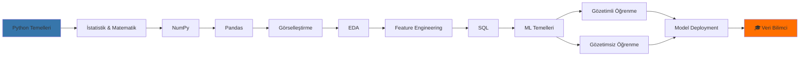

<div align="center">

# 🚀 Veri Bilimi ve Makine Öğrenmesi 2026
## 100 Günlük Bootcamp - Yönetim Bilişim Sistemleri Özel Eğitim Serisi

[](https://www.python.org/)
[](https://www.tensorflow.org/)
[](https://www.anaconda.com/)
[](https://openai.com/)
[](https://pandas.pydata.org/)
[](https://numpy.org/)
[](https://scikit-learn.org/)
[](https://www.kaggle.com/)

### 💡 *Yapay Zekaya Sıfırdan Başlayarak Profesyonel Veri Bilimci Olma Yolculuğu*

**50+ Veri Seti | Gerçek Dünya Projeleri | Kapsamlı Teorik Altyapı | İş Hayatı Odaklı**

---

</div>

## 📋 İçindekiler

- [🎯 Kursun Amacı](#-kursun-amacı)
- [✨ Öne Çıkan Özellikler](#-öne-çıkan-özellikler)
- [📚 Program İçeriği](#-program-içeriği)
- [🗺️ Öğrenme Yol Haritası](#️-öğrenme-yol-haritası)
- [💼 Projeler ve Veri Setleri](#-projeler-ve-veri-setleri)
- [👥 Kimler İçin Uygun](#-kimler-için-uygun)
- [🎓 Öğrenme Çıktıları](#-öğrenme-çıktıları)
- [🛠️ Kullanılan Teknolojiler](#️-kullanılan-teknolojiler)
- [📖 Kurulum ve Başlangıç](#-kurulum-ve-başlangıç)
- [🤝 Katkıda Bulunma](#-katkıda-bulunma)
- [📜 Lisans ve Referanslar](#-lisans-ve-referanslar)
- [📞 İletişim](#-iletişim)

---

## 🎯 Kursun Amacı

Bu eğitim serisi, **Udemy'de 400.000+ öğrenciye ulaşan ve Boğaziçi Üniversitesi Yazılım Eğitmeni Atıl Samancıoğlu** tarafından hazırlanan "Veri Bilimi ve Makine Öğrenmesi 2026: 100 Günlük Kamp" kursundan esinlenerek, **Yönetim Bilişim Sistemleri** müfredatına özel olarak **revize edilmiş ve genişletilmiştir**.

### 🎪 Neden Bu Bootcamp?

- ✅ **Sıfırdan İleri Seviyeye**: Hiçbir ön bilgi gerektirmeden başlayıp profesyonel seviyeye ulaşın
- ✅ **Teori + Pratik Dengesi**: Her konunun ardındaki matematiksel ve istatistiksel temelleri anlayın
- ✅ **Gerçek Dünya Uygulamaları**: İş hayatında kullanılan güncel veri bilimi teknikleri
- ✅ **Mülakat Hazırlığı**: Veri bilimci pozisyonları için profesyonel ipuçları ve sorular
- ✅ **YBS Odaklı**: İş analitiği, karar destek sistemleri ve stratejik veri yönetimine özel içerikler

---

## ✨ Öne Çıkan Özellikler

<div align="center">

| 🎯 Özellik | 📝 Açıklama |
|-----------|-------------|
| **100 Gün Süre** | Sistematik ve adım adım ilerleyen program |
| **50+ Veri Seti** | Gerçek dünya problemleri ve çözümleri |
| **Kapsamlı Makaleler** | Her konu için özel hazırlanmış dokümantasyon |
| **Canlı Kodlar** | GitHub üzerinden erişilebilir tüm proje kodları |
| **İnteraktif Notebook'lar** | Jupyter Notebook ile uygulamalı öğrenme |
| **Kaggle Projeleri** | Yarışma formatında gerçek veri bilimi deneyimi |
| **SQL Eğitimi** | Veri tabanı yönetimi ve sorgulama teknikleri |
| **Model Deployment** | Üretilen modellerin gerçek sistemlere entegrasyonu |

</div>

---

## 📚 Program İçeriği

### 🔹 Modül 1: Python Programlama Temelleri (Gün 1-15)
- Değişkenler, Veri Tipleri ve Operatörler
- Kontrol Yapıları (if-else, loops)
- Fonksiyonlar ve Lambda İfadeleri
- Nesne Yönelimli Programlama (OOP)
- Hata Yönetimi ve Exception Handling
- Dosya İşlemleri ve I/O Operations

### 🔹 Modül 2: Veri Bilimi İçin İstatistik ve Matematik (Gün 16-25)
- Temel İstatistik Kavramları
- Olasılık Teorisi ve Dağılımlar
- Merkezi Eğilim ve Dağılım Ölçüleri
- Korelasyon ve Kovaryans
- Hipotez Testleri
- Lineer Cebir Temelleri

### 🔹 Modül 3: NumPy ile Sayısal Hesaplama (Gün 26-30)
- NumPy Dizileri ve Array Operasyonları
- Broadcasting ve Vectorization
- Matematiksel ve İstatistiksel Fonksiyonlar
- Matris İşlemleri
- Random Number Generation

### 🔹 Modül 4: Pandas ile Veri Manipülasyonu (Gün 31-40)
- DataFrame ve Series Yapıları
- Veri Okuma ve Yazma (CSV, Excel, JSON)
- Veri Temizleme ve Preprocessing
- Veri Birleştirme (Merge, Join, Concat)
- GroupBy ve Aggregation İşlemleri
- Time Series Analysis

### 🔹 Modül 5: Matplotlib ve Seaborn ile Görselleştirme (Gün 41-48)
- Temel Grafik Türleri (Line, Bar, Scatter)
- İstatistiksel Görselleştirmeler
- Çok Boyutlu Veri Görselleştirme
- Isı Haritaları (Heatmaps)
- Profesyonel Grafik Tasarımı
- Dashboard Oluşturma

### 🔹 Modül 6: Keşifsel Veri Analizi (EDA) (Gün 49-55)
- Veri Keşif Süreçleri
- Univariate, Bivariate, Multivariate Analysis
- Outlier Detection (Aykırı Değer Tespiti)
- Missing Value Analysis
- Veri Dağılımı İnceleme
- İş Problemine Uygun Analizler

### 🔹 Modül 7: Feature Engineering (Özellik Mühendisliği) (Gün 56-63)
- Feature Extraction (Özellik Çıkarımı)
- Feature Selection (Özellik Seçimi)
- Feature Scaling ve Normalization
- Encoding Teknikleri (Label, One-Hot, Target)
- Feature Creation
- Dimensionality Reduction (PCA, LDA)

### 🔹 Modül 8: SQL ve Veri Tabanı Yönetimi (Gün 64-70)
- SQL Temelleri ve Sorgu Yazımı
- JOIN İşlemleri
- Aggregate Functions
- Subqueries ve Complex Queries
- Database Design ve Normalization
- Python ile Database Connection

### 🔹 Modül 9: Makine Öğrenmesi Temelleri (Gün 71-75)
- Machine Learning Nedir?
- Gözetimli vs Gözetimsiz Öğrenme
- Model Eğitim Süreci
- Train-Test Split ve Cross Validation
- Overfitting ve Underfitting
- Model Performans Metrikleri

### 🔹 Modül 10: Gözetimli Öğrenme Algoritmaları (Gün 76-88)
#### Regresyon Algoritmaları:
- Linear Regression
- Polynomial Regression
- Ridge & Lasso Regression
- Decision Trees
- Random Forest
- Gradient Boosting (XGBoost, LightGBM, CatBoost)
- Support Vector Regression (SVR)

#### Sınıflandırma Algoritmaları:
- Logistic Regression
- K-Nearest Neighbors (KNN)
- Decision Trees
- Random Forest
- Support Vector Machines (SVM)
- Naive Bayes
- Ensemble Methods

### 🔹 Modül 11: Gözetimsiz Öğrenme Algoritmaları (Gün 89-93)
- K-Means Clustering
- Hierarchical Clustering
- DBSCAN
- Principal Component Analysis (PCA)
- Association Rule Learning
- Anomaly Detection

### 🔹 Modül 12: Model Deployment ve İş Hayatı (Gün 94-100)
- Model Kaydetme (Pickle, Joblib)
- Model Versiyonlama
- API Geliştirme (Flask/FastAPI)
- Cloud Deployment (AWS, Azure, GCP)
- MLOps Best Practices
- Kaggle Yarışmalarına Hazırlık
- Veri Bilimci Mülakat Teknikleri

---

## 🗺️ Öğrenme Yol Haritası



### 📊 Zorluk Seviyeleri

```
Gün 1-15   : 🟢 Başlangıç
Gün 16-40  : 🟡 Temel
Gün 41-70  : 🟠 Orta
Gün 71-88  : 🔴 İleri
Gün 89-100 : 🟣 Uzman
```

---

## 💼 Projeler ve Veri Setleri

### 🎯 Ana Projeler

| # | Proje Adı | Teknikler | Seviye |
|---|-----------|-----------|--------|
| 1 | **Müşteri Segmentasyonu** | K-Means, PCA, EDA | 🟠 Orta |
| 2 | **Ev Fiyat Tahmini** | Linear Regression, Random Forest | 🟡 Temel |
| 3 | **Kredi Riski Analizi** | Logistic Regression, XGBoost | 🔴 İleri |
| 4 | **Satış Tahmin Sistemi** | Time Series, ARIMA, Prophet | 🔴 İleri |
| 5 | **Müşteri Churn Analizi** | Feature Engineering, Ensemble | 🟠 Orta |
| 6 | **Doğal Dil İşleme (Sentiment Analysis)** | NLP, Text Mining | 🟣 Uzman |
| 7 | **Görüntü Sınıflandırma** | CNN, Transfer Learning | 🟣 Uzman |
| 8 | **Öneri Sistemi** | Collaborative Filtering | 🔴 İleri |
| 9 | **Fraud Detection** | Anomaly Detection, Imbalanced Data | 🟣 Uzman |
| 10 | **A/B Test Analizi** | İstatistiksel Testler, Hipotez | 🟠 Orta |

### 📂 Veri Setleri (50+)

Kurs boyunca kullanılan veri setleri şu kategorilerde:
- 🏦 **Finans**: Kredi verileri, hisse senedi fiyatları, bankacılık verileri
- 🏪 **E-ticaret**: Müşteri verileri, satış kayıtları, ürün analitiği
- 🏥 **Sağlık**: Hasta verileri, hastalık tahminleri, klinik çalışmalar
- 🏠 **Emlak**: Ev fiyatları, lokasyon verileri, pazar analizleri
- 🚗 **Otomotiv**: Araç fiyatları, yakıt tüketimi, satış verileri
- 📱 **Telekomünikasyon**: Müşteri kayıp analizi, network verileri
- 🎬 **Eğlence**: Film önerileri, kullanıcı yorumları, rating verileri

---

## 👥 Kimler İçin Uygun

<div align="center">

### ✅ Bu Bootcamp Sizin İçin İdeal Eğer:

</div>

- 🎓 **Yönetim Bilişim Sistemleri** öğrencisi veya mezunusanız
- 💼 **İş Analisti** veya **Veri Analisti** olmak istiyorsanız
- 🐍 **Python** öğrenmek ve veri bilimi alanında uzmanlaşmak istiyorsanız
- 🤖 **Yapay Zeka** ve **Makine Öğrenmesi** konularına ilgi duyuyorsanız
- 📊 **Veri odaklı karar verme** süreçlerini öğrenmek istiyorsanız
- 🚀 Kariyer değişikliği yaparak **Veri Bilimci** olmak istiyorsanız
- 🎯 **Kaggle** yarışmalarına katılmak istiyorsanız
- 📈 Şirketinizde **veri analitiği** yapısı kurmak istiyorsanız
- 🏢 **İş Zekası (BI)** ve **Karar Destek Sistemleri** konularında derinleşmek istiyorsanız

---

## 🎓 Öğrenme Çıktıları

Bu bootcamp'i tamamladığınızda:

### 🔷 Teknik Beceriler
- ✅ Python programlama dilinde ileri seviye yetkinlik
- ✅ Numpy, Pandas, Matplotlib, Seaborn kütüphanelerinde uzmanlaşma
- ✅ İstatistik ve matematik temellerini veri biliminde uygulama
- ✅ EDA ve Feature Engineering tekniklerini profesyonel düzeyde kullanma
- ✅ SQL ile veri tabanı yönetimi ve complex query yazma
- ✅ 15+ makine öğrenmesi algoritmasını anlama ve uygulama
- ✅ Model performans değerlendirme ve optimizasyon
- ✅ Modelleri production ortamına deployment etme

### 🔷 İş Hayatı Becerileri
- ✅ Gerçek iş problemlerini veri bilimi ile çözme
- ✅ İş değeri yaratan veri analitiği projeleri geliştirme
- ✅ Teknik olmayan kişilere veri analizlerini sunma
- ✅ Veri bilimci pozisyonları için mülakatlara hazır olma
- ✅ Kaggle yarışmalarına katılabilme
- ✅ Profesyonel GitHub portfolyosu oluşturma

### 🔷 Sertifikasyon ve Kariyer
- ✅ Bootcamp tamamlama sertifikası
- ✅ Veri Bilimci, Machine Learning Engineer pozisyonlarına başvuru
- ✅ İş Analisti, Data Analyst pozisyonlarında ileri seviye fark yaratma
- ✅ Freelance veri bilimi projeleri alabilme

---

## 🛠️ Kullanılan Teknolojiler

<div align="center">

### 📚 Kütüphaneler ve Framework'ler


### ☁️ Platform ve Araçlar


</div>

---

## 📖 Kurulum ve Başlangıç

### 🔧 Gereksinimler

```bash
Python 3.11+
Anaconda, VSCode, veya Miniconda
Jupyter Notebook veya JupyterLab
Git
```

### 📥 Kurulum Adımları

1️⃣ **Repository'yi Klonlayın**
```bash
git clone https://github.com/[kullanici-adiniz]/veri-bilimi-makine-ogrenmesi-2026.git
cd veri-bilimi-makine-ogrenmesi-2026
```

2️⃣ **Sanal Ortam Oluşturun**
```bash
conda create -n veri_bilimi python=3.11
conda activate veri_bilimi
```

3️⃣ **Gerekli Kütüphaneleri Yükleyin**
```bash
pip install -r requirements.txt
```

4️⃣ **Jupyter Notebook'u Başlatın**
```bash
jupyter notebook
```

### 📁 Proje Yapısı

```
📦 Veri Bilimi ve Makine Öğrenmesi 2026
 ┣ 📂 day1-15_python_temelleri/
 ┣ 📂 day16-25_istatistik_matematik/
 ┣ 📂 day26-30_numpy/
 ┣ 📂 day31-40_pandas/
 ┣ 📂 day41-48_gorsellestirme/
 ┣ 📂 day49-55_eda/
 ┣ 📂 day56-63_feature_engineering/
 ┣ 📂 day64-70_sql/
 ┣ 📂 day71-75_ml_temelleri/
 ┣ 📂 day76-88_gozetimli_ogrenme/
 ┣ 📂 day89-93_gozetimsiz_ogrenme/
 ┣ 📂 day94-100_model_deployment/
 ┣ 📂 datasets/
 ┣ 📂 projects/
 ┣ 📂 articles/
 ┣ 📂 notebooks/
 ┣ 📜 README.md
 ┗ 📜 requirements.txt
```

---

## 🤝 Katkıda Bulunma

Bu proje açık kaynak olup, geliştirmelere ve katkılara açıktır! 

### 🌟 Nasıl Katkıda Bulunabilirsiniz?

1. 🍴 Bu repository'yi **fork** edin
2. 🌿 Yeni bir **branch** oluşturun (`git checkout -b feature/yeniOzellik`)
3. ✏️ Değişikliklerinizi **commit** edin (`git commit -m 'Yeni özellik eklendi'`)
4. 📤 Branch'inizi **push** edin (`git push origin feature/yeniOzellik`)
5. 🔃 Bir **Pull Request** oluşturun

### 💡 Katkı Fikirleri
- Yeni veri setleri ekleme
- Alternatif çözüm yöntemleri önerme
- Dökümantasyon iyileştirmeleri
- Hata düzeltmeleri
- Yeni proje örnekleri

---

## 📜 Lisans ve Referanslar

### 📚 Esinlenilen Kaynak

Bu eğitim serisi, **Udemy platformunda yayınlanan** ve **400.000+ öğrenciye ulaşan** Atıl Samancıoğlu'nun hazırladığı şu kurslardan esinlenerek oluşturulmuştur:

> **"Veri Bilimi ve Makine Öğrenmesi 2026 : 100 Günlük Kamp"**
> 
> 👨‍🏫 **Eğitmen**: Atıl Samancıoğlu  
> 🏛️ **Kurum**: Boğaziçi Üniversitesi - Yazılım Eğitmeni  
> 🎓 **Platform**: Udemy  
> 👥 **Öğrenci Sayısı**: 400,000+

### 🎯 Revizyonlar ve Genişletmeler

Bu bootcamp, orijinal kursun tüm içeriklerini kapsarken, özellikle **Yönetim Bilişim Sistemleri (YBS)** müfredatına uygun olarak:

- ✅ İş Analitiği odaklı case study'ler eklenmiştir
- ✅ Karar Destek Sistemleri konularına ağırlık verilmiştir
- ✅ SQL ve veri tabanı yönetimi daha detaylı işlenmiştir
- ✅ İş dünyası uygulamalarına odaklanılmıştır
- ✅ Enterprise veri yönetimi konuları eklenmiştir

### ⚖️ Lisans

Bu proje [MIT Lisansı](LICENSE) altında yayınlanmıştır. Eğitim amaçlı kullanım için özgürce kullanabilir, geliştirebilir ve paylaşabilirsiniz.

### 🙏 Teşekkürler

- **Atıl Samancıoğlu**'na kaliteli içerik ve ilham için teşekkür ederiz
- **Boğaziçi Üniversitesi** ekibine katkıları için teşekkür ederiz
- Tüm **açık kaynak topluluk**larına katkıları için teşekkür ederiz

---

## 📞 İletişim

### 🌐 Bağlantılar

- 🔗 **GitHub**: [github.com/cemal-yuksel](https://github.com)
- 💼 **LinkedIn**: [linkedin.com/in/cemal-yuksel](https://linkedin.com)
- 📧 **E-posta**: [cyuksel@bandirma.edu.tr](mailto:cyuksel@bandirma.edu.tr)
- 🌍 **Website**: [www.cemalyuksel.org](https://www.cemalyuksel.org)

### 💬 Destek ve Sorular

- 💡 **Sorularınız için**: GitHub Issues bölümünü kullanabilirsiniz
- 🐛 **Hata bildirimi**: Bug report şablonuyla issue açabilirsiniz
- 🚀 **Özellik önerileri**: Feature request ile görüşlerinizi paylaşabilirsiniz
- 📖 **Dokümantasyon**: Wiki sayfasını inceleyebilirsiniz

---

**Made with** ❤️ **for Data Science Community**

*Veri Bilimi Yolculuğunuzda Başarılar Dileriz!* 🚀

---

**© 2026 | Tüm Hakları Saklıdır**

</div>
