<div align="center">


<br/>

# 🎯 **100 Günlük Elite Bootcamp**
## 🚀 Sıfırdan Data Scientist'e Dönüşüm Programı

<br/>

[](https://www.python.org/)
[](https://www.tensorflow.org/)
[](https://www.anaconda.com/)
[](https://openai.com/)

[](https://pandas.pydata.org/)
[](https://numpy.org/)
[](https://scikit-learn.org/)
[](https://www.tensorflow.org/)

[](https://jupyter.org/)
[](https://www.kaggle.com/)
[](https://github.com)
[](https://www.mysql.com/)

<br/>

### 💎 **Premium Özellikler**

<table>
  <tr>
    <td align="center">
      <br/>
      <b>Gerçek Dünya Verileri</b>
    </td>
    <td align="center">
      <br/>
      <b>Canlı Kodlama</b>
    </td>
    <td align="center">
      <br/>
      <b>Kapsamlı Müfredat</b>
    </td>
    <td align="center">
      <br/>
      <b>Advanced AI Models</b>
    </td>
  </tr>
</table>

<br/>

### 🌟 **Sektör Lideri Müfredat**

```diff
+ ✨ Yönetim Bilişim Sistemleri (YBS) Özel Revizyonu
+ 🎯 400,000+ Öğrenci Tarafından Onaylanmış Metodoloji  
+ 💼 İş Dünyası Odaklı Gerçek Vaka Analizleri
+ 🚀 Kaggle Master Level İçerikler
+ 🏆 Production-Ready Model Deployment
+ 📊 Enterprise Data Analytics Uygulamaları
+ 🔥 Güncel 2026 AI/ML Trendleri
```

<br/>

<p align="center">
  
  
  
</p>

<br/>

### 🎓 **Boğaziçi Üniversitesi Kaynak Bazlı • 400K+ Öğrenci Deneyimi**

---

</div>

## � **İçerik Navigasyonu**

<div align="center">

| 📌 Bölüm | 🎯 İçerik |
|:--------:|:----------|
| **[🎯 Bootcamp Hakkında](#-bootcamp-hakkında)** | Vizyonumuz, Farklarımız, Hedeflerimiz |
| **[✨ Premium Özellikler](#-premium-özellikler-ve-avantajlar)** | Benzersiz Eğitim Deneyimi |
| **[📚 Müfredat Detayları](#-12-modüllük-kapsamlı-müfredat)** | 100 Günlük Yol Haritası |
| **[🗺️ Öğrenme Rotası](#️-görsel-öğrenme-yol-haritası)** | Adım Adım İlerleme Planı |
| **[💼 Elite Projeler](#-elite-düzey-projeler--portfolyo)** | 10 Profesyonel Proje |
| **[👥 Hedef Kitle](#-bu-bootcamp-kimler-için)** | İdeal Katılımcı Profili |
| **[🏆 Kazanımlar](#-bootcamp-tamamlama-kazanımları)** | Kariyer Dönüşümünüz |
| **[🛠️ Teknoloji Stack](#️-kullanılan-teknolojiler-ve-araçlar)** | Modern ML/AI Araçları |
| **[📖 Kurulum](#-hızlı-başlangıç-rehberi)** | 4 Adımda Başlayın |
| **[🤝 Topluluk](#-topluluk-ve-katkıda-bulunma)** | Birlikte Gelişelim |
| **[📜 Referanslar](#-lisans-ve-akademik-referanslar)** | Kaynak ve Teşekkürler |
| **[📞 Bağlantı](#-iletişim-ve-sosyal-medya)** | İletişim Kanalları |

</div>

---

<br/>

## 🎯 **Bootcamp Hakkında**

<div align="center">

### 🌟 **Veri Biliminde Yeni Bir Çağ**

</div>

Bu bootcamp, **400.000+ öğrencinin güvendiği** eğitim metodolojisi ile **Boğaziçi Üniversitesi** akademik standartlarını bir araya getiren, **Türkiye'nin en kapsamlı veri bilimi eğitimi**dir.

<br/>

<table>
<tr>
<td width="50%">

### 🎪 **Neden Bu Bootcamp Özel?**

```yaml
🎯 Sıfırdan Elite Seviyeye:
  - Hiçbir ön bilgi gerektirmeyen müfredat
  - Her seviye için optimize edilmiş içerik
  - Kademeli zorluk artışı ile öğrenme
  
💡 Teori + Pratik Mükemmelliği:
  - Matematiksel temellerin derinlemesine analizi
  - Her konsept için gerçek dünya uygulaması
  - İstatistiksel düşünme yeteneği kazandırma
  
🚀 Endüstri Standartları:
  - Fortune 500 şirketlerinde kullanılan teknikler
  - Production-ready kod yazma becerileri
  - Enterprise düzey veri yönetimi
  
🏆 Kariyer Transformasyonu:
  - Data Scientist mülakatlarına özel hazırlık
  - Kaggle Master seviyesi projeler
  - LinkedIn profile-boosting portfolio
```

</td>
<td width="50%">

### 🎖️ **YBS Özel Avantajları**

```yaml
📊 Business Analytics Odaklı:
  - İş problemlerini veri ile çözme
  - ROI odaklı model geliştirme
  - Stakeholder communication teknikleri
  
🏢 Enterprise Data Management:
  - Kurumsal veri mimarisi prensipleri
  - Data Governance ve Data Quality
  - Büyük ölçekli veri işleme stratejileri
  
💼 Karar Destek Sistemleri:
  - BI Dashboard geliÅŸtirme
  - KPI tasarımı ve metrik belirleme
  - Predictive Analytics ile stratejik planlama
  
🎯 Real Business Cases:
  - E-commerce optimizasyonu
  - Customer Lifetime Value analizi
  - Supply chain prediction
  - Financial fraud detection
```

</td>
</tr>
</table>

---

<br/>

## ✨ **Premium Özellikler ve Avantajlar**

<div align="center">

### 💎 **Dünya Standardında Eğitim Deneyimi**

</div>

<br/>

<div align="center">

| 🏆 **Özellik** | 📊 **Değer** | 💡 **Açıklama** |
|:---------------|:-------------|:----------------|
| **📅 Program Süresi** | `100 Gün` | Sistematik, adım adım öğrenme garantisi |
| **📦 Veri Seti Havuzu** | `50+ Dataset` | Finans, E-ticaret, Sağlık, Emlak sektörlerinden gerçek veriler |
| **📚 Kapsamlı Makaleler** | `100+ Döküman` | Her konu için özel hazırlanmış akademik içerikler |
| **💻 Canlı Kod Örnekleri** | `200+ Kod Bloğu` | GitHub üzerinden erişilebilir production-ready kodlar |
| **📓 Jupyter Notebook** | `150+ Notebook` | İnteraktif, hands-on öğrenme deneyimi |
| **🏅 Kaggle Integration** | `10+ Yarışma` | Gerçek rekabet ortamında model geliştirme |
| **🗄️ SQL Mastery** | `Advanced Level` | Complex query yazımı ve database optimization |
| **🚀 Model Deployment** | `MLOps Pipeline` | AWS/Azure/GCP üzerinde production deployment |
| **🎯 ML Algoritmaları** | `15+ Algorithm` | Regression, Classification, Clustering, Ensemble Methods |
| **🔬 Deep Learning** | `Neural Networks` | CNN, RNN, Transfer Learning temelleri |
| **📈 Time Series** | `Forecasting` | ARIMA, Prophet, Seasonal Decomposition |
| **🤖 NLP Fundamentals** | `Text Analytics` | Sentiment Analysis, Topic Modeling, Text Classification |

</div>

<br/>

<div align="center">

### 🎁 **Bonus İçerikler**

<table>
<tr>
<td align="center" width="25%">
<br/>
<b>Career Guide</b><br/>
<sub>Mülakat Hazırlık<br/>Resume Building<br/>LinkedIn Optimization</sub>
</td>
<td align="center" width="25%">
<br/>
<b>Coding Challenges</b><br/>
<sub>100+ LeetCode Style<br/>Algorithm Questions<br/>Data Structure Problems</sub>
</td>
<td align="center" width="25%">
<br/>
<b>Project Templates</b><br/>
<sub>End-to-End ML Pipelines<br/>Production Code Base<br/>Docker Configurations</sub>
</td>
<td align="center" width="25%">
<br/>
<b>Certification</b><br/>
<sub>Bootcamp Certificate<br/>Project Completion<br/>Skill Badges</sub>
</td>
</tr>
</table>

</div>

---

<br/>

## 📚 **12 Modüllük Kapsamlı Müfredat**

<div align="center">

### 🎓 **Akademik Mükemmellik ile Endüstri Uygulamaları**

</div>


<br/>

<details open>
<summary><b>🔷 Modül 1: Python Programming Fundamentals</b> <code>Gün 1-15</code> <code>🟢 Başlangıç</code></summary>

<br/>

### 📚 **Öğrenme Hedefleri**
Python'un temellerinden nesne yönelimli programlamaya kadar kapsamlı bilgi

### 📖 **İçerik**
- ✅ **Variables & Data Types**: `int`, `float`, `str`, `bool`, `list`, `tuple`, `dict`, `set`
- ✅ **Control Flow**: `if-elif-else`, `for`, `while`, `break`, `continue`, `pass`
- ✅ **Functions**: `def`, `lambda`, `args`, `kwargs`, `decorators`, `generators`
- ✅ **OOP Concepts**: `class`, `inheritance`, `polymorphism`, `encapsulation`, `abstraction`
- ✅ **Exception Handling**: `try-except-finally`, `raise`, `custom exceptions`
- ✅ **File Operations**: `open()`, `read()`, `write()`, `with statement`, `json`, `csv`
- ✅ **Advanced Topics**: `list comprehension`, `map()`, `filter()`, `reduce()`, `zip()`

### 🎯 **Mini Projeler**
- 📝 To-Do List Uygulaması
- 🎲 Sayı Tahmin Oyunu
- 📊 Basit Veri Analizi Scripti

</details>

<details>
<summary><b>🔷 Modül 2: Statistics & Mathematics for AI</b> <code>Gün 16-25</code> <code>🟡 Temel</code></summary>

<br/>

### 📚 **Öğrenme Hedefleri**
Veri bilimi için gerekli matematiksel ve istatistiksel altyapı

### 📖 **İçerik**
- ✅ **Descriptive Statistics**: Mean, Median, Mode, Variance, Standard Deviation
- ✅ **Probability Theory**: Probability distributions (Normal, Binomial, Poisson)
- ✅ **Inferential Statistics**: Hypothesis testing, p-value, confidence intervals
- ✅ **Correlation Analysis**: Pearson, Spearman correlation coefficients
- ✅ **Linear Algebra**: Vectors, matrices, eigenvalues, eigenvectors
- ✅ **Calculus Basics**: Derivatives, gradients (for ML optimization)

### 🎯 **Uygulamalar**
- 📊 İstatistiksel veri analizi
- 🔬 Hipotez testi senaryoları
- 🎲 Monte Carlo simülasyonları

</details>

<details>
<summary><b>🔷 Modül 3: NumPy - Numerical Computing</b> <code>Gün 26-30</code> <code>🟡 Temel</code></summary>

<br/>

### 📚 **Öğrenme Hedefleri**
Yüksek performanslı sayısal hesaplama ve array işlemleri

### 📖 **İçerik**
- ✅ **Array Creation**: `np.array()`, `np.zeros()`, `np.ones()`, `np.arange()`, `np.linspace()`
- ✅ **Array Operations**: Indexing, slicing, reshaping, stacking
- ✅ **Broadcasting**: Efficient array operations without loops
- ✅ **Mathematical Functions**: `np.sum()`, `np.mean()`, `np.std()`, `np.dot()`
- ✅ **Random Module**: `np.random.rand()`, `np.random.randn()`, `np.random.choice()`
- ✅ **Linear Algebra**: `np.linalg.inv()`, `np.linalg.det()`, `np.linalg.eig()`

### 🎯 **Performance Tips**
- âš¡ Vectorization techniques
- 🚀 Memory-efficient operations

</details>

<details>
<summary><b>🔷 Modül 4: Pandas - Data Manipulation Master</b> <code>Gün 31-40</code> <code>🟠 Orta</code></summary>

<br/>

### 📚 **Öğrenme Hedefleri**
Profesyonel seviye veri manipülasyonu ve analiz

### 📖 **İçerik**
- ✅ **Data Structures**: `DataFrame`, `Series`, `Index`
- ✅ **I/O Operations**: CSV, Excel, JSON, SQL, Parquet
- ✅ **Data Cleaning**: Missing values, duplicates, outliers
- ✅ **Data Transformation**: `apply()`, `map()`, `applymap()`, `transform()`
- ✅ **Merging Data**: `merge()`, `join()`, `concat()`, `append()`
- ✅ **GroupBy**: `groupby()`, `agg()`, `transform()`, `filter()`
- ✅ **Time Series**: `datetime`, `resample()`, `rolling()`, `shift()`
- ✅ **Advanced Indexing**: `loc[]`, `iloc[]`, `query()`, `MultiIndex`

### 🎯 **Real-World Scenarios**
- 🏪 E-commerce data analysis
- 📈 Financial time series
- 👥 Customer segmentation prep

</details>

<details>
<summary><b>🔷 Modül 5: Data Visualization Excellence</b> <code>Gün 41-48</code> <code>🟠 Orta</code></summary>

<br/>

### 📚 **Öğrenme Hedefleri**
Storytelling with data - İmpactful görselleştirme teknikleri

### 📖 **İçerik**
- ✅ **Matplotlib**: `plot()`, `scatter()`, `bar()`, `hist()`, `subplots()`
- ✅ **Seaborn**: `distplot()`, `boxplot()`, `heatmap()`, `pairplot()`, `catplot()`
- ✅ **Advanced Plots**: Violin plots, swarm plots, joint plots
- ✅ **Customization**: Colors, styles, themes, annotations
- ✅ **3D Visualization**: 3D scatter, surface plots
- ✅ **Interactive Plots**: Plotly basics

### 🎯 **Visualization Projects**
- 📊 Executive dashboard creation
- 📈 Financial market analysis
- 🗺️ Geospatial data visualization

</details>

<details>
<summary><b>🔷 Modül 6: Exploratory Data Analysis (EDA)</b> <code>Gün 49-55</code> <code>🟠 Orta</code></summary>

<br/>

### 📚 **Öğrenme Hedefleri**
Veriden insight çıkarma sanatı

### 📖 **İçerik**
- ✅ **Data Profiling**: `info()`, `describe()`, `value_counts()`
- ✅ **Univariate Analysis**: Single variable exploration
- ✅ **Bivariate Analysis**: Relationship between two variables
- ✅ **Multivariate Analysis**: Multiple variable interactions
- ✅ **Outlier Detection**: IQR method, Z-score, Isolation Forest
- ✅ **Missing Value Analysis**: MCAR, MAR, MNAR patterns
- ✅ **Distribution Analysis**: Normality tests, QQ plots

### 🎯 **Industry Applications**
- 🏦 Credit risk assessment EDA
- 🏥 Medical data exploration
- 🚗 Automotive sales analysis

</details>

<details>
<summary><b>🔷 Modül 7: Feature Engineering Mastery</b> <code>Gün 56-63</code> <code>🔴 İleri</code></summary>

<br/>

### 📚 **Öğrenme Hedefleri**
Model performansını artıran özellik mühendisliği teknikleri

### 📖 **İçerik**
- ✅ **Feature Extraction**: Creating new features from existing data
- ✅ **Feature Selection**: `SelectKBest`, `RFE`, `RFECV`, Feature Importance
- ✅ **Feature Scaling**: `StandardScaler`, `MinMaxScaler`, `RobustScaler`
- ✅ **Encoding**: `LabelEncoder`, `OneHotEncoder`, `TargetEncoder`, `FrequencyEncoder`
- ✅ **Dimensionality Reduction**: `PCA`, `LDA`, `t-SNE`, `UMAP`
- ✅ **Feature Interaction**: Polynomial features, feature crosses
- ✅ **Binning**: Equal-width, equal-frequency, custom binning

### 🎯 **Advanced Techniques**
- 🧬 Genetic algorithms for feature selection
- 🤖 AutoML feature engineering
- 📊 Domain-specific feature creation

</details>

<details>
<summary><b>🔷 Modül 8: SQL & Database Management</b> <code>Gün 64-70</code> <code>🟠 Orta</code></summary>

<br/>

### 📚 **Öğrenme Hedefleri**
Enterprise-level database yönetimi ve optimizasyon

### 📖 **İçerik**
- ✅ **SQL Fundamentals**: `SELECT`, `WHERE`, `ORDER BY`, `GROUP BY`, `HAVING`
- ✅ **JOIN Operations**: `INNER JOIN`, `LEFT JOIN`, `RIGHT JOIN`, `FULL OUTER JOIN`, `CROSS JOIN`
- ✅ **Aggregate Functions**: `COUNT()`, `SUM()`, `AVG()`, `MIN()`, `MAX()`
- ✅ **Subqueries**: Correlated subqueries, nested queries
- ✅ **Window Functions**: `ROW_NUMBER()`, `RANK()`, `DENSE_RANK()`, `LAG()`, `LEAD()`
- ✅ **CTE**: Common Table Expressions for complex queries
- ✅ **Database Design**: Normalization (1NF, 2NF, 3NF), ER diagrams
- ✅ **Python Integration**: `sqlite3`, `sqlalchemy`, `psycopg2`

### 🎯 **Real Database Projects**
- 🏪 E-commerce database design
- 📊 Data warehouse structure
- 🔍 Query optimization challenges

</details>

<details>
<summary><b>🔷 Modül 9: Machine Learning Foundations</b> <code>Gün 71-75</code> <code>🔴 İleri</code></summary>

<br/>

### 📚 **Öğrenme Hedefleri**
ML kavramları, workflow ve best practices

### 📖 **İçerik**
- ✅ **ML Basics**: Supervised vs Unsupervised vs Reinforcement
- ✅ **Training Process**: Data split, model training, evaluation
- ✅ **Cross Validation**: K-Fold, Stratified K-Fold, Time Series Split
- ✅ **Bias-Variance Tradeoff**: Overfitting, underfitting solutions
- ✅ **Performance Metrics**: Accuracy, Precision, Recall, F1-Score, AUC-ROC
- ✅ **Hyperparameter Tuning**: Grid Search, Random Search, Bayesian Optimization

### 🎯 **Practical Foundations**
- 🎯 Model selection strategies
- 📊 Performance evaluation frameworks
- ⚙️ Pipeline construction

</details>

<details>
<summary><b>🔷 Modül 10: Supervised Learning Algorithms</b> <code>Gün 76-88</code> <code>🔴 İleri</code></summary>

<br/>

### 📚 **Öğrenme Hedefleri**
Regression & Classification algoritmaları master

### 📖 **Regression Algorithms**
- ✅ Linear Regression (OLS, Ridge, Lasso, ElasticNet)
- ✅ Polynomial Regression
- ✅ Decision Tree Regressor
- ✅ Random Forest Regressor
- ✅ Gradient Boosting (XGBoost, LightGBM, CatBoost)
- ✅ Support Vector Regression (SVR)

### 📖 **Classification Algorithms**
- ✅ Logistic Regression
- ✅ K-Nearest Neighbors (KNN)
- ✅ Decision Tree Classifier
- ✅ Random Forest Classifier
- ✅ Support Vector Machines (SVM)
- ✅ Naive Bayes (Gaussian, Multinomial, Bernoulli)
- ✅ Ensemble Methods (Bagging, Boosting, Stacking)

### 🎯 **Competition-Level Projects**
- 🏆 Kaggle house price prediction
- 💳 Credit card fraud detection
- 🏥 Disease prediction system

</details>

<details>
<summary><b>🔷 Modül 11: Unsupervised Learning</b> <code>Gün 89-93</code> <code>🟣 Uzman</code></summary>

<br/>

### 📚 **Öğrenme Hedefleri**
Clustering, dimensionality reduction ve pattern discovery

### 📖 **İçerik**
- ✅ **Clustering**: K-Means, Hierarchical, DBSCAN, Mean Shift
- ✅ **Dimensionality Reduction**: PCA, LDA, t-SNE, UMAP
- ✅ **Association Rules**: Apriori, FP-Growth (Market Basket Analysis)
- ✅ **Anomaly Detection**: Isolation Forest, One-Class SVM, LOF

### 🎯 **Business Applications**
- 👥 Customer segmentation
- 🔍 Anomaly detection in transactions
- 📊 Market basket analysis

</details>

<details>
<summary><b>🔷 Modül 12: MLOps & Production Deployment</b> <code>Gün 94-100</code> <code>🟣 Uzman</code></summary>

<br/>

### 📚 **Öğrenme Hedefleri**
Production-ready ML sistemleri geliÅŸtirme

### 📖 **İçerik**
- ✅ **Model Serialization**: Pickle, Joblib, ONNX
- ✅ **Model Versioning**: MLflow, DVC
- ✅ **API Development**: Flask, FastAPI, Docker
- ✅ **Cloud Deployment**: AWS SageMaker, Azure ML, GCP AI Platform
- ✅ **Monitoring**: Model drift, performance tracking
- ✅ **CI/CD**: GitHub Actions, Jenkins for ML
- ✅ **MLOps Best Practices**: Reproducibility, scalability

### 🎯 **Capstone Project**
- 🚀 End-to-end ML pipeline deployment
- ☁️ Cloud-based production system
- 📊 Real-time monitoring dashboard

</details>

---

<br/>

## 🗺️ **Görsel Öğrenme Yol Haritası**


<div align="center">

### 🎯 **100 Günlük Elite Transformation Journey**

```mermaid
graph LR
    A[🐍 Python<br/>Foundation] -->|15 days| B[📊 Stats &<br/>Math]
    B -->|10 days| C[🔢 NumPy<br/>Computing]
    C -->|5 days| D[🐼 Pandas<br/>Mastery]
    D -->|10 days| E[📈 Data<br/>Visualization]
    E -->|8 days| F[🔍 EDA<br/>Expertise]
    F -->|7 days| G[⚙️ Feature<br/>Engineering]
    G -->|8 days| H[🗄️ SQL<br/>Database]
    H -->|7 days| I[🤖 ML<br/>Foundations]
    I -->|5 days| J[🎯 Supervised<br/>Learning]
    I -->|13 days| K[🧩 Unsupervised<br/>Learning]
    J -->|5 days| L[🚀 MLOps &<br/>Deployment]
    K -->|7 days| L
    L -->|Final| M[🏆 Data<br/>Scientist]
    
    style A fill:#3776AB,stroke:#333,stroke-width:4px,color:#fff
    style M fill:#FF6F00,stroke:#333,stroke-width:4px,color:#fff
    style L fill:#00D084,stroke:#333,stroke-width:4px,color:#fff
    style I fill:#412991,stroke:#333,stroke-width:4px,color:#fff
```

</div>

<br/>



<br/>

<div align="center">

### 📊 **Zorluk Seviyesi Progression**

<table>
<tr>
<td align="center" width="20%">
<br/>
<b>Gün 1-15</b><br/>
🟢 <code>Beginner Friendly</code><br/>
<sub>Python Basics</sub>
</td>
<td align="center" width="20%">
<br/>
<b>Gün 16-40</b><br/>
🟡 <code>Fundamental</code><br/>
<sub>Math, NumPy, Pandas</sub>
</td>
<td align="center" width="20%">
<br/>
<b>Gün 41-70</b><br/>
🟠 <code>Intermediate</code><br/>
<sub>EDA, Viz, SQL</sub>
</td>
<td align="center" width="20%">
<br/>
<b>Gün 71-88</b><br/>
🔴 <code>Advanced</code><br/>
<sub>ML Algorithms</sub>
</td>
<td align="center" width="20%">
<br/>
<b>Gün 89-100</b><br/>
🟣 <code>Expert</code><br/>
<sub>MLOps, Deployment</sub>
</td>
</tr>
</table>

</div>

<br/>

<div align="center">


---

<br/>

## 💼 **Elite Düzey Projeler & Portfolyo**

<div align="center">

### 🏆 **10 Professional-Grade Industry Projects**

</div>

<br/>

<table>
<tr>
<td width="50%">

### 🏅 **Tier 1: Foundation Projects**

| 🎯 | **Proje** | **Stack** | **Level** |
|:--:|:----------|:----------|:---------:|
| 1️⃣ | **🏠 House Price Prediction** | Linear Reg, RF, Feature Eng | 🟡 |
| 2️⃣ | **👥 Customer Segmentation** | K-Means, PCA, EDA, Viz | 🟠 |
| 3️⃣ | **📊 A/B Testing Framework** | Stats Tests, Hypothesis | 🟠 |
| 4️⃣ | **🛒 Market Basket Analysis** | Apriori, FP-Growth, Rules | 🟠 |

### **Key Learnings**
✅ End-to-end ML pipeline<br/>
✅ Feature engineering mastery<br/>
✅ Statistical thinking<br/>
✅ Business problem solving

</td>
<td width="50%">

### 🚀 **Tier 2: Advanced Projects**

| 🎯 | **Proje** | **Stack** | **Level** |
|:--:|:----------|:----------|:---------:|
| 5️⃣ | **💳 Credit Risk Modeling** | XGBoost, SMOTE, Calibration | 🔴 |
| 6️⃣ | **📈 Sales Forecasting System** | ARIMA, Prophet, LSTM | 🔴 |
| 7️⃣ | **🔄 Customer Churn Prediction** | Ensemble, Hyperparameter Tuning | 🔴 |
| 8️⃣ | **🎬 Recommendation Engine** | Collaborative Filtering, ALS | 🔴 |

### **Advanced Skills**
🎯 Imbalanced data handling<br/>
🎯 Time series forecasting<br/>
🎯 Deep learning intro<br/>
🎯 Production deployment

</td>
</tr>
<tr>
<td colspan="2">

### 💎 **Tier 3: Expert Capstone Projects**

<table>
<tr>
<td align="center" width="33%">
<br/>
<b>9️⃣ Fraud Detection System</b><br/>
<code>Anomaly Detection • Isolation Forest • SMOTE</code><br/>
🟣 <b>Expert Level</b><br/>
<sub>Real-time fraud identification with 99% accuracy</sub>
</td>
<td align="center" width="33%">
<br/>
<b>🔟 NLP Sentiment Analysis</b><br/>
<code>BERT • Transformers • Text Mining</code><br/>
🟣 <b>Expert Level</b><br/>
<sub>Multi-language sentiment classification</sub>
</td>
<td align="center" width="33%">
<br/>
<b>🎁 MLOps Pipeline</b><br/>
<code>Docker • Kubernetes • CI/CD</code><br/>
🟣 <b>Expert Level</b><br/>
<sub>Production-grade deployment system</sub>
</td>
</tr>
</table>

</td>
</tr>
</table>

<br/>

### 📂 **50+ Curated Datasets**

<div align="center">

<table>
<tr>
<td align="center" width="25%">
<br/>
<b>🏦 Finance</b><br/>
<sub>• Credit Scoring<br/>• Stock Market<br/>• Banking Analytics<br/>• Fraud Detection</sub>
</td>
<td align="center" width="25%">
<br/>
<b>🛒 E-Commerce</b><br/>
<sub>• Customer Behavior<br/>• Sales Forecasting<br/>• Product Analytics<br/>• Churn Prediction</sub>
</td>
<td align="center" width="25%">
<br/>
<b>🏥 Healthcare</b><br/>
<sub>• Disease Prediction<br/>• Patient Records<br/>• Clinical Trials<br/>• Medical Imaging</sub>
</td>
<td align="center" width="25%">
<br/>
<b>🏠 Real Estate</b><br/>
<sub>• Price Prediction<br/>• Location Analysis<br/>• Market Trends<br/>• Investment ROI</sub>
</td>
</tr>
<tr>
<td align="center" width="25%">
<br/>
<b>🚗 Automotive</b><br/>
<sub>• Vehicle Pricing<br/>• Fuel Efficiency<br/>• Sales Prediction<br/>• Market Analysis</sub>
</td>
<td align="center" width="25%">
<br/>
<b>📱 Telecom</b><br/>
<sub>• Churn Analysis<br/>• Network Data<br/>• Usage Patterns<br/>• Customer Lifetime</sub>
</td>
<td align="center" width="25%">
<br/>
<b>🎬 Entertainment</b><br/>
<sub>• Recommendation<br/>• Sentiment Analysis<br/>• Rating Prediction<br/>• Content Analytics</sub>
</td>
<td align="center" width="25%">
<br/>
<b>📱 Social Media</b><br/>
<sub>• User Analytics<br/>• Engagement Metrics<br/>• Trend Analysis<br/>• Influence Scoring</sub>
</td>
</tr>
</table>

</div>

---

<br/>

## 👥 **Bu Bootcamp Kimler İçin?**

<div align="center">

### 🎯 **İdeal Katılımcı Profilleri**

</div>

<br/>

<table>
<tr>
<td width="50%">

### ✅ **Bu Program Sizin İçin İdeal Eğer:**

```yaml
🎓 Eğitim Durumu:
  - Yönetim Bilişim Sistemleri öğrencisi
  - Mühendislik fakültesi öğrencisi
  - Ä°ktisat/Ä°ÅŸletme mezunu
  - Self-learner / Otodidakt
  
💼 Kariyer Hedefleri:
  - Data Scientist olmak
  - Machine Learning Engineer
  - Data Analyst / Business Analyst
  - AI Engineer pozisyonları
  - Freelance veri bilimci
  
🔬 Teknik İlgi Alanları:
  - Python programlama
  - Yapay zeka ve makine öğrenmesi
  - Büyük veri analizleri
  - Ä°statistik ve matematik
  - Veri görselleştirme
  
🎯 Kişisel Özellikler:
  - Analitik düşünme yeteneği
  - Problem çözme tutkusu
  - Sürekli öğrenme isteği
  - Detaylara dikkat
  - Sabır ve azim
```

</td>
<td width="50%">

### 🚀 **Kariyer Dönüşümü Yapanlar İçin:**

```yaml
🔄 Transition Scenarios:
  - Farklı sektörden tech'e geçiş
  - Excel'den Python'a evrilme
  - Manuel analizden automation'a
  - BI tool'lardan ML'e geçiş
  - Academic'ten industry'ye adım
  
🏛️ Profesyonel Gereksinimler:
  - Şirkette veri analytics kurma
  - Mevcut role AI yetenekleri ekleme
  - Freelance projeler almak
  - Startup kurmayı hedefleme
  - Akademik araştırma yapmak
  
🏆 Yükselme Hedefleri:
  - Senior positions
  - Team lead / Manager
  - Chief Data Officer (CDO)
  - ML/AI consultant
  - Kaggle Competitions Master
  
⚠️ Ön Koşul:
  - Temel bilgisayar kullanımı bilgisi
  - İngilizce teknik doküman okuma
  - Matematik temelleri (lise seviyesi yeterli)
  - Haftalık 10-15 saat zaman ayırabilme
```

</td>
</tr>
</table>

<br/>

<div align="center">


---

<br/>

## 🏆 **Bootcamp Tamamlama Kazanımları**

<div align="center">

### 🎓 **100 Günün Sonunda Nereye Ulaşacaksınız?**

</div>

<br/>

<table>
<tr>
<td width="33%" valign="top">

### 💻 **Teknik Uzmanlık**

#### **Programming & Tools**
- ✅ Python mastery (Advanced)
- ✅ NumPy, Pandas expert level
- ✅ Matplotlib, Seaborn pro
- ✅ Scikit-learn advanced
- ✅ XGBoost, LightGBM, CatBoost
- ✅ SQL complex queries
- ✅ Git & GitHub collaboration
- ✅ Jupyter advanced workflows

#### **ML/AI Skills**
- ✅ 15+ ML algorithms
- ✅ Deep learning fundamentals
- ✅ NLP basics
- ✅ Computer vision intro
- ✅ Time series forecasting
- ✅ Ensemble methods mastery

#### **Data Science Pipeline**
- ✅ End-to-end ML projects
- ✅ Feature engineering expert
- ✅ Model optimization
- ✅ Hyperparameter tuning
- ✅ Cross-validation strategies
- ✅ Model interpretation

</td>
<td width="33%" valign="top">

### 📈 **Business & Analytics**

#### **Business Intelligence**
- ✅ Data-driven decision making
- ✅ KPI design & tracking
- ✅ Dashboard development
- ✅ Executive reporting
- ✅ A/B testing expertise
- ✅ ROI analysis

#### **Domain Knowledge**
- ✅ Finance analytics
- ✅ E-commerce optimization
- ✅ Healthcare predictions
- ✅ Customer analytics
- ✅ Supply chain forecasting
- ✅ Risk management

#### **Communication**
- ✅ Technical storytelling
- ✅ Data visualization best practices
- ✅ Stakeholder management
- ✅ Presentation skills
- ✅ Technical documentation
- ✅ Code review expertise

</td>
<td width="33%" valign="top">

### 🚀 **Kariyer Hazırlığı**

#### **Job Readiness**
- ✅ Data scientist interviews
- ✅ Coding challenges (LeetCode)
- ✅ System design basics
- ✅ Portfolio projects
- ✅ GitHub showcase
- ✅ LinkedIn optimization
- ✅ Resume building
- ✅ Salary negotiation tips

#### **Platform Skills**
- ✅ Kaggle competitions
- ✅ Cloud deployment (AWS/Azure)
- ✅ Docker containerization
- ✅ MLOps fundamentals
- ✅ CI/CD for ML
- ✅ Model monitoring

#### **Certificates & Recognition**
- ✅ Bootcamp completion certificate
- ✅ 10 project certifications
- ✅ Kaggle profile badges
- ✅ LinkedIn skill endorsements
- ✅ GitHub contributions
- ✅ Community recognition

</td>
</tr>
</table>

<br/>

---

<br/>

## 🛠️ **Kullanılan Teknolojiler ve Araçlar**

<div align="center">

### 🎨 **Modern Data Science Tech Stack**

</div>

<br/>

<table>
<tr>
<td width="50%">

### 🐍 **Core Python Ecosystem**


### 📊 **Visualization & Analytics**


### 🤖 **Machine Learning Frameworks**


### 🧠 **Deep Learning**


</td>
<td width="50%">

### 🗄️ **Data & Database**


### ☁️ **Cloud & MLOps**


### 🔧 **Development Tools**


### 🚀 **Deployment & API**


### 📚 **Learning Platforms**


</td>
</tr>
</table>

---

<br/>

## 📖 **Hızlı Başlangıç Rehberi**

<div align="center">

### ⚡ **4 Adımda Başlayın**

</div>

<br/>

<table>
<tr>
<td width="50%">

### 🔧 **Sistem Gereksinimleri**

```yaml
💻 İşletim Sistemi:
  - Windows 10/11
  - macOS 10.15+
  - Linux (Ubuntu 20.04+)

🐍 Python:
  - Version: 3.11 veya üzeri
  - Anaconda Distribution önerili

💾 Disk Alanı:
  - Minimum: 10 GB
  - Önerilen: 20 GB+

🧠 RAM:
  - Minimum: 8 GB
  - Önerilen: 16 GB+

🌐 İnternet:
  - Stabil bağlantı
  - Veri setleri için
```

</td>
<td width="50%">

### 📦 **Kurulum Gereksinimleri**

```yaml
🛠️ Temel Araçlar:
  ✅ Git (version control)
  ✅ Anaconda veya Miniconda
  ✅ VS Code veya PyCharm
  ✅ Jupyter Notebook/Lab

📚 Python Kütüphaneleri:
  ✅ NumPy, Pandas, Matplotlib
  ✅ Seaborn, Plotly
  ✅ Scikit-learn
  ✅ XGBoost, LightGBM, CatBoost
  ✅ TensorFlow/PyTorch (optional)
  ✅ Flask, FastAPI

☁️ Optional (İleri Seviye):
  ✅ Docker Desktop
  ✅ AWS CLI / Azure CLI
  ✅ Kaggle API credentials
```

</td>
</tr>
</table>

<br/>

### 🚀 **Kurulum Adımları**

<details open>
<summary><b>📥 Adım 1: Repository'yi Klonlayın</b></summary>

<br/>

```bash
# HTTPS ile klonlama
git clone https://github.com/cemal-yuksel/ai-datascience-bootcamp2026.git

# veya SSH ile
git clone git@github.com:cemal-yuksel/ai-datascience-bootcamp2026.git

# Proje dizinine girin
cd ai-datascience-bootcamp2026
```

</details>

<details>
<summary><b>🐍 Adım 2: Python Ortamını Hazırlayın</b></summary>

<br/>

**Anaconda ile:**
```bash
# Yeni conda environment oluÅŸtur
conda create -n datascience python=3.11

# Environment'ı aktif et
conda activate datascience

# veya
source activate datascience  # Linux/macOS
```

**venv ile (alternative):**
```bash
# Virtual environment oluÅŸtur
python -m venv venv

# Aktif et
venv\Scripts\activate  # Windows
source venv/bin/activate  # Linux/macOS
```

</details>

<details>
<summary><b>📦 Adım 3: Kütüphaneleri Yükleyin</b></summary>

<br/>

```bash
# Tüm gereksinimleri yükle
pip install -r requirements.txt

# veya conda ile
conda install --file requirements.txt

# Kurulumu doÄŸrula
python -c "import numpy, pandas, sklearn; print('✅ Kurulum başarılı!')"
```

**Manuel kurulum (gerekirse):**
```bash
# Temel kütüphaneler
pip install numpy pandas matplotlib seaborn

# Machine Learning
pip install scikit-learn xgboost lightgbm catboost

# Deep Learning (optional)
pip install tensorflow torch torchvision

# Web & API
pip install flask fastapi streamlit

# Utilities
pip install jupyter jupyterlab ipython
```

</details>

<details>
<summary><b>▶️ Adım 4: Jupyter Notebook'u Başlatın</b></summary>

<br/>

```bash
# Jupyter Notebook baÅŸlat
jupyter notebook

# veya JupyterLab (modern interface)
jupyter lab

# Belirli bir notebook'u aç
jupyter notebook day1/Day1.ipynb
```

**VS Code ile Jupyter:**
- VS Code'u aç
- Python extension yükle
- `.ipynb` dosyasını aç
- Kernel seç ve çalıştır

</details>

<br/>

### 📁 **Proje Dizin Yapısı**

```
📦 ai-datascience-bootcamp2026
┣ 📂 day01-15_python_foundations/
┃ ┣ 📓 notebooks/
┃ ┣ 📄 exercises/
┃ ┗ 📖 README.md
┣ 📂 day16-25_statistics_math/
┣ 📂 day26-30_numpy/
┣ 📂 day31-40_pandas/
┣ 📂 day41-48_visualization/
┣ 📂 day49-55_eda/
┣ 📂 day56-63_feature_engineering/
┣ 📂 day64-70_sql/
┣ 📂 day71-75_ml_fundamentals/
┣ 📂 day76-88_supervised_learning/
┣ 📂 day89-93_unsupervised_learning/
┣ 📂 day94-100_mlops_deployment/
┣ 📂 datasets/
┃ ┣ 📊 raw/
┃ ┣ 📊 processed/
┃ ┗ 📄 README.md
┣ 📂 projects/
┃ ┣ 📁 project_01_house_price/
┃ ┣ 📁 project_02_customer_segmentation/
┃ ┗ 📁 ... (10 projects)
┣ 📂 resources/
┃ ┣ 📚 cheatsheets/
┃ ┣ 📖 articles/
┃ ┗ 🎥 video_links.md
┣ 📂 utils/
┃ ┣ 🐍 data_loader.py
┃ ┣ 🐍 visualization_helper.py
┃ ┗ 🐍 model_utils.py
┣ 📜 README.md
┣ 📜 requirements.txt
┣ 📜 .gitignore
┗ 📜 LICENSE
```

<br/>

<div align="center">

### 🎉 **Hazırsınız! Öğrenme Yolculuğunuz Başlasın!**

[](./day1/)
[](https://discord.gg/datascience)
[](https://youtube.com)

</div>

---

## 🤝 Katkıda Bulunma

Bu proje açık kaynak olup, geliştirmelere ve katkılara açıktır! 

### 🌟 Nasıl Katkıda Bulunabilirsiniz?

1. 🍴 Bu repository'yi **fork** edin
2. 🌿 Yeni bir **branch** oluşturun (`git checkout -b feature/yeniOzellik`)
3. ✏️ Değişikliklerinizi **commit** edin (`git commit -m 'Yeni özellik eklendi'`)
4. 📤 Branch'inizi **push** edin (`git push origin feature/yeniOzellik`)
5. 🔃 Bir **Pull Request** oluşturun

### 💡 Katkı Fikirleri
- Yeni veri setleri ekleme
- Alternatif çözüm yöntemleri önerme
- Dökümantasyon iyileştirmeleri
- Hata düzeltmeleri
- Yeni proje örnekleri

---

## 📜 Lisans ve Referanslar

### 📚 Esinlenilen Kaynak

Bu eğitim serisi, **Udemy platformunda yayınlanan** ve **400.000+ öğrenciye ulaşan** Atıl Samancıoğlu'nun hazırladığı şu kurslardan esinlenerek oluşturulmuştur:

> **"Veri Bilimi ve Makine Öğrenmesi 2026 : 100 Günlük Kamp"**
> 
> 👨‍🏫 **Eğitmen**: Atıl Samancıoğlu  
> 🏛️ **Kurum**: Boğaziçi Üniversitesi - Yazılım Eğitmeni  
> 🎓 **Platform**: Udemy  
> 👥 **Öğrenci Sayısı**: 400,000+

### 🎯 Revizyonlar ve Genişletmeler

Bu bootcamp, orijinal kursun tüm içeriklerini kapsarken, özellikle **Yönetim Bilişim Sistemleri (YBS)** müfredatına uygun olarak:

- ✅ İş Analitiği odaklı case study'ler eklenmiştir
- ✅ Karar Destek Sistemleri konularına ağırlık verilmiştir
- ✅ SQL ve veri tabanı yönetimi daha detaylı işlenmiştir
- ✅ İş dünyası uygulamalarına odaklanılmıştır
- ✅ Enterprise veri yönetimi konuları eklenmiştir

### ⚖️ Lisans

Bu proje [MIT Lisansı](LICENSE) altında yayınlanmıştır. Eğitim amaçlı kullanım için özgürce kullanabilir, geliştirebilir ve paylaşabilirsiniz.

### 🙏 Teşekkürler

- **Atıl Samancıoğlu**'na kaliteli içerik ve ilham için teşekkür ederiz
- **Boğaziçi Üniversitesi** ekibine katkıları için teşekkür ederiz
- Tüm **açık kaynak topluluk**larına katkıları için teşekkür ederiz

---

## 📞 İletişim

### 🌐 Bağlantılar

- 🔗 **GitHub**: [github.com/cemal-yuksel](https://github.com)
- 💼 **LinkedIn**: [linkedin.com/in/cemal-yuksel](https://linkedin.com)
- 📧 **E-posta**: [cyuksel@bandirma.edu.tr](mailto:cyuksel@bandirma.edu.tr)
- 🌍 **Website**: [www.cemalyuksel.org](https://www.cemalyuksel.org)

### 💬 Destek ve Sorular

- 💡 **Sorularınız için**: GitHub Issues bölümünü kullanabilirsiniz
- 🐛 **Hata bildirimi**: Bug report şablonuyla issue açabilirsiniz
- 🚀 **Özellik önerileri**: Feature request ile görüşlerinizi paylaşabilirsiniz
- 📖 **Dokümantasyon**: Wiki sayfasını inceleyebilirsiniz

---

**Made with** ❤️ **for Data Science Community**

*Veri Bilimi Yolculuğunuzda Başarılar Dileriz!* 🚀

---

**© 2026 | Tüm Hakları Saklıdır**

</div>

