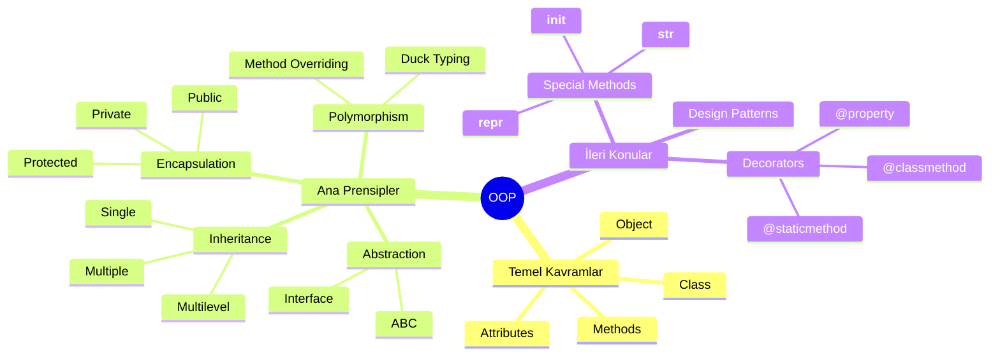

# 🐍 Python ile Nesne Yönelimli Programlama (OOP) - Kapsamlı Eğitim Serisi

<div align="center">


### 🎯 Yönetim Bilişim Sistemleri için Profesyonel OOP Eğitimi

**FROM ZERO TO HERO** - Sıfırdan Profesyonelliğe Python OOP Yolculuğu

[📚 Notebook'u Görüntüle](day10&11-oop.ipynb) • [🌟 Yıldız Ver](#) • [🐛 Sorun Bildir](#) • [💡 Katkıda Bulun](#)

</div>

---

## 📖 Genel Bakış

Bu kapsamlı eğitim materyali, **Python programlama dilinde Nesne Yönelimli Programlama (OOP)** konseptlerini temellerden ileri seviyeye kadar öğretmek üzere tasarlanmıştır. Özellikle **Yönetim Bilişim Sistemleri (YBS)** öğrencileri ve profesyonelleri için gerçek dünya senaryolarıyla zenginleştirilmiştir.

### ✨ Neden Bu Eğitim?

- 🎓 **Kapsamlı İçerik:** 4-6 saatlik detaylı anlatım
- 💼 **Gerçek Dünya Projeleri:** E-Ticaret Sistemi, Veri Analizi Uygulamaları
- 🧪 **Bol Örnekli:** 85+ kod hücresi, 50+ açıklama bölümü
- 🎯 **Uygulamalı Öğrenme:** Her konsept için pratik örnekler
- 📊 **YBS Odaklı:** İş dünyasına yönelik senaryolar
- 🚀 **Sıfırdan İleri Seviyeye:** Temellerden complex design patterns'e

### 🎬 Ne Öğreneceksiniz?

```python
class OOPEğitimi:
    """Kapsamlı Python OOP Öğrenme Yolculuğu"""
    
    def __init__(self):
        self.temeller = ["Class", "Object", "Attributes", "Methods"]
        self.ileri_seviye = ["Inheritance", "Polymorphism", 
                             "Encapsulation", "Abstraction"]
        self.uygulamalar = ["E-Ticaret Sistemi", "Veri Analizi", 
                           "Banka Sistemi", "Okul Yönetimi"]
        self.süre = "4-6 saat"
        self.seviye = "Başlangıç → İleri"
    
    def başla(self):
        return "🚀 Hadi OOP Yolculuğuna Başlayalım!"
```

### 🌟 Öne Çıkan Özellikler

<table>
<tr>
<td width="50%">

#### 📚 Eğitim İçeriği
- ✅ 12 Ana Bölüm
- ✅ 92 Notebook Hücresi
- ✅ 6450+ Kod Satırı
- ✅ Türkçe Detaylı Açıklamalar
- ✅ İngilizce Kod Örnekleri

</td>
<td width="50%">

#### 🎯 Hedef Kitle
- 🎓 YBS Öğrencileri
- 💼 İş Analisti Adayları
- 📊 Veri Analisti Adayları
- 🖥️ Backend Developer'lar
- 🔰 Python Öğrenenler

</td>
</tr>
</table>

---

## 📑 İçindekiler

<details>
<summary>📚 <b>Detaylı İçerik Listesi</b> (Tıklayarak Genişlet)</summary>

- [📖 Genel Bakış](#-genel-bakış)
- [🎯 Öğrenme Yolculuğu](#-öğrenme-yolculuğu)
- [📚 Modül Yapısı](#-modül-yapısı)
  - [1️⃣ OOP Temelleri](#1️⃣-oop-temelleri)
  - [2️⃣ Class ve Object](#2️⃣-class-ve-object)
  - [3️⃣ Attributes (Özellikler)](#3️⃣-attributes-özellikler)
  - [4️⃣ Methods (Metodlar)](#4️⃣-methods-metodlar)
  - [5️⃣ Inheritance (Kalıtım)](#5️⃣-inheritance-kalıtım)
  - [6️⃣ Polymorphism](#6️⃣-polymorphism)
  - [7️⃣ Encapsulation](#7️⃣-encapsulation)
  - [8️⃣ Abstraction](#8️⃣-abstraction)
  - [9️⃣ Special Methods](#9️⃣-special-methods)
  - [🔟 Kapsamlı Projeler](#-kapsamlı-projeler)
- [💻 Kurulum ve Kullanım](#-kurulum-ve-kullanım)
- [🎓 Gereksinimler](#-gereksinimler)
- [📊 Örnek Projeler](#-örnek-projeler)
- [🤝 Katkıda Bulunma](#-katkıda-bulunma)
- [📜 Lisans](#-lisans)
- [👨‍💻 İletişim](#-iletişim)

</details>

---

## 🎯 Öğrenme Yolculuğu

### 🗺️ OOP Öğrenme Haritası


### 📊 Zorluk Seviyesi Dağılımı

```
🟢 Kolay (Başlangıç)       ████████░░░░ 40%
🟡 Orta (Orta Seviye)      ██████████░░ 35%
🔴 İleri (Profesyonel)     ███████░░░░░ 25%
```

### 🎓 Öğrenme Hedefleri ve Çıktıları

<table>
<tr>
<td width="50%" valign="top">

#### 🎯 Teorik Kazanımlar

- ✅ OOP paradigmasını anlama
- ✅ 4 ana prensibi kavrama
- ✅ Class-Object ilişkisini öğrenme
- ✅ Design patterns'lere giriş
- ✅ UML diyagramları okuma
- ✅ Software architecture kavramları

</td>
<td width="50%" valign="top">

#### 💪 Pratik Beceriler

- ✅ Profesyonel class tasarımı
- ✅ Gerçek dünya uygulamaları
- ✅ E-Ticaret sistemi geliştirme
- ✅ Banka yönetim sistemi
- ✅ Veri analizi entegrasyonu
- ✅ Clean code yazma

</td>
</tr>
</table>

### 📈 İlerleme Takip Sistemi

```ascii
┌─────────────────────────────────────────────────────────────┐
│  🎯 OOP YOLCULUĞUNUZ                                        │
├─────────────────────────────────────────────────────────────┤
│                                                              │
│  Başlangıç    Temel      Orta       İleri    Master         │
│      ●━━━━━━━━●━━━━━━━━●━━━━━━━━●━━━━━━━━●                 │
│      ↓         ↓         ↓         ↓         ↓               │
│   Class    Methods  Inheritance Abstract  Projects          │
│  Object  Attributes Polymorphism Patterns                    │
│                                                              │
│  Tahmini Süre: 15dk → 1.5h → 3h → 5h → 6h                  │
└─────────────────────────────────────────────────────────────┘
```

---

## 📚 Modül Yapısı

### 🎨 OOP Mimarisi Görselleştirme

```ascii
                    🏛️ OOP MİMARİSİ
         ╔══════════════════════════════════════╗
         ║                                      ║
         ║         🎯 OOP (Ana Yapı)           ║
         ║                                      ║
         ╚══════════════╦═══════════════════════╝
                        ║
         ┌──────────────┼──────────────┐
         │              │              │
    ╔════▼════╗   ╔════▼════╗   ╔════▼════╗
    ║  🧬      ║   ║  🎭      ║   ║  🔒      ║
    ║Inherit. ║   ║Polymorp. ║   ║Encapsul.║
    ╚════╦════╝   ╚════╦════╝   ╚════╦════╝
         │              │              │
         └──────────────┼──────────────┘
                        │
                   ╔════▼════╗
                   ║  📐      ║
                   ║Abstract. ║
                   ╚═════════╝
```

### 📋 Detaylı Modül Listesi

#### 1️⃣ OOP Temelleri
**⏱️ Süre:** 15 dakika | **🎯 Seviye:** 🟢 Kolay

<details>
<summary><b>📖 İçerik Detayları</b></summary>

- 🎯 OOP nedir ve neden kullanılır?
- 🏛️ Procedural vs OOP karşılaştırması
- 🌍 Gerçek dünya örnekleri
- 📊 YBS uygulamaları
- 💡 İlk class tanımlama

**Kazanımlar:**
```python
✓ OOP paradigmasını anlama
✓ Class-Object kavramlarını öğrenme
✓ Temel terminolojiyi kavrama
```

</details>

#### 2️⃣ Class ve Object
**⏱️ Süre:** 30 dakika | **🎯 Seviye:** 🟢 Kolay

<details>
<summary><b>📖 İçerik Detayları</b></summary>

- 📦 Class tanımlama (class keyword)
- 🏗️ Object (nesne) oluşturma
- 🎨 Constructor (__init__) metodu
- 🔍 self parametresi derinlemesine
- 💼 Müşteri yönetim sistemi örneği

**Örnek Projeler:**
```
🏪 E-Ticaret Müşteri Sistemi
🏦 Banka Hesap Yönetimi
🎓 Öğrenci Kayıt Sistemi
```

</details>

#### 3️⃣ Attributes (Özellikler)
**⏱️ Süre:** 25 dakika | **🎯 Seviye:** 🟢 Kolay

<details>
<summary><b>📖 İçerik Detayları</b></summary>

- 🏷️ Instance attributes (örnek özellikleri)
- 🌐 Class attributes (sınıf özellikleri)
- 🔄 Attribute değiştirme
- 🎯 Public vs Private attributes
- 📊 Attribute yönetimi best practices

**Konsept Diyagramı:**
```
Class Attributes (Ortak)
    ↓
┌─────────────────────┐
│   🏢 Company Info   │
│   Shared by All     │
└─────────────────────┘
         ↓
    ┌────┴────┐
    ↓         ↓
[Müşteri1] [Müşteri2]
Instance   Instance
Attributes Attributes
```

</details>

#### 4️⃣ Methods (Metodlar)
**⏱️ Süre:** 30 dakika | **🎯 Seviye:** 🟡 Orta

<details>
<summary><b>📖 İçerik Detayları</b></summary>

- ⚡ Instance methods
- 🌍 Class methods (@classmethod)
- 🔧 Static methods (@staticmethod)
- 🎯 Method parametreleri ve return değerleri
- 💼 İşlem metodları (business logic)

**Uygulamalar:**
```python
✓ Para yatırma/çekme işlemleri
✓ Sipariş oluşturma
✓ Rapor üretme
✓ İstatistik hesaplama
```

</details>

#### 5️⃣ Inheritance (Kalıtım)
**⏱️ Süre:** 40 dakika | **🎯 Seviye:** 🟡 Orta

<details>
<summary><b>📖 İçerik Detayları</b></summary>

- 🧬 Kalıtım kavramı ve faydaları
- 👨‍👩‍👧 Parent-Child ilişkisi
- 🔄 Method overriding (ezme)
- ⬆️ super() fonksiyonu
- 📊 Çoklu kalıtım (Multiple Inheritance)

**Kalıtım Hiyerarşisi:**
```
        🏛️ Çalışan (Base)
              │
      ┌───────┼───────┐
      ↓       ↓       ↓
   👔 Müdür  💻 Dev  📊 Analist
```

</details>

#### 6️⃣ Polymorphism
**⏱️ Süre:** 35 dakika | **🎯 Seviye:** 🟡 Orta

<details>
<summary><b>📖 İçerik Detayları</b></summary>

- 🎭 Çok biçimlilik (Polymorphism) nedir?
- 🔄 Method overriding
- 🎨 Duck typing in Python
- 🎯 Farklı nesnelerle aynı interface
- 💼 Gerçek dünya uygulamaları

**Örnek:**
```python
# Farklı nesneler, aynı metod ismi
müdür.maas_hesapla()      # Farklı hesaplama
developer.maas_hesapla()  # Farklı hesaplama
analist.maas_hesapla()    # Farklı hesaplama
```

</details>

#### 7️⃣ Encapsulation
**⏱️ Süre:** 30 dakika | **🎯 Seviye:** 🟡 Orta

<details>
<summary><b>📖 İçerik Detayları</b></summary>

- 🔒 Kapsülleme (Encapsulation) kavramı
- 🔐 Public, Protected, Private
- 🎯 Getter ve Setter metodları
- 💎 @property decorator
- 🛡️ Veri koruma stratejileri

**Erişim Seviyeleri:**
```
Public      attribute    → Herkes erişebilir
Protected   _attribute   → Alt sınıflar erişebilir
Private     __attribute  → Sadece kendi sınıfı
```

</details>

#### 8️⃣ Abstraction
**⏱️ Süre:** 40 dakika | **🎯 Seviye:** 🔴 İleri

<details>
<summary><b>📖 İçerik Detayları</b></summary>

- 📐 Soyutlama (Abstraction) nedir?
- 🎯 Abstract Base Classes (ABC)
- ⚡ Abstract methods
- 🏗️ Interface tasarımı
- 🎨 Design patterns'e giriş

**Abstract Pattern:**
```python
ABC Ödeme (Abstract)
    │
    ├── Kredi Kartı ✓
    ├── Banka Kartı ✓
    └── Dijital Cüzdan ✓
```

</details>

#### 9️⃣ Special Methods
**⏱️ Süre:** 35 dakika | **🎯 Seviye:** 🔴 İleri

<details>
<summary><b>📖 İçerik Detayları</b></summary>

- ⭐ Magic/Dunder methods
- 🎨 `__str__` ve `__repr__`
- ➕ `__add__`, `__sub__` (operator overloading)
- 📏 `__len__`, `__getitem__`
- 🔍 `__call__`, `__enter__`, `__exit__`

**En Kullanışlı Dunder Methods:**
```python
__init__    → Constructor
__str__     → String temsili
__repr__    → Developer temsili
__len__     → len() ile kullanım
__add__     → + operatörü
```

</details>

#### 🔟 Kapsamlı Projeler
**⏱️ Süre:** 60+ dakika | **🎯 Seviye:** 🔴 İleri

<details>
<summary><b>📖 İçerik Detayları</b></summary>

### 🛒 Proje 1: E-Ticaret Sistemi
```
✓ Ürün yönetimi
✓ Alışveriş sepeti
✓ Sipariş işlemleri
✓ Ödeme sistemleri
```

### 🏦 Proje 2: Banka Yönetim Sistemi
```
✓ Hesap türleri (Vadesiz, Vadeli)
✓ Para transferleri
✓ Kredi hesaplama
✓ İşlem geçmişi
```

### 📊 Proje 3: Veri Analizi + OOP
```
✓ Pandas entegrasyonu
✓ Custom data classes
✓ Analiz pipeline'ları
✓ Görselleştirme
```

</details>

---
## 💻 Kurulum ve Kullanım

### 🎓 Gereksinimler

<table>
<tr>
<td width="50%">

#### 🖥️ Sistem Gereksinimleri

```
OS:       Windows / macOS / Linux
RAM:      Min 4GB (8GB önerilir)
Storage:  500MB boş alan
Python:   3.8 veya üzeri
```

</td>
<td width="50%">

#### 📦 Yazılım Gereksinimleri

- 🐍 Python 3.8+
- 📓 Jupyter Notebook / JupyterLab
- 📊 Pandas
- 🔢 NumPy
- 📈 Matplotlib
- 🎨 Seaborn

</td>
</tr>
</table>

### 📥 Kurulum Adımları

#### Adım 1️⃣: Python Kurulumu

<details>
<summary><b>🪟 Windows</b></summary>

```powershell
# Python'un kurulu olup olmadığını kontrol edin
python --version

# Eğer kurulu değilse, python.org'dan indirin
# https://www.python.org/downloads/
```

</details>

<details>
<summary><b>🍎 macOS</b></summary>

```bash
# Homebrew ile Python kurulumu
brew install python3

# Kontrol
python3 --version
```

</details>

<details>
<summary><b>🐧 Linux</b></summary>

```bash
# Ubuntu/Debian
sudo apt update
sudo apt install python3 python3-pip

# Fedora
sudo dnf install python3 python3-pip

# Kontrol
python3 --version
```

</details>

#### Adım 2️⃣: Repository'yi Klonlayın

```bash
# Git ile klonlama
git clone https://github.com/your-username/ai-datascience-bootcamp2026.git

# Dizine geçiş
cd ai-datascience-bootcamp2026/day10
```

#### Adım 3️⃣: Sanal Ortam Oluşturun (Önerilir)

```bash
# Sanal ortam oluşturma
python -m venv venv

# Sanal ortamı aktifleştirme

# Windows
venv\Scripts\activate

# macOS/Linux
source venv/bin/activate
```

#### Adım 4️⃣: Gerekli Paketleri Yükleyin

```bash
# Tüm gereksinimleri yükleme
pip install jupyter pandas numpy matplotlib seaborn

# Veya requirements.txt varsa
pip install -r requirements.txt
```

#### Adım 5️⃣: Jupyter Notebook'u Başlatın

```bash
# Jupyter Notebook'u başlatma
jupyter notebook

# Veya JupyterLab tercih ediyorsanız
jupyter lab
```

### 🚀 Hızlı Başlangıç

#### 🎯 5 Dakikada OOP!

Notebook'u açtıktan sonra bu adımları izleyin:

```ascii
┌─────────────────────────────────────────────────────┐
│  🎬 HIZLI BAŞLANGIÇ YOLU                            │
├─────────────────────────────────────────────────────┤
│                                                      │
│  1. 📂 day10&11-oop.ipynb dosyasını açın           │
│  2. ⬇️  İlk hücreyi (kütüphaneler) çalıştırın      │
│  3. 📚 Sırayla hücreleri okuyup çalıştırın         │
│  4. 🧪 Kodları değiştirip deneyebilirsiniz         │
│  5. 💾 Değişikliklerinizi kaydedin                  │
│                                                      │
└─────────────────────────────────────────────────────┘
```

#### 🎨 İlk Class'ınızı Oluşturun

Notebook'ta deneyebileceğiniz basit bir örnek:

```python
# Basit bir müşteri sınıfı oluşturalım
class Musteri:
    def __init__(self, isim, email):
        self.isim = isim
        self.email = email
    
    def selamla(self):
        return f"Merhaba, ben {self.isim}!"

# Nesne oluşturma
musteri1 = Musteri("Ahmet Yılmaz", "ahmet@email.com")
print(musteri1.selamla())
# Çıktı: Merhaba, ben Ahmet Yılmaz!
```

### 📖 Kullanım Senaryoları

#### 🎓 Scenario 1: Akademik Çalışma

```bash
# Teoriyi öğrenmek için
1. Markdown hücrelerini dikkatlice okuyun
2. Her bölümün sonundaki özetlere bakın
3. Flashcard'ları kullanarak tekrar yapın
4. Quiz sorularını çözün
```

#### 💼 Scenario 2: İş Projesi İçin

```bash
# Pratik uygulama için
1. Direkt proje bölümlerine gidin (Bölüm 10-11)
2. E-Ticaret veya Banka sistemini inceleyin
3. Kendi projenize uyarlayın
4. Best practices'leri uygulayın
```

#### 🎯 Scenario 3: Interview Hazırlığı

```bash
# Mülakat için
1. Her bölümün sonu "ÖNEMLI SORULAR" kısmını çalışın
2. Örnekleri ezbere kodlayın
3. Diyagramları çizebilmeyi öğrenin
4. Real-world örnekleri hazırlayın
```

### 🔧 Troubleshooting (Sorun Giderme)

<details>
<summary><b>❌ "ModuleNotFoundError: No module named 'pandas'"</b></summary>

**Çözüm:**
```bash
# Pandas'ı yükleyin
pip install pandas

# Jupyter'ı yeniden başlatın
```

</details>

<details>
<summary><b>❌ "Kernel died unexpectedly"</b></summary>

**Çözüm:**
```bash
# 1. Jupyter'ı kapatın
# 2. Sanal ortamı yeniden aktifleştirin
# 3. Jupyter'ı tekrar başlatın

# Windows
venv\Scripts\activate
jupyter notebook

# macOS/Linux
source venv/bin/activate
jupyter notebook
```

</details>

<details>
<summary><b>❌ "Port 8888 is already in use"</b></summary>

**Çözüm:**
```bash
# Farklı bir port kullanın
jupyter notebook --port 8889

# Veya çalışan Jupyter'ı bulup kapatın
# Windows
taskkill /F /IM jupyter.exe

# macOS/Linux
pkill -f jupyter
```

</details>

<details>
<summary><b>❌ Türkçe karakterler düzgün görünmüyor</b></summary>

**Çözüm:**
```python
# Notebook'un başına ekleyin
import sys
sys.setdefaultencoding('utf-8')

# Matplotlib için
import matplotlib.pyplot as plt
plt.rcParams['font.sans-serif'] = ['DejaVu Sans']
```

</details>

<details>
<summary><b>❌ Kodlar çok yavaş çalışıyor</b></summary>

**Öneriler:**
- ✅ Büyük veri setleriyle çalışıyorsanız veri boyutunu küçültün
- ✅ Gereksiz çıktıları (print) azaltın
- ✅ RAM kullanımını kontrol edin (Task Manager / Activity Monitor)
- ✅ Jupyter'ı yeniden başlatıp kernel'ı temizleyin

</details>

### 💡 Pro Tips

```ascii
╔══════════════════════════════════════════════════════╗
║  🌟 PROFESYONEL İPUÇLARI                            ║
╠══════════════════════════════════════════════════════╣
║                                                      ║
║  ⚡ Shift + Enter     → Hücreyi çalıştır           ║
║  🎯 Ctrl + Enter      → Hücreyi çalıştır (aşağı)   ║
║  ➕ A (command mode)  → Yukarı hücre ekle          ║
║  ➕ B (command mode)  → Aşağı hücre ekle           ║
║  ✂️  X (command mode)  → Hücreyi kes               ║
║  📋 C (command mode)  → Hücreyi kopyala            ║
║  📌 V (command mode)  → Hücreyi yapıştır           ║
║  🔄 00 (command mode) → Kernel'ı yeniden başlat    ║
║                                                      ║
╚══════════════════════════════════════════════════════╝
```

---

## 📊 Örnek Projeler

### 🎯 Notebook'taki Proje Örnekleri

#### 🛒 E-Ticaret Yönetim Sistemi

```python
"""
Kapsamlı E-Ticaret Sistemi Özellikleri:

🏪 Ürün Yönetimi
  ├── Elektronik
  ├── Giyim
  └── Kitap

👥 Müşteri Yönetimi
  ├── Standart Müşteri
  ├── Premium Müşteri
  └── VIP Müşteri

🛒 Sipariş Sistemi
  ├── Sepet İşlemleri
  ├── Ödeme Entegrasyonu
  └── Kargo Takibi

💳 Ödeme Sistemleri
  ├── Kredi Kartı
  ├── Havale/EFT
  └── Dijital Cüzdan
"""
```

**Öğrenilen Konseptler:**
- ✅ Inheritance (Ürün türleri)
- ✅ Polymorphism (Farklı ödeme metodları)
- ✅ Encapsulation (Müşteri bilgileri)
- ✅ Abstraction (Ödeme interface'i)

#### 🏦 Banka Yönetim Sistemi

```python
"""
Banka Sistemi Özellikleri:

💰 Hesap Türleri
  ├── Vadesiz Hesap
  ├── Vadeli Hesap
  └── Kredi Kartı Hesabı

💸 İşlem Türleri
  ├── Para Yatırma
  ├── Para Çekme
  ├── Transfer
  └── Kredi Başvurusu

📊 Raporlama
  ├── Hesap Özeti
  ├── İşlem Geçmişi
  └── Faiz Hesaplama
"""
```

**Öğrenilen Konseptler:**
- ✅ Class hierarchy (Hesap türleri)
- ✅ Method overriding (Farklı faiz hesaplamaları)
- ✅ Exception handling
- ✅ Data validation

#### 📚 Okul Yönetim Sistemi

```python
"""
Okul Sistemi Özellikleri:

👨‍🎓 Kullanıcı Rolleri
  ├── Öğrenci
  ├── Öğretmen
  └── İdareci

📖 Akademik İşlemler
  ├── Ders Kayıt
  ├── Not Girişi
  ├── Devamsızlık Takibi
  └── Transkript Oluşturma

📊 Analiz ve Raporlama
  ├── Başarı İstatistikleri
  ├── Sınıf Ortalamaları
  └── Grafik Gösterimler
"""
```

**Öğrenilen Konseptler:**
- ✅ Multiple inheritance
- ✅ @property decorators
- ✅ Class methods & Static methods
- ✅ Data visualization with OOP

### 🎨 Kendi Projenizi Oluşturun

```ascii
┌──────────────────────────────────────────────────────┐
│  🚀 PROJENİZ İÇİN ADIMLAR                           │
├──────────────────────────────────────────────────────┤
│                                                       │
│  1️⃣  Gerçek dünya problemini belirleyin             │
│  2️⃣  Ana entity'leri (varlıkları) tanımlayın        │
│  3️⃣  İlişkileri (relationships) çizin               │
│  4️⃣  Class diagram oluşturun                        │
│  5️⃣  Base class'ları kodlayın                       │
│  6️⃣  Child class'ları implement edin                │
│  7️⃣  Test edin ve geliştirin                        │
│                                                       │
└──────────────────────────────────────────────────────┘
```

---

## 🎯 Öğrenme Kaynakları

### 📚 İçerik Özeti

Bu notebook boyunca öğreneceğiniz temel kavramlar:



### 📖 Ek Kaynaklar

#### 🌐 Online Kaynaklar

- 📘 [Python Official Documentation - Classes](https://docs.python.org/3/tutorial/classes.html)
- 🎓 [Real Python - OOP in Python 3](https://realpython.com/python3-object-oriented-programming/)
- 📚 [GeeksforGeeks - Python OOP](https://www.geeksforgeeks.org/python-oops-concepts/)
- 🎥 [YouTube - Corey Schafer OOP Series](https://www.youtube.com/watch?v=ZDa-Z5JzLYM)

#### 📚 Önerilen Kitaplar

1. **"Python Crash Course"** - Eric Matthes
   - 🟢 Seviye: Başlangıç
   - 📖 Bölüm 9: Classes

2. **"Fluent Python"** - Luciano Ramalho
   - 🔴 Seviye: İleri
   - 📖 Part IV: Object-Oriented Idioms

3. **"Design Patterns in Python"** - Dusty Phillips
   - 🔴 Seviye: İleri
   - 📖 Tüm bölümler

#### 🎯 Pratik Yapabileceğiniz Siteler

```ascii
┌────────────────────────────────────────────────┐
│  🏋️ PRATIK PLATFORMLARI                       │
├────────────────────────────────────────────────┤
│                                                 │
│  ⭐ LeetCode         → leetcode.com            │
│  ⭐ HackerRank       → hackerrank.com          │
│  ⭐ Codewars         → codewars.com            │
│  ⭐ Exercism         → exercism.org            │
│  ⭐ Project Euler    → projecteuler.net        │
│                                                 │
└────────────────────────────────────────────────┘
```

### 🎓 Sertifika ve Kurslar

- 🎯 [Coursera - Python for Everybody](https://www.coursera.org/specializations/python)
- 🎯 [Udemy - Complete Python Bootcamp](https://www.udemy.com/course/complete-python-bootcamp/)
- 🎯 [edX - Introduction to Computer Science and Programming Using Python](https://www.edx.org/course/introduction-to-computer-science-and-programming-7)

---

## 🤝 Katkıda Bulunma

Bu projeye katkıda bulunmak isterseniz, aşağıdaki adımları izleyebilirsiniz:

### 🌟 Katkı Yöntemleri

<table>
<tr>
<td width="33%">

#### 🐛 Hata Bildirimi
```
1. Issue açın
2. Hatayı detaylı açıklayın
3. Ekran görüntüsü ekleyin
4. Çözüm öneriniz varsa belirtin
```

</td>
<td width="33%">

#### ✨ Yeni Özellik
```
1. Feature request oluşturun
2. Kullanım senaryosu yazın
3. Mockup/Taslak paylaşın
4. Tartışmaya katılın
```

</td>
<td width="33%">

#### 📝 Dokümantasyon
```
1. Fork yapın
2. Düzeltmeleri yapın
3. Pull request gönderin
4. Review bekleyin
```

</td>
</tr>
</table>

### 🔀 Pull Request Süreci

```ascii
┌──────────────────────────────────────────────────────┐
│  📋 PR SÜRECİ                                        │
├──────────────────────────────────────────────────────┤
│                                                       │
│  1️⃣  Fork & Clone                                   │
│      git clone [your-fork-url]                       │
│                                                       │
│  2️⃣  Yeni Branch Oluştur                            │
│      git checkout -b feature/amazing-feature         │
│                                                       │
│  3️⃣  Değişiklikleri Yap                             │
│      [kodları düzenle]                               │
│                                                       │
│  4️⃣  Commit Et                                       │
│      git commit -m "feat: add amazing feature"       │
│                                                       │
│  5️⃣  Push Et                                         │
│      git push origin feature/amazing-feature         │
│                                                       │
│  6️⃣  Pull Request Aç                                │
│      GitHub'da PR oluştur                            │
│                                                       │
└──────────────────────────────────────────────────────┘
```

### 📋 Kod Standartları

```python
"""
✅ Kod Yazım Kuralları:

1. PEP 8 standartlarına uyun
2. Docstring'leri yazın
3. Type hints kullanın (Python 3.8+)
4. Anlamlı değişken isimleri seçin
5. Yorumları Türkçe, kodu İngilizce yazın
"""

# ✅ İyi Örnek
class Customer:
    """Müşteri sınıfı - E-Ticaret sistemi için."""
    
    def __init__(self, name: str, email: str) -> None:
        """
        Müşteri oluşturucu.
        
        Args:
            name: Müşteri adı soyadı
            email: E-posta adresi
        """
        self.name = name
        self.email = email
    
    def get_discount(self) -> float:
        """Müşteri indirim oranını hesapla."""
        return 0.1  # %10 indirim

# ❌ Kötü Örnek
class c:
    def __init__(self,n,e):
        self.n=n
        self.e=e
```


### 🎯 Hedefimiz

```
╔══════════════════════════════════════════════════════╗
║                                                      ║
║  🌟 MİSYONUMUZ                                      ║
║                                                      ║
║  Python OOP'yi herkes için erişilebilir ve          ║
║  anlaşılır kılmak!                                  ║
║                                                      ║
║  "Öğrenmek bir yolculuktur, her adım önemlidir."   ║
║                                                      ║
╚══════════════════════════════════════════════════════╝
```

---

<div align="center">

## 🚀 Başarılar Dileriz!

**Mutlu Kodlamalar! Happy Coding! 🐍💻**

---

### 📊 Proje İstatistikleri


---

**⭐ Bu projeyi faydalı bulduysanız yıldız vermeyi unutmayın!**

Made with ❤️ by Cemal YÜKSEL for AI & Data Science Bootcamp 2026

**Son Güncelleme:** 12 Ocak 2026

</div>