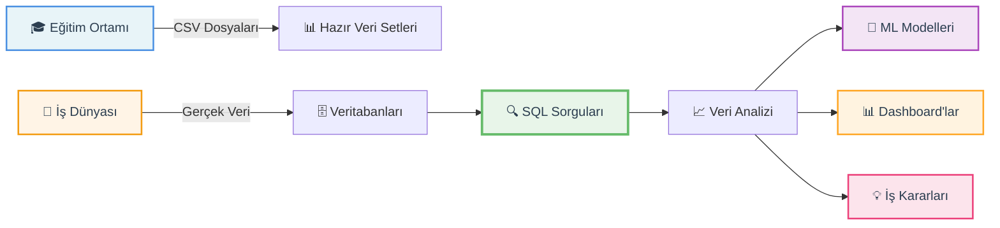
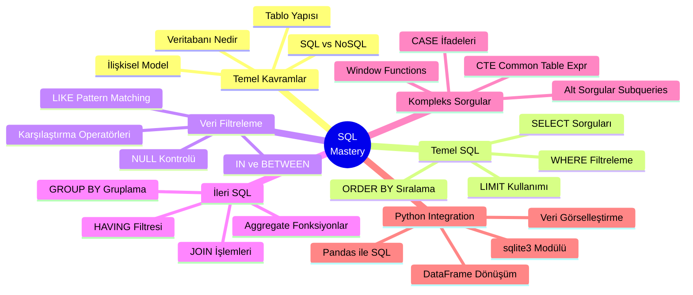
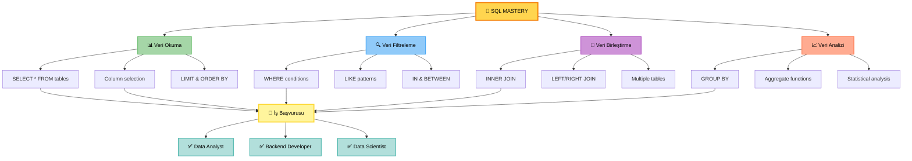
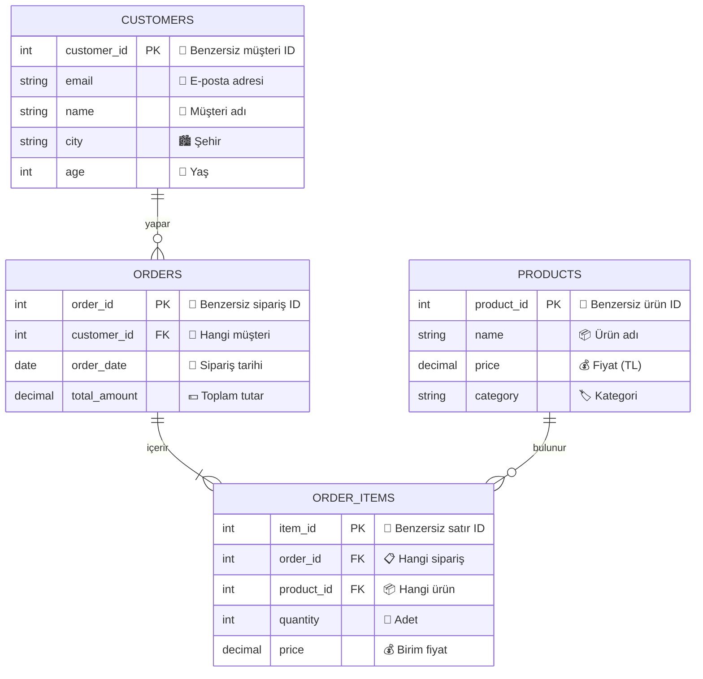
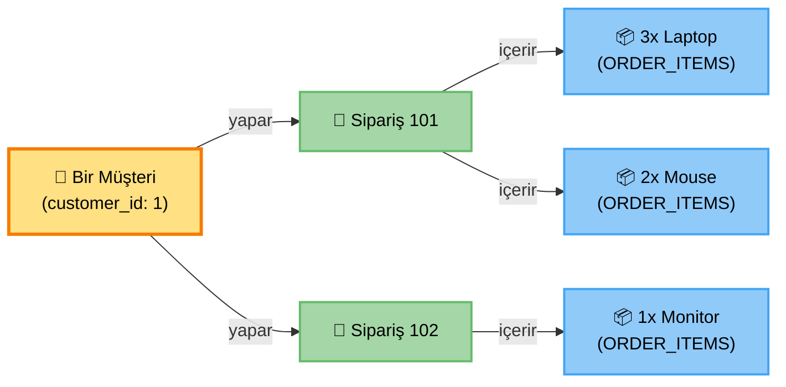
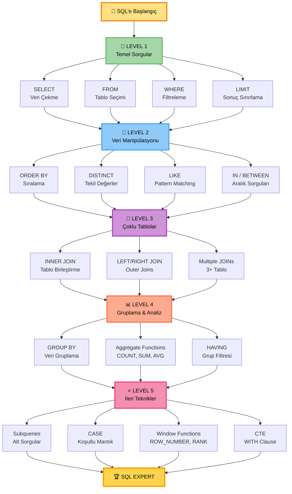
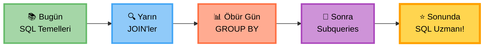

<div align="center">

```
███████╗ ██████╗ ██╗         ███╗   ███╗ █████╗ ███████╗████████╗███████╗██████╗ ██╗   ██╗
██╔════╝██╔═══██╗██║         ████╗ ████║██╔══██╗██╔════╝╚══██╔══╝██╔════╝██╔══██╗╚██╗ ██╔╝
███████╗██║   ██║██║         ██╔████╔██║███████║███████╗   ██║   █████╗  ██████╔╝ ╚████╔╝ 
╚════██║██║▄▄ ██║██║         ██║╚██╔╝██║██╔══██║╚════██║   ██║   ██╔══╝  ██╔══██╗  ╚██╔╝  
███████║╚██████╔╝███████╗    ██║ ╚═╝ ██║██║  ██║███████║   ██║   ███████╗██║  ██║   ██║   
╚══════╝ ╚══▀▀═╝ ╚══════╝    ╚═╝     ╚═╝╚═╝  ╚═╝╚══════╝   ╚═╝   ╚══════╝╚═╝  ╚═╝   ╚═╝   
```

# 🎓 SQL'e Giriş: YBS için Kapsamlı Veritabanı Eğitimi

### *Veriden Anlam Çıkarmanın İlk Adımı* 

<br>

[](https://www.sqlite.org/)
[](https://www.python.org/)
[](https://jupyter.org/)
[](https://github.com)
[](LICENSE)

<br>

### 💫 **Proje Hakkında**

Bu proje, **Veri Bilimi ve Makine Öğrenmesi 2026 - 100 Günlük Bootcamp** programının 13. gününde hazırlanmış, 
**YBS** öğrencileri ve veri bilimi meraklıları için SQL'in temellerinden 
ileri seviye sorgularına kadar kapsamlı bir öğrenme deneyimi sunar.

Gerçek dünya senaryolarıyla zenginleştirilmiş, e-ticaret örneği üzerinden SQL'in gücünü keşfedeceksiniz! 🚀

<br>

</div>

---

## 🎯 **Neden Bu Proje Önemli?**



<div align="center">

### 🌟 **Öğrenme Yolculuğunuz**

| 📚 **Başlangıç** | 🎯 **Temel** | 🚀 **İleri** | ⭐ **Uzman** |
|:---:|:---:|:---:|:---:|
| Veritabanı Nedir? | SELECT, WHERE | JOIN, GROUP BY | Subqueries, CTEs |
| SQL vs NoSQL | LIMIT, ORDER BY | HAVING, Aggregates | Window Functions |
| Tablo Yapısı | Filtreleme | Çoklu Tablolar | Optimizasyon |

</div>

---

## ✨ **Proje Özellikleri**

<table>
<tr>
<td width="50%" valign="top">

### 🎨 **Görsel ve Etkileşimli**
- ✅ Renkli ve modern notebook tasarımı
- ✅ Her konu için flashcard'lar
- ✅ Mermaid diyagramları ile görselleştirme
- ✅ Adım adım ilerleyen yapı

</td>
<td width="50%" valign="top">

### 🏆 **Gerçek Dünya Senaryoları**
- ✅ E-ticaret veritabanı örneği
- ✅ 4 tablolu ilişkisel yapı
- ✅ Pratik SQL soruları
- ✅ YBS odaklı yaklaşım

</td>
</tr>
<tr>
<td width="50%" valign="top">

### 📊 **Kapsamlı İçerik**
- ✅ 177 code cell & markdown
- ✅ 2800+ satır eğitim materyali
- ✅ Temel → İleri SQL komutları
- ✅ Python-SQL entegrasyonu

</td>
<td width="50%" valign="top">

### 🎓 **Kolay Öğrenme**
- ✅ Sıfırdan başlayanlar için uygun
- ✅ Her adım detaylı açıklanmış
- ✅ Kod örnekleri ile pekiştirme
- ✅ Anında çalıştırılabilir

</td>
</tr>
</table>

---

<div align="center">

### 📅 **Proje Bilgileri**

**Hazırlayan:** Veri Bilimi & Makine Öğrenmesi Bootcamp Ekibi  
**Tarih:** 18 Ocak 2026  
**Gün:** Day 13 - SQL Temelleri  
**Seviye:** Başlangıç → İleri

<br>

**🔥 Hemen başlamak için aşağı kaydırın! 👇**

</div>

---

## 📑 **İçindekiler**

<div align="center">

### 🗺️ **Hızlı Navigasyon Menüsü**

</div>

<table>
<tr>
<td width="50%" valign="top">

#### 📖 **Temel Bölümler**
- [🎯 Neden Bu Proje Önemli?](#-neden-bu-proje-önemli)
- [✨ Proje Özellikleri](#-proje-özellikleri)
- [💡 Ne Öğreneceğim?](#-ne-öğreneceğim)
- [🎓 Öğrenme Hedefleri](#-öğrenme-hedefleri)
- [📊 Veritabanı Şeması](#-veritabanı-şeması-e-ticaret-sistemi)
- [🗺️ SQL Öğrenme Yol Haritası](#️-sql-öğrenme-yol-haritası)

</td>
<td width="50%" valign="top">

#### 🚀 **Başlangıç ve Referans**
- [⚙️ Kurulum ve Gereksinimler](#️-kurulum-ve-gereksinimler)
- [🎬 Hızlı Başlangıç](#-hızlı-başlangıç)
- [📚 SQL Komutları Referansı](#-sql-komutları-referansı)
- [💻 Notebook İçeriği](#-notebook-içeriği)
- [🤝 Katkıda Bulunma](#-katkıda-bulunma)
- [📞 İletişim](#-iletişim)

</td>
</tr>
</table>

---

## 💡 **Ne Öğreneceğim?**

<div align="center">



</div>

<br>

<table>
<tr>
<td width="33%" align="center" valign="top">

### 🌱 **Başlangıç Seviyesi**


**Öğreneceğiniz Konular:**
- ✅ Veritabanı temel kavramları
- ✅ SQL söz dizimi (syntax)
- ✅ SELECT, FROM, WHERE
- ✅ Basit sorgular yazma
- ✅ Python ile bağlantı

**Süre:** ~2 saat  
**Ön Koşul:** Yok

</td>
<td width="33%" align="center" valign="top">

### 🎯 **Orta Seviye**


**Öğreneceğiniz Konular:**
- ✅ JOIN ile tablo birleştirme
- ✅ GROUP BY ile gruplama
- ✅ Aggregate fonksiyonlar
- ✅ Alt sorgular (Subqueries)
- ✅ CASE ifadeleri

**Süre:** ~3 saat  
**Ön Koşul:** Temel SQL

</td>
<td width="33%" align="center" valign="top">

### 🚀 **İleri Seviye**


**Öğreneceğiniz Konular:**
- ✅ Window functions
- ✅ CTE (WITH clause)
- ✅ Kompleks JOIN'ler
- ✅ Query optimization
- ✅ Best practices

**Süre:** ~2 saat  
**Ön Koşul:** Orta SQL

</td>
</tr>
</table>

<div align="center">

### 🎯 **Hedef Kitle**

</div>

<table>
<tr>
<td width="25%" align="center">

### 🎓
**YBS Öğrencileri**

Veritabanı dersleri için pratik yapanlar

</td>
<td width="25%" align="center">

### 📊
**Veri Analistleri**

SQL becerisini geliştirmek isteyenler

</td>
<td width="25%" align="center">

### 💻
**Yazılımcılar**

Backend ve veritabanı öğrenenler

</td>
<td width="25%" align="center">

### 🤖
**Data Scientists**

ML için veri çekmeyi öğrenenler

</td>
</tr>
</table>

---

## 🎓 **Öğrenme Hedefleri**

<div align="center">


<br>

<table>
<tr>
<td width="50%" valign="top">

### 💎 **Teknik Beceriler**

<table>
<tr>
<td bgcolor="#E8F5E9" style="padding: 15px; border-radius: 8px;">

**🔹 SQL Temel Komutları**
- ✨ `SELECT`, `FROM`, `WHERE` ile veri çekme
- ✨ `ORDER BY` ile sıralama
- ✨ `LIMIT` ile sonuç sayısı kontrolü
- ✨ `DISTINCT` ile tekil değerler

</td>
</tr>
<tr>
<td bgcolor="#FFF3E0" style="padding: 15px; border-radius: 8px;">

**🔹 Veri Filtreleme Uzmanlığı**
- ✨ Karşılaştırma operatörleri (`=`, `>`, `<`, `!=`)
- ✨ Mantıksal operatörler (`AND`, `OR`, `NOT`)
- ✨ `LIKE` ile pattern matching
- ✨ `IN`, `BETWEEN`, `IS NULL` kullanımı

</td>
</tr>
<tr>
<td bgcolor="#F3E5F5" style="padding: 15px; border-radius: 8px;">

**🔹 İlişkisel Veritabanı**
- ✨ `INNER JOIN` ile tablo birleştirme
- ✨ `LEFT JOIN`, `RIGHT JOIN` kavramları
- ✨ Foreign Key ilişkileri
- ✨ Çoklu tablo sorguları

</td>
</tr>
<tr>
<td bgcolor="#E1F5FE" style="padding: 15px; border-radius: 8px;">

**🔹 Veri Gruplama ve Aggregation**
- ✨ `GROUP BY` ile veri gruplama
- ✨ `COUNT()`, `SUM()`, `AVG()`, `MIN()`, `MAX()`
- ✨ `HAVING` ile grup filtresi
- ✨ İstatistiksel sorgular

</td>
</tr>
</table>

</td>
<td width="50%" valign="top">

### 🎯 **Uygulama Becerileri**

<table>
<tr>
<td bgcolor="#FCE4EC" style="padding: 15px; border-radius: 8px;">

**🔹 Python-SQL Entegrasyonu**
- ✨ `sqlite3` modülü ile bağlantı
- ✨ Cursor objesi kullanımı
- ✨ Parametreli sorgular (SQL injection güvenliği)
- ✨ Pandas DataFrame'e dönüştürme

</td>
</tr>
<tr>
<td bgcolor="#E8EAF6" style="padding: 15px; border-radius: 8px;">

**🔹 Gerçek Dünya Senaryoları**
- ✨ E-ticaret veri analizi
- ✨ Müşteri segmentasyonu
- ✨ Satış raporları oluşturma
- ✨ Stok takibi sorguları

</td>
</tr>
<tr>
<td bgcolor="#FFF9C4" style="padding: 15px; border-radius: 8px;">

**🔹 İleri SQL Teknikleri**
- ✨ Alt sorgular (Subqueries)
- ✨ `CASE` ile koşullu mantık
- ✨ Window functions (`ROW_NUMBER`, `RANK`)
- ✨ CTE (Common Table Expressions)

</td>
</tr>
<tr>
<td bgcolor="#E0F2F1" style="padding: 15px; border-radius: 8px;">

**🔹 Best Practices**
- ✨ Okunabilir sorgu yazma
- ✨ Query optimization teknikleri
- ✨ Index kullanımı
- ✨ Performans iyileştirme

</td>
</tr>
</table>

</td>
</tr>
</table>

---

### 🌈 **Öğrenme Çıktıları (Learning Outcomes)**

<div align="center">



</div>

<br>

<div align="center">

| 🎯 **Öğrenme Alanı** | 📝 **Kazanım** | 💼 **Gerçek Hayat Uygulaması** |
|:---|:---|:---|
| **SQL Temelleri** | Veritabanlarından veri çekebilme | Şirket CRM sisteminden müşteri listesi çekme |
| **Filtreleme** | Koşullu sorgular yazabilme | "İstanbul'dan son 30 günde alışveriş yapan müşteriler" |
| **JOIN İşlemleri** | Çoklu tabloları birleştirebilme | Müşteri + Sipariş + Ürün verilerini birleştirme |
| **Gruplama** | İstatistiksel analizler yapabilme | Aylık satış raporları, kategori bazlı analizler |
| **Alt Sorgular** | Karmaşık sorgular yazabilme | "En çok satan ürünü alan müşteriler" gibi sorgular |
| **Python-SQL** | Programlama ile entegrasyon | Otomatik raporlama, ML için veri hazırlama |

</div>

---

## 📊 **Veritabanı Şeması: E-Ticaret Sistemi**

<div align="center">

### 🗄️ **İlişkisel Veritabanı Yapımız**

Bu projede gerçek bir **e-ticaret sistemi veritabanı** kullanıyoruz. 4 ana tablo ve aralarındaki ilişkiler ile profesyonel bir yapı deneyimleyeceksiniz!

</div>

<br>



<br>

### 🔍 **Tablolar ve İlişkiler Detayı**

<table>
<tr>
<td width="50%" valign="top">

#### 👥 **CUSTOMERS (Müşteriler)**

<table>
<tr bgcolor="#E8F5E9">
<td><strong>📋 Kolon</strong></td>
<td><strong>🏷️ Tip</strong></td>
<td><strong>📝 Açıklama</strong></td>
</tr>
<tr>
<td><code>customer_id</code></td>
<td>INTEGER</td>
<td>🔑 Primary Key - Otomatik artan</td>
</tr>
<tr>
<td><code>email</code></td>
<td>TEXT</td>
<td>📧 Benzersiz e-posta adresi</td>
</tr>
<tr>
<td><code>name</code></td>
<td>TEXT</td>
<td>👤 Müşteri adı soyadı</td>
</tr>
<tr>
<td><code>city</code></td>
<td>TEXT</td>
<td>🏙️ Yaşadığı şehir</td>
</tr>
<tr>
<td><code>age</code></td>
<td>INTEGER</td>
<td>🎂 Müşteri yaşı</td>
</tr>
</table>

**💡 Kullanım Alanları:**
- Müşteri segmentasyonu (yaş, şehir bazlı)
- E-posta kampanyaları için liste
- Demografik analizler

<br>

#### 📦 **PRODUCTS (Ürünler)**

<table>
<tr bgcolor="#FFF3E0">
<td><strong>📋 Kolon</strong></td>
<td><strong>🏷️ Tip</strong></td>
<td><strong>📝 Açıklama</strong></td>
</tr>
<tr>
<td><code>product_id</code></td>
<td>INTEGER</td>
<td>🔑 Primary Key - Otomatik artan</td>
</tr>
<tr>
<td><code>name</code></td>
<td>TEXT</td>
<td>📦 Ürün ismi</td>
</tr>
<tr>
<td><code>price</code></td>
<td>REAL</td>
<td>💰 Satış fiyatı (TL)</td>
</tr>
<tr>
<td><code>category</code></td>
<td>TEXT</td>
<td>🏷️ Ürün kategorisi</td>
</tr>
</table>

**💡 Kullanım Alanları:**
- Kategori bazlı satış analizleri
- Fiyat karşılaştırmaları
- Stok takibi ve raporlama

</td>
<td width="50%" valign="top">

#### 🛒 **ORDERS (Siparişler)**

<table>
<tr bgcolor="#F3E5F5">
<td><strong>📋 Kolon</strong></td>
<td><strong>🏷️ Tip</strong></td>
<td><strong>📝 Açıklama</strong></td>
</tr>
<tr>
<td><code>order_id</code></td>
<td>INTEGER</td>
<td>🔑 Primary Key - Otomatik artan</td>
</tr>
<tr>
<td><code>customer_id</code></td>
<td>INTEGER</td>
<td>🔗 Foreign Key → CUSTOMERS</td>
</tr>
<tr>
<td><code>order_date</code></td>
<td>DATE</td>
<td>📅 Sipariş tarihi (YYYY-MM-DD)</td>
</tr>
<tr>
<td><code>total_amount</code></td>
<td>REAL</td>
<td>💵 Toplam sipariş tutarı</td>
</tr>
</table>

**💡 Kullanım Alanları:**
- Günlük/Aylık satış raporları
- Müşteri başına ortalama sipariş değeri
- Zaman serisi analizleri

<br>

#### 📋 **ORDER_ITEMS (Sipariş Kalemleri)**

<table>
<tr bgcolor="#E1F5FE">
<td><strong>📋 Kolon</strong></td>
<td><strong>🏷️ Tip</strong></td>
<td><strong>📝 Açıklama</strong></td>
</tr>
<tr>
<td><code>item_id</code></td>
<td>INTEGER</td>
<td>🔑 Primary Key - Otomatik artan</td>
</tr>
<tr>
<td><code>order_id</code></td>
<td>INTEGER</td>
<td>🔗 Foreign Key → ORDERS</td>
</tr>
<tr>
<td><code>product_id</code></td>
<td>INTEGER</td>
<td>🔗 Foreign Key → PRODUCTS</td>
</tr>
<tr>
<td><code>quantity</code></td>
<td>INTEGER</td>
<td>🔢 Ürün adedi</td>
</tr>
<tr>
<td><code>price</code></td>
<td>REAL</td>
<td>💰 O anki birim fiyat</td>
</tr>
</table>

**💡 Kullanım Alanları:**
- Ürün bazlı satış istatistikleri
- Çapraz satış (cross-sell) analizleri
- Sepet analizi

</td>
</tr>
</table>

---

### 🔗 **İlişkisel Yapının Mantığı**

<div align="center">



</div>

<br>

<table>
<tr>
<td width="33%" align="center" bgcolor="#E8F5E9" style="padding: 20px; border-radius: 10px;">

### 🔑 **Primary Key (PK)**

**Benzersiz tanımlayıcı**

Her satırı **unique** olarak tanımlar. NULL olamaz, tekrarlanamaz.

**Örnekler:**
- `customer_id`
- `product_id`
- `order_id`

</td>
<td width="33%" align="center" bgcolor="#FFF3E0" style="padding: 20px; border-radius: 10px;">

### 🔗 **Foreign Key (FK)**

**Başka tabloya referans**

Bir tablonun, başka bir tablonun PK'sını referans etmesi. **İlişki** kurar.

**Örnekler:**
- `ORDERS.customer_id` → `CUSTOMERS.customer_id`
- `ORDER_ITEMS.product_id` → `PRODUCTS.product_id`

</td>
<td width="33%" align="center" bgcolor="#F3E5F5" style="padding: 20px; border-radius: 10px;">

### 🎯 **İlişki Tipleri**

**Tablolar arası bağlantı**

- **1:N** (One-to-Many): Bir müşteri → Çok sipariş
- **N:M** (Many-to-Many): ORDER_ITEMS ile çözülür

**Avantajı:**
Veri tekrarı yok, tutarlılık var!

</td>
</tr>
</table>

---

### 📝 **Örnek Veri Yapısı**

<div align="center">

**Veritabanımızda şu verileri bulacaksınız:**

| 📊 **Tablo** | 🔢 **Kayıt Sayısı** | 📝 **İçerik** |
|:---:|:---:|:---|
| **CUSTOMERS** | ~50 müşteri | İstanbul, Ankara, İzmir'den çeşitli yaş grupları |
| **PRODUCTS** | ~30 ürün | Elektronik, Giyim, Ev & Yaşam kategorilerinde |
| **ORDERS** | ~200 sipariş | 2024-2026 tarihleri arasında |
| **ORDER_ITEMS** | ~500 satır | Her siparişteki ürün detayları |

</div>

---

## 🗺️ **SQL Öğrenme Yol Haritası**

<div align="center">

### 🚀 **Başlangıçtan Uzmanlığa SQL Yolculuğu**

</div>



---

## 💻 **Notebook İçeriği**

<div align="center">

### 📚 **Konu Başlıkları ve Ne Öğreneceğiniz**

Bu notebook'ta **177 hücre** ve **2800+ satır** eğitim materyali bulacaksınız!

</div>

<br>

### 🌱 **Bölüm 1: SQL'e Giriş ve Temel Kavramlar**

<table>
<tr>
<td width="50%" valign="top" bgcolor="#E8F5E9" style="padding: 20px;">

#### 📖 **Teorik Bilgiler**
- ✅ SQL nedir, neden öğrenmeli?
- ✅ Veritabanı türleri (SQL vs NoSQL)
- ✅ İlişkisel veritabanı mantığı
- ✅ Tablo, satır, sütun kavramları
- ✅ Primary Key & Foreign Key
- ✅ SQLite özellikleri

**📊 İçerik:**
- Renkli açıklayıcı kutular
- Mermaid diyagramları
- Flashcard'lar
- YBS senaryoları

</td>
<td width="50%" valign="top" bgcolor="#E8F5E9" style="padding: 20px;">

#### 💻 **Pratik Uygulamalar**
```python
import sqlite3
import pandas as pd

# Veritabanı bağlantısı
conn = sqlite3.connect('eticaret_ybs.db')
cursor = conn.cursor()

# İlk sorgumuz
cursor.execute("SELECT * FROM customers")
```

**🎯 Çıktılar:**
- Veritabanı oluşturma
- 4 tablo yapısı kurma
- Python ile bağlantı
- İlk veri ekleme

</td>
</tr>
</table>

---

### 🎯 **Bölüm 2: SELECT - Veri Çekmenin Temelleri**

<table>
<tr>
<td width="50%" valign="top" bgcolor="#FFF3E0" style="padding: 20px;">

#### 📌 **SELECT Komutu**

**Söz Dizimi:**
```sql
SELECT column1, column2, ...
FROM table_name;
```

**Öğreneceğiniz Varyasyonlar:**
- ✨ `SELECT *` - Tüm kolonlar
- ✨ `SELECT name, email` - Belirli kolonlar
- ✨ `SELECT DISTINCT city` - Tekil değerler
- ✨ `SELECT COUNT(*)` - Satır sayısı

**🎯 Pratik Örnekler:**
- Tüm müşterileri listele
- Sadece isim ve email çek
- Kaç farklı şehir var?
- Ürün sayısını bul

</td>
<td width="50%" valign="top" bgcolor="#FFF3E0" style="padding: 20px;">

#### 💡 **Gerçek Senaryolar**

**Senaryo 1: Müşteri Listesi**
```sql
SELECT name, email, city 
FROM customers;
```
*Pazarlama ekibi için müşteri listesi*

**Senaryo 2: Ürün Kataloğu**
```sql
SELECT name, price, category 
FROM products;
```
*Web sitesi için ürün gösterimi*

**Senaryo 3: Aktif Şehirler**
```sql
SELECT DISTINCT city 
FROM customers;
```
*Lojistik planlama için şehir listesi*

</td>
</tr>
</table>

---

### 🔍 **Bölüm 3: WHERE - Veri Filtreleme**

<table>
<tr>
<td width="50%" valign="top" bgcolor="#F3E5F5" style="padding: 20px;">

#### 🎯 **WHERE Operatörleri**

**Karşılaştırma:**
- `=` Eşittir
- `>` Büyüktür
- `<` Küçüktür
- `>=` Büyük eşit
- `<=` Küçük eşit
- `!=` veya `<>` Eşit değil

**Mantıksal:**
- `AND` - Her iki koşul da doğru
- `OR` - En az biri doğru
- `NOT` - Değil

**Özel:**
- `LIKE` - Pattern matching
- `IN` - Liste içinde
- `BETWEEN` - Aralık
- `IS NULL` - Boş değer

</td>
<td width="50%" valign="top" bgcolor="#F3E5F5" style="padding: 20px;">

#### 💻 **Örnek Sorgular**

```sql
-- Yaşı 30'dan büyük müşteriler
SELECT * FROM customers 
WHERE age > 30;

-- İstanbul'dan müşteriler
SELECT * FROM customers 
WHERE city = 'İstanbul';

-- Fiyatı 1000-5000 TL arası ürünler
SELECT * FROM products 
WHERE price BETWEEN 1000 AND 5000;

-- E-mail'i gmail olan müşteriler
SELECT * FROM customers 
WHERE email LIKE '%@gmail.com';

-- Elektronik veya Giyim kategorisi
SELECT * FROM products 
WHERE category IN ('Elektronik', 'Giyim');
```

</td>
</tr>
</table>

---

### 🔗 **Bölüm 4: JOIN - Tabloları Birleştirme**

<table>
<tr>
<td width="50%" valign="top" bgcolor="#E1F5FE" style="padding: 20px;">

#### 🔗 **JOIN Türleri**

**INNER JOIN**
```sql
SELECT * FROM orders
INNER JOIN customers 
ON orders.customer_id = customers.customer_id;
```
*Her iki tabloda da eşleşme olanlar*

**LEFT JOIN**
```sql
SELECT * FROM customers
LEFT JOIN orders 
ON customers.customer_id = orders.customer_id;
```
*Sol tablodaki tüm kayıtlar + eşleşenler*

**Çoklu JOIN**
```sql
SELECT c.name, o.order_date, p.name
FROM customers c
JOIN orders o ON c.customer_id = o.customer_id
JOIN order_items oi ON o.order_id = oi.order_id
JOIN products p ON oi.product_id = p.product_id;
```

</td>
<td width="50%" valign="top" bgcolor="#E1F5FE" style="padding: 20px;">

#### 🎯 **JOIN Senaryoları**

**Senaryo 1: Müşteri Siparişleri**
```sql
-- Hangi müşteri hangi siparişi vermiş?
SELECT 
    c.name AS musteri_adi,
    o.order_date AS siparis_tarihi,
    o.total_amount AS tutar
FROM customers c
INNER JOIN orders o 
ON c.customer_id = o.customer_id;
```

**Senaryo 2: Siparişteki Ürünler**
```sql
-- Sipariş 101'de hangi ürünler var?
SELECT 
    p.name AS urun,
    oi.quantity AS adet,
    oi.price AS fiyat
FROM order_items oi
JOIN products p 
ON oi.product_id = p.product_id
WHERE oi.order_id = 101;
```

</td>
</tr>
</table>

---

### 📊 **Bölüm 5: GROUP BY ve Aggregate Fonksiyonlar**

<table>
<tr>
<td width="50%" valign="top" bgcolor="#FCE4EC" style="padding: 20px;">

#### 📈 **Aggregate Fonksiyonlar**

**Temel Fonksiyonlar:**
- `COUNT()` - Satır sayısı
- `SUM()` - Toplam
- `AVG()` - Ortalama
- `MIN()` - En küçük
- `MAX()` - En büyük

**GROUP BY Kullanımı:**
```sql
SELECT 
    category,
    COUNT(*) AS urun_sayisi,
    AVG(price) AS ort_fiyat
FROM products
GROUP BY category;
```

**HAVING ile Filtreleme:**
```sql
SELECT city, COUNT(*) AS musteri_sayisi
FROM customers
GROUP BY city
HAVING COUNT(*) > 5;
```

</td>
<td width="50%" valign="top" bgcolor="#FCE4EC" style="padding: 20px;">

#### 💼 **İş Analizi Örnekleri**

**Kategori Bazlı Satış Analizi:**
```sql
SELECT 
    p.category,
    COUNT(*) AS satis_adedi,
    SUM(oi.quantity * oi.price) AS toplam_gelir,
    AVG(oi.price) AS ort_fiyat
FROM order_items oi
JOIN products p ON oi.product_id = p.product_id
GROUP BY p.category
ORDER BY toplam_gelir DESC;
```

**Şehir Bazlı Müşteri Dağılımı:**
```sql
SELECT 
    city,
    COUNT(*) AS musteri_sayisi,
    AVG(age) AS ort_yas
FROM customers
GROUP BY city
ORDER BY musteri_sayisi DESC;
```

</td>
</tr>
</table>

---

### ⭐ **Bölüm 6: İleri SQL Teknikleri**

<table>
<tr>
<td width="50%" valign="top" bgcolor="#E8EAF6" style="padding: 20px;">

#### 🚀 **Subqueries (Alt Sorgular)**

```sql
-- Ortalama sipariş tutarından yüksek siparişler
SELECT * FROM orders
WHERE total_amount > (
    SELECT AVG(total_amount) 
    FROM orders
);

-- En çok satılan ürünü alan müşteriler
SELECT name FROM customers
WHERE customer_id IN (
    SELECT DISTINCT customer_id 
    FROM orders o
    JOIN order_items oi ON o.order_id = oi.order_id
    WHERE oi.product_id = (
        SELECT product_id 
        FROM order_items 
        GROUP BY product_id 
        ORDER BY SUM(quantity) DESC 
        LIMIT 1
    )
);
```

</td>
<td width="50%" valign="top" bgcolor="#E8EAF6" style="padding: 20px;">

#### 💎 **CASE İfadeleri**

```sql
-- Müşterileri yaşa göre kategorize et
SELECT 
    name,
    age,
    CASE 
        WHEN age < 25 THEN 'Genç'
        WHEN age BETWEEN 25 AND 45 THEN 'Orta Yaş'
        ELSE 'Kıdemli'
    END AS yas_grubu
FROM customers;

-- Ürünleri fiyata göre etiketle
SELECT 
    name,
    price,
    CASE 
        WHEN price < 1000 THEN 'Ekonomik'
        WHEN price BETWEEN 1000 AND 5000 THEN 'Orta'
        ELSE 'Premium'
    END AS fiyat_segmenti
FROM products;
```

</td>
</tr>
</table>

---

## 📚 **SQL Komutları Referansı**

<div align="center">

### 🎯 **Hızlı SQL Komutları Cheat Sheet**

</div>

<table>
<tr>
<td width="50%" valign="top" bgcolor="#E8F5E9" style="padding: 15px;">

### 📊 **Temel Komutlar**

| Komut | Açıklama | Örnek |
|:---|:---|:---|
| `SELECT` | Veri çekme | `SELECT * FROM table` |
| `FROM` | Tablo seçimi | `FROM customers` |
| `WHERE` | Filtreleme | `WHERE age > 25` |
| `ORDER BY` | Sıralama | `ORDER BY name ASC` |
| `LIMIT` | Sonuç sınırı | `LIMIT 10` |
| `DISTINCT` | Tekil değerler | `SELECT DISTINCT city` |

</td>
<td width="50%" valign="top" bgcolor="#FFF3E0" style="padding: 15px;">

### 🔍 **WHERE Operatörleri**

| Operatör | Açıklama | Örnek |
|:---|:---|:---|
| `=` | Eşittir | `city = 'İstanbul'` |
| `>`, `<` | Büyük/Küçük | `age > 30` |
| `>=`, `<=` | Büyük eşit/Küçük eşit | `price >= 1000` |
| `!=`, `<>` | Eşit değil | `status != 'active'` |
| `LIKE` | Pattern | `email LIKE '%@gmail.com'` |
| `IN` | Liste içinde | `city IN ('İstanbul', 'Ankara')` |
| `BETWEEN` | Aralık | `age BETWEEN 25 AND 45` |
| `IS NULL` | Boş kontrol | `phone IS NULL` |

</td>
</tr>
<tr>
<td width="50%" valign="top" bgcolor="#F3E5F5" style="padding: 15px;">

### 🔗 **JOIN Komutları**

| Komut | Açıklama |
|:---|:---|
| `INNER JOIN` | Her iki tabloda eşleşenler |
| `LEFT JOIN` | Sol tablodaki tümü + eşleşenler |
| `RIGHT JOIN` | Sağ tablodaki tümü + eşleşenler |
| `FULL OUTER JOIN` | Her iki tablodaki tümü |

**Söz Dizimi:**
```sql
SELECT * FROM table1
JOIN table2 
ON table1.id = table2.foreign_id;
```

</td>
<td width="50%" valign="top" bgcolor="#E1F5FE" style="padding: 15px;">

### 📈 **Aggregate Fonksiyonlar**

| Fonksiyon | Açıklama | Örnek |
|:---|:---|:---|
| `COUNT()` | Satır sayısı | `COUNT(*)` |
| `SUM()` | Toplam | `SUM(price)` |
| `AVG()` | Ortalama | `AVG(age)` |
| `MIN()` | En küçük | `MIN(price)` |
| `MAX()` | En büyük | `MAX(total_amount)` |

**GROUP BY ile:**
```sql
SELECT category, COUNT(*) 
FROM products 
GROUP BY category;
```

</td>
</tr>
</table>

---

<div align="center">

## 🎯 **SQL Yolculuğunuz Başlıyor!**

### *"Veritabanları, modern dünyanın kalbidir. SQL ise bu kalbin dilini öğrenmektir."*

<br>



<br>

### 🎓 **Bugün SQL Temellerini Attık!**

Tebrikler! 🎉 Bu notebook ile **SQL'in temel taşlarını** öğrendiniz:
- ✅ `SELECT` ve `FROM` ile veri çekmeyi
- ✅ `WHERE` ile filtreleme yapmayı
- ✅ `JOIN` ile tabloları birleştirmeyi
- ✅ `GROUP BY` ile analiz yapmayı

<br>

### 🚀 **Yarın JOIN'ler ile Derinleşeceğiz!**

Bir sonraki adımda:
- 🔗 **INNER JOIN** - İki tablodaki ortak veriler
- 🔗 **LEFT/RIGHT JOIN** - Tüm kayıtları koruyarak birleştirme
- 🔗 **FULL OUTER JOIN** - Her şeyi bir arada görme
- 🔗 **SELF JOIN** - Tablonun kendisiyle birleşmesi
- 🔗 **Çoklu JOIN** - 3+ tablo ile kompleks sorgular

<br>

### 💪 **Motive Olun!**

> *"Bugün attığınız her adım, yarın yazacağınız karmaşık sorgular için bir temeldir."*

**İlk adımı attınız!** SQL dünyasında yolculuğa başladınız. 
- 📊 Veri analisti olma yolunda
- 💼 Backend developer olarak
- 🤖 Data scientist kariyerinde

**SQL, kapılarınızı açan anahtar!** 🔑

---

### 📅 **Day 13 Tamamlandı! ✅**

**Veri Bilimi ve Makine Öğrenmesi 2026 - 100 Günlük Bootcamp**

📍 **Bugün:** SQL Temellerini Öğrendik  
📍 **Yarın:** JOIN İşlemleri ve İleri Sorgular  
📍 **Hedef:** SQL Mastery! 🎯

<br>

**🔥 Hadi, bir sonraki günde görüşelim!**  
**Happy Querying! 🚀**

</div>

---


**© 2026 Veri Bilimi & Makine Öğrenmesi Bootcamp**  
**Day 13 - SQL Temelleri ve İleri Sorgular**

<br>

*"Veriden Anlam Çıkarmanın İlk Adımı"* 💫

---

**🎯 SELECT success FROM learning WHERE topic = 'SQL';** ✨

---

</div>
