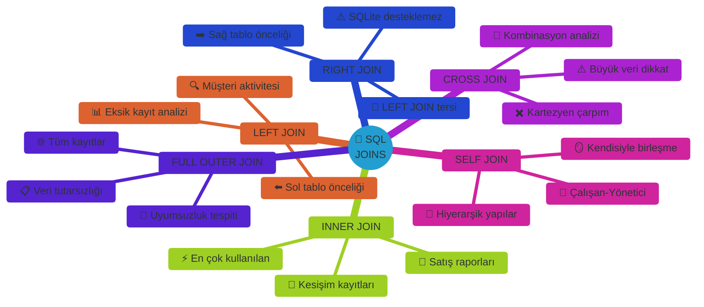
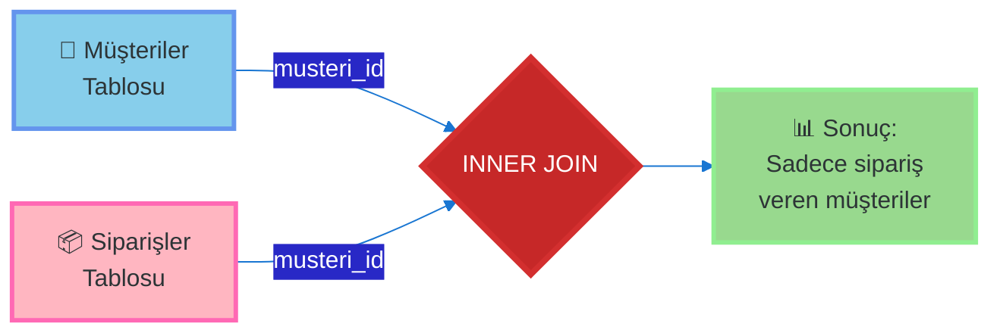
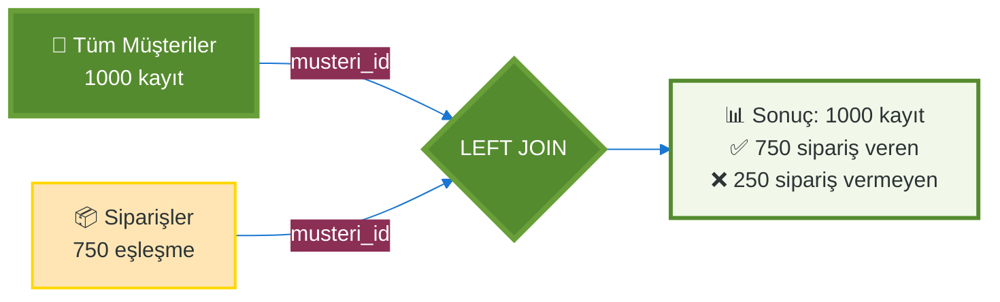
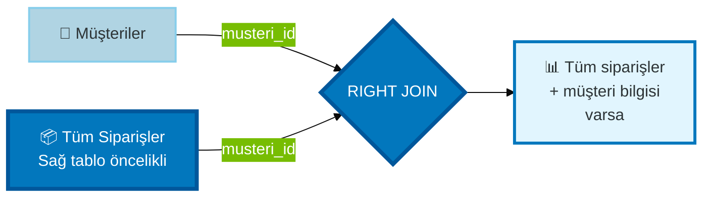
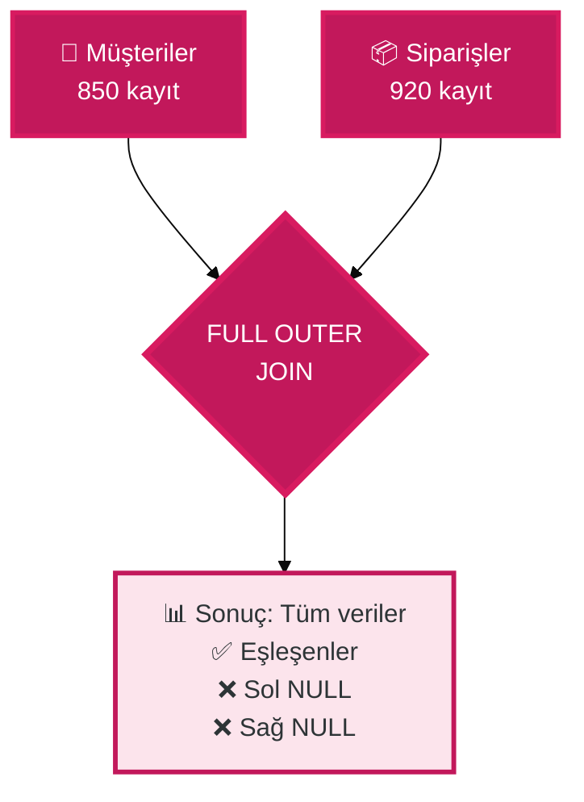
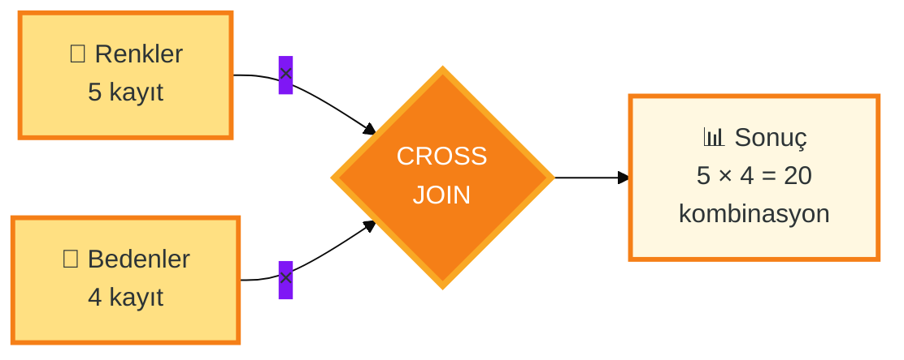
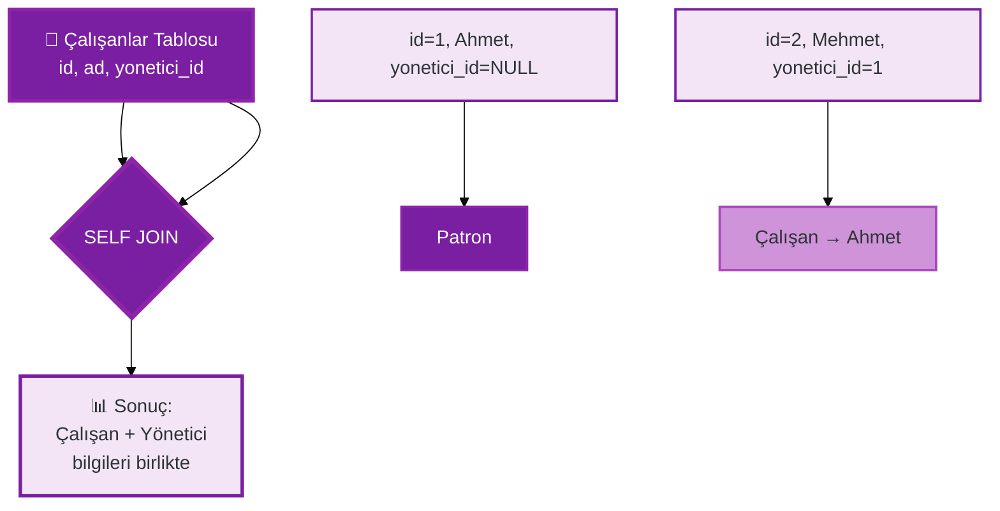
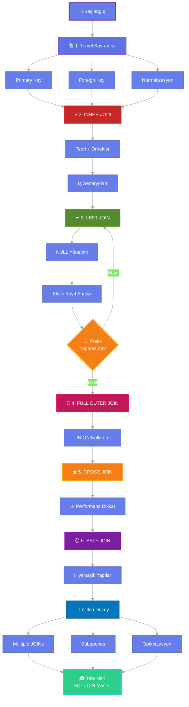

<div align="center">

```text
    ███████╗ ██████╗ ██╗              ██╗ ██████╗ ██╗███╗   ██╗███████╗
    ██╔════╝██╔═══██╗██║         ██  ██║██╔═══██╗██║████╗  ██║██╔════╝
    ███████╗██║   ██║██║         ╚█████╔╝██║   ██║██║██╔██╗ ██║███████╗
    ╚════██║██║▄▄ ██║██║          ╚═══██╗██║   ██║██║██║╚██╗██║╚════██║
    ███████║╚██████╔╝███████╗         ██║╚██████╔╝██║██║ ╚████║███████║
    ╚══════╝ ╚══▀▀═╝ ╚══════╝         ╚═╝ ╚═════╝ ╚═╝╚═╝  ╚═══╝╚══════╝
                                                                        
    ███████╗██████╗  ██████╗ ███╗   ███╗    ███████╗███████╗██████╗  ██████╗ 
    ██╔════╝██╔══██╗██╔═══██╗████╗ ████║    ╚══███╔╝██╔════╝██╔══██╗██╔═══██╗
    █████╗  ██████╔╝██║   ██║██╔████╔██║      ███╔╝ █████╗  ██████╔╝██║   ██║
    ██╔══╝  ██╔══██╗██║   ██║██║╚██╔╝██║     ███╔╝  ██╔══╝  ██╔══██╗██║   ██║
    ██║     ██║  ██║╚██████╔╝██║ ╚═╝ ██║    ███████╗███████╗██║  ██║╚██████╔╝
    ╚═╝     ╚═╝  ╚═╝ ╚═════╝ ╚═╝     ╚═╝    ╚══════╝╚══════╝╚═╝  ╚═╝ ╚═════╝ 
                                                                               
          ████████╗ ██████╗     ██╗  ██╗███████╗██████╗  ██████╗              
          ╚══██╔══╝██╔═══██╗    ██║  ██║██╔════╝██╔══██╗██╔═══██╗             
             ██║   ██║   ██║    ███████║█████╗  ██████╔╝██║   ██║             
             ██║   ██║   ██║    ██╔══██║██╔══╝  ██╔══██╗██║   ██║             
             ██║   ╚██████╔╝    ██║  ██║███████╗██║  ██║╚██████╔╝             
             ╚═╝    ╚═════╝     ╚═╝  ╚═╝╚══════╝╚═╝  ╚═╝ ╚═════╝              
```

### 🎓 YBS Öğrencileri İçin Kapsamlı SQL JOIN Eğitimi

**From Zero to Hero | Görselleştirmeler ile İnteraktif Öğrenme**

---

[](https://python.org)
[](https://sqlite.org)
[](https://pandas.pydata.org)
[](https://jupyter.org)
[](LICENSE)

</div>

---

## 🌟 Genel Bakış

Bu proje, **SQL JOIN işlemlerini** temellerden ileri seviyeye öğretmek için tasarlanmış **kapsamlı bir Jupyter Notebook eğitim materyalidir**. YBS (Yönetim Bilişim Sistemleri) öğrencileri ve veri analizcileri için gerçek iş senaryoları ile zenginleştirilmiş, görsel diyagramlar ve interaktif örnekler içerir.

### 🎯 Neden Bu Eğitim?

<table>
<tr>
<td width="50%" valign="top">

**📚 Eğitim Özellikleri**
- ✅ **6 farklı JOIN türü** detaylı açıklamalar ile
- ✅ **Görsel Venn diyagramları** ve SVG illüstrasyonlar
- ✅ **YBS perspektifiyle** gerçek iş senaryoları
- ✅ **İnteraktif HTML tablolar** ve renkli çıktılar
- ✅ **SQLite3 + Pandas** entegre kullanım
- ✅ **Best practices** ve sık yapılan hatalar

</td>
<td width="50%" valign="top">

**🎓 Öğrenme Çıktıları**
- ✅ Veritabanı normalizasyonu kavramı
- ✅ Primary Key ve Foreign Key ilişkileri
- ✅ Her JOIN türünün kullanım senaryoları
- ✅ SQL sorgu optimizasyonu teknikleri
- ✅ Pandas ile SQL entegrasyonu
- ✅ Gerçek dünya veri analizi becerileri

</td>
</tr>
</table>

### 🎭 6 JOIN Türü

Bu eğitimde öğrenecekleriniz:



---

## 📂 Proje Yapısı

```
day14/
│
├── 📓 sqljoins.ipynb                  # Ana eğitim notebook'u (4560+ satır)
├── 📄 README.md                       # Bu dosya
└── 🗄️ joins_example.db               # SQLite veritabanı (runtime'da oluşur)
```

### 📓 Notebook Yapısı

| Bölüm | İçerik | Hücre Sayısı |
|-------|--------|--------------|
| 🌟 **Giriş** | Motivasyon, JOIN'in önemi, terminoloji | 6 hücre |
| 🛠️ **Ortam Hazırlığı** | Veritabanı oluşturma, örnek veri | 8 hücre |
| ⚡ **INNER JOIN** | Teori, örnekler, iş senaryoları | 10 hücre |
| ⬅️ **LEFT JOIN** | Açıklama, kullanım alanları, pratikler | 8 hücre |
| ➡️ **RIGHT JOIN** | SQLite alternatifi, emülasyon | 6 hücre |
| 🔄 **FULL OUTER JOIN** | Simülasyon, UNION kullanımı | 8 hücre |
| ✖️ **CROSS JOIN** | Kartezyen çarpım, dikkat edilecekler | 6 hücre |
| 🪞 **SELF JOIN** | Hiyerarşik yapılar, recursive sorgular | 8 hücre |
| 🎯 **İleri Düzey** | Multiple joins, subqueries, optimizasyon | 10 hücre |

---

## 🎓 Eğitim Hedefleri

<div align="center">

| 🎯 Hedef | 📝 Açıklama | ✅ Başarı Kriteri |
|----------|-------------|-------------------|
| **JOIN Kavramı** | SQL JOIN'in ne olduğunu ve neden önemli olduğunu anlamak | Normalizasyon ve JOIN ilişkisini açıklayabilme |
| **Tüm JOIN Türleri** | 6 farklı JOIN türünü teorik ve pratik olarak öğrenmek | Her JOIN türü için doğru kullanım senaryosunu belirleme |
| **YBS Perspektifi** | İş dünyasındaki gerçek senaryolarla uygulamalı öğrenme | İş problemi için uygun JOIN stratejisi geliştirebilme |
| **Best Practices** | SQL sorgu optimizasyonu ve yaygın hataları önleme | Performanslı ve okunabilir sorgular yazabilme |
| **Pandas Entegrasyonu** | SQL ve Pandas'ı birlikte kullanma | Veritabanından Pandas'a veri çekip analiz edebilme |

</div>

---

## 📊 JOIN Türleri - Detaylı Açıklama

### ⚡ INNER JOIN

En yaygın kullanılan JOIN türüdür. **Sadece her iki tabloda da eşleşen kayıtları** döndürür.



**💼 Kullanım Senaryoları:**
- Satış raporları (Müşteri + Sipariş)
- Stok analizi (Ürün + Tedarikçi)
- Çalışan departman listesi (Çalışan + Departman)

**🎯 Avantajlar:**
- Sadece ilgili kayıtları getirir
- Performans açısından optimize
- NULL değerlerle uğraşmaya gerek yok

**⚠️ Dezavantajlar:**
- Eşleşmeyen kayıtlar kaybolur
- Eksik veri analizinde kullanılamaz

---

### ⬅️ LEFT JOIN (LEFT OUTER JOIN)

Sol tablodaki **tüm kayıtları** döndürür, sağ tabloda eşleşme varsa ekler, yoksa **NULL** döner.



**💼 Kullanım Senaryoları:**
- Sipariş vermeyen müşterileri bulma
- Satın alma yapmayan ürünleri tespit etme
- Eksik kayıt analizi

**🎯 Avantajlar:**
- Sol tablonun bütünlüğü korunur
- Eksik kayıtları tespit edebilme
- Veri kaybı olmaz

**⚠️ Dikkat:**
- Sağ taraf NULL'lar içerebilir
- NULL kontrolü gerektirir

---

### ➡️ RIGHT JOIN (RIGHT OUTER JOIN)

Sağ tablodaki **tüm kayıtları** döndürür. LEFT JOIN'in tam tersidir.

> **⚠️ ÖNEMLİ NOT:** SQLite **RIGHT JOIN'i desteklemez**. Bu eğitimde LEFT JOIN ile nasıl emüle edileceği gösterilmektedir.



**💡 SQLite'ta Alternatif:**
```sql
-- RIGHT JOIN (desteklenmez)
SELECT * FROM A RIGHT JOIN B ON A.id = B.id

-- LEFT JOIN ile eşdeğer
SELECT * FROM B LEFT JOIN A ON B.id = A.id
```

---

### 🔄 FULL OUTER JOIN

Her iki tablodaki **tüm kayıtları** döndürür. Eşleşmeyen kayıtlar NULL ile doldurulur.



**💼 Kullanım Senaryoları:**
- Veri tutarsızlığı analizi
- Uyumsuz kayıtları bulma
- Veri kalitesi kontrolü

**🎯 SQLite'ta Implementasyon:**
```sql
-- UNION ile simülasyon
SELECT * FROM A LEFT JOIN B ON A.id = B.id
UNION
SELECT * FROM A RIGHT JOIN B ON A.id = B.id
```

> **⚠️ NOT:** SQLite FULL OUTER JOIN'i desteklemez, UNION ile emüle edilir.

---

### ✖️ CROSS JOIN (Kartezyen Çarpım)

Her iki tablonun **her satırını birbirleriyle eşleştirir**. Sonuç = A satır sayısı × B satır sayısı



**💼 Kullanım Senaryoları:**
- Ürün kombinasyonları (renk × beden)
- Takvim tabloları (yıl × ay × gün)
- Test veri setleri oluşturma

**⚠️ DİKKAT EDİLMESİ GEREKENLER:**
- 🚨 Satır sayısı hızla patlar!
- 🚨 1000 × 1000 = 1,000,000 satır
- 🚨 Performans sorunu yaratabilir
- ✅ WHERE ile filtreleyin

---

### 🪞 SELF JOIN

Bir tablo **kendisiyle JOIN** edilir. Hiyerarşik yapılar için idealdir.



**💼 Kullanım Senaryoları:**
- Çalışan-Yönetici ilişkisi
- Ürün kategorileri (ana kategori - alt kategori)
- Organizasyon şemaları
- Aile ağaçları

**🎯 Önemli Nokta:**
- Tablo iki farklı **alias** ile kullanılır (e1, e2)
- Sonsuz döngüden kaçının
- Recursive yapılar için CTE kullanın

---

## 🛠️ Teknoloji Stack

| Teknoloji | Versiyon | Kullanım Amacı |
|-----------|----------|----------------|
| **Python** | 3.8+ | Ana programlama dili |
| **SQLite3** | 3.0+ | Hafif dosya tabanlı veritabanı |
| **Pandas** | 2.0+ | Veri manipülasyonu ve analiz |
| **Jupyter** | Latest | İnteraktif notebook ortamı |
| **Matplotlib** | 3.0+ | (Opsiyonel) Veri görselleştirme |

---

## 🚀 Kurulum ve Çalıştırma

### 📋 Gereksinimler

```bash
# Python 3.8 veya üzeri gereklidir
python --version

# Gerekli kütüphaneler
pip install pandas jupyter notebook
```

> **💡 NOT:** SQLite3 Python'a gömülüdür, ayrıca kurulum gerekmez!

### ▶️ Notebook'u Çalıştırma

1. **Repository'yi klonlayın veya dosyayı indirin**
   ```bash
   cd day14
   ```

2. **Jupyter Notebook'u başlatın**
   ```bash
   jupyter notebook sqljoins.ipynb
   ```

3. **Hücreleri sırayla çalıştırın**
   - `Shift + Enter` ile hücre çalıştırma
   - `Cell > Run All` ile tümünü çalıştırma

### 📁 Veritabanı Oluşturma

Notebook çalıştığında otomatik olarak `joins_example.db` dosyası oluşturulur ve örnek verilerle doldurulur:

- 👥 **Customers** (Müşteriler)
- 📦 **Orders** (Siparişler)
- 🏢 **Employees** (Çalışanlar)
- 📊 **Products** (Ürünler)
- 🎨 **Colors** (Renkler)
- 📐 **Sizes** (Bedenler)

---

## 💼 Gerçek Dünya Kullanım Senaryoları

### 🎯 Senaryo 1: Satış Raporu Oluşturma

**İş İhtiyacı:** Müşteri adı, sipariş tarihi ve ürün bilgilerini içeren satış raporu

**Kullanılan JOIN:**
- Customers ⚡ INNER JOIN Orders
- Orders ⚡ INNER JOIN Products

**Çıktı:** Satış yapan müşteriler, siparişleri ve ürün detayları

---

### 🎯 Senaryo 2: Aktif Olmayan Müşterileri Bulma

**İş İhtiyacı:** Hiç sipariş vermemiş müşterileri pazarlama kampanyası için tespit etme

**Kullanılan JOIN:**
- Customers ⬅️ LEFT JOIN Orders
- WHERE Orders.id IS NULL

**Çıktı:** Sipariş vermeyen müşteri listesi

---

### 🎯 Senaryo 3: Organizasyon Şeması

**İş İhtiyacı:** Her çalışanın kim olduğunu ve yöneticisinin kim olduğunu gösterme

**Kullanılan JOIN:**
- Employees 🪞 SELF JOIN Employees

**Çıktı:** Çalışan - Yönetici eşleşmeleri

---

### 🎯 Senaryo 4: Ürün Varyasyon Matrisi

**İş İhtiyacı:** E-ticaret sitesi için tüm renk-beden kombinasyonlarını oluşturma

**Kullanılan JOIN:**
- Colors ✖️ CROSS JOIN Sizes

**Çıktı:** Tüm olası ürün varyasyonları

---

## 📈 Öğrenme Yol Haritası



---

## 🎯 Best Practices ve İpuçları

### ✅ Yapılması Gerekenler

| 🎯 Kural | 📝 Açıklama |
|----------|-------------|
| **İndeks Kullanın** | JOIN anahtarları üzerinde index oluşturun |
| **Alias Kullanın** | Tablo adlarını kısaltın (t1, t2) |
| **WHERE Filtreleyin** | JOIN öncesi gereksiz satırları filtreleyin |
| **SELECT Spesifik** | `SELECT *` yerine gerekli sütunları belirtin |
| **JOIN Sırası** | Küçük tablolarla başlayın |

### ❌ Yapılmaması Gerekenler

| ⚠️ Hata | 📝 Sonuç |
|---------|----------|
| **CROSS JOIN Kontrolsüz** | Milyonlarca satır üretebilir |
| **NULL Kontrolsüz LEFT JOIN** | Beklenmeyen sonuçlar |
| **İndeks Olmadan Büyük JOIN** | Performans felaketi |
| **Gereksiz FULL OUTER** | Yavaş ve verimsiz |
| **SELF JOIN Sonsuz Döngü** | Stack overflow |

---

## 📚 Ek Kaynaklar

### 📖 Önerilen Okumalar

- [SQLite Official Documentation](https://www.sqlite.org/docs.html)
- [Pandas SQL Integration](https://pandas.pydata.org/docs/reference/api/pandas.read_sql.html)
- [SQL JOIN Visualizer](https://sql-joins.leopard.in.ua/)
- [Database Normalization Guide](https://www.guru99.com/database-normalization.html)

### 🎥 Video Kaynakları

- Khan Academy - SQL Basics
- Coursera - Database Management Essentials
- YouTube - SQL JOIN Tutorial by freeCodeCamp

---

## 🤝 Katkıda Bulunma

Bu eğitim materyali **Veri Bilimi ve Makine Öğrenmesi 2026 - 100 Günlük Bootcamp** programının bir parçasıdır.

### 💡 Önerileriniz

- Hata bulursanız issue açın
- Yeni örnekler eklemek isterseniz pull request gönderin
- Sorularınız için discussions kullanın

---

## 📝 Lisans

Bu proje eğitim amaçlı hazırlanmıştır. Kaynak göstererek kullanabilirsiniz.

---

<div align="center">

### 🎓 İyi Öğrenmeler Dileriz!

**Sorularınız için:** GitHub Discussions  
**Güncellemeler için:** Repository'yi ⭐ işaretleyin

---

**Made with ❤️ by Cemal YÜKSEL for YBS Students**

</div>
