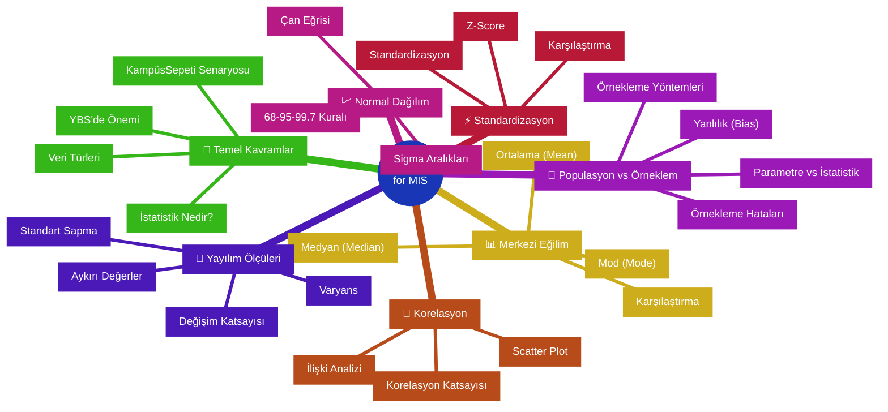
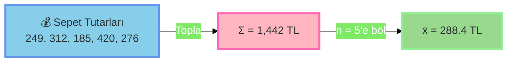

<div align="center">

```text
    ███████╗████████╗ █████╗ ████████╗██╗███████╗████████╗██╗ ██████╗███████╗
    ██╔════╝╚══██╔══╝██╔══██╗╚══██╔══╝██║██╔════╝╚══██╔══╝██║██╔════╝██╔════╝
    ███████╗   ██║   ███████║   ██║   ██║███████╗   ██║   ██║██║     ███████╗
    ╚════██║   ██║   ██╔══██║   ██║   ██║╚════██║   ██║   ██║██║     ╚════██║
    ███████║   ██║   ██║  ██║   ██║   ██║███████║   ██║   ██║╚██████╗███████║
    ╚══════╝   ╚═╝   ╚═╝  ╚═╝   ╚═╝   ╚═╝╚══════╝   ╚═╝   ╚═╝ ╚═════╝╚══════╝
                                                                               
                    ███████╗ ██████╗ ██████╗     ███╗   ███╗██╗███████╗      
                    ██╔════╝██╔═══██╗██╔══██╗    ████╗ ████║██║██╔════╝      
                    █████╗  ██║   ██║██████╔╝    ██╔████╔██║██║███████╗      
                    ██╔══╝  ██║   ██║██╔══██╗    ██║╚██╔╝██║██║╚════██║      
                    ██║     ╚██████╔╝██║  ██║    ██║ ╚═╝ ██║██║███████║      
                    ╚═╝      ╚═════╝ ╚═╝  ╚═╝    ╚═╝     ╚═╝╚═╝╚══════╝      
```

### 🎓 YBS Öğrencileri İçin İstatistiğe Kapsamlı Giriş

**KampüsSepeti E-Ticaret Senaryosu ile From Zero to Hero**

---

[](https://python.org)
[](https://pandas.pydata.org)
[](https://numpy.org)
[](https://matplotlib.org)
[](https://jupyter.org)
[](LICENSE)

</div>

---

## 🌟 Genel Bakış

Bu proje, **İstatistiğin temel kavramlarını** Yönetim Bilişim Sistemleri (YBS) perspektifinden öğrenmek için tasarlanmış **kapsamlı bir Jupyter Notebook eğitim materyalidir**. **KampüsSepeti** adlı gerçekçi bir e-ticaret kampanya senaryosu üzerinden betimsel istatistik, merkezi eğilim ölçüleri, yayılım ölçüleri, normal dağılım, standardizasyon ve korelasyon analizi konularını öğreneceksiniz.

### 🎯 Neden Bu Eğitim?

<table>
<tr>
<td width="50%" valign="top">

**📚 Eğitim Özellikleri**
- ✅ **Gerçek iş senaryosu** ile uygulama
- ✅ **1200 gerçekçi veri** noktası ile çalışma
- ✅ **HTML görselleştirmeleri** ve interaktif kartlar
- ✅ **Mermaid diyagramları** ile kavramsal anlayış
- ✅ **Türkçe + İngilizce** terminoloji
- ✅ **5000+ satır** kapsamlı içerik

</td>
<td width="50%" valign="top">

**🎓 Öğrenme Çıktıları**
- ✅ Betimsel istatistik temellerini kavrama
- ✅ Ortalama, medyan, mod kullanımı
- ✅ Varyans, standart sapma hesaplama
- ✅ Z-Score ve standardizasyon
- ✅ Normal dağılım ve sigma kuralları
- ✅ Korelasyon analizi yapabilme

</td>
</tr>
</table>

### 🎭 Öğrenilecek Konular

Bu eğitimde kapsamlı bir şekilde öğrenecekleriniz:



---

## 📂 Proje Yapısı

```
day15/
│
├── 📓 intro-to-statistic-for-mis.ipynb    # Ana eğitim notebook'u (5079 satır, 80 hücre)
├── 📄 README.md                           # Bu dosya
└── 📊 [Runtime'da oluşan veriler]         # KampüsSepeti veri seti
```

### 📓 Notebook Yapısı ve İçerik

| Bölüm | İçerik | Hücre Sayısı | Satır Aralığı |
|-------|--------|--------------|---------------|
| 🌟 **Giriş** | İstatistik nedir, YBS'de önemi, terminoloji | 11 hücre | 1-425 |
| 🛒 **Senaryo Tanıtımı** | KampüsSepeti e-ticaret kampanyası, veri seti oluşturma | 5 hücre | 426-770 |
| 📊 **Betimsel İstatistik** | Merkezi eğilim kavramları, kullanım alanları | 8 hücre | 771-1469 |
| 1️⃣ **Ortalama (Mean)** | Formül, hesaplama, kullanım, avantaj/dezavantajlar | 3 hücre | 1470-1731 |
| 2️⃣ **Medyan (Median)** | Ortanca değer, aykırı değerlere dayanıklılık | 3 hücre | 1732-2061 |
| 3️⃣ **Mod (Mode)** | En sık değer, kategorik veriler | 3 hücre | 2062-2380 |
| 📏 **Yayılım Ölçüleri** | Varyans, standart sapma, değişim katsayısı | 9 hücre | 2381-2910 |
| 🎲 **Populasyon vs Örneklem** | Parametre, istatistik, örnekleme hataları, bias | 7 hücre | 2911-3438 |
| 📈 **Normal Dağılım** | Gauss dağılımı, 68-95-99.7 kuralı, sigma aralıkları | 8 hücre | 3439-3852 |
| ⚡ **Z-Score** | Standardizasyon, karşılaştırma, outlier tespiti | 7 hücre | 3853-4159 |
| 🔗 **Korelasyon** | İlişki analizi, korelasyon matrisi, scatter plot | 10 hücre | 4160-4803 |
| 📝 **Özet** | Tüm konuların özeti, sonraki adımlar | 4 hücre | 4804-5079 |

---

## 🎯 İstatistik Konuları - Detaylı Açıklama

### 📊 Merkezi Eğilim Ölçüleri (Measures of Central Tendency)

En temel istatistiksel ölçülerdir. Veriyi tek bir "tipik" değerle özetlemeyi hedefler.

#### 1️⃣ **Ortalama (Mean) - Aritmetik Ortalama**

<div align="center">

**Formül:** `μ = Σx / n`

</div>



**💼 Kullanım Alanları:**
- Finansal raporlama (ortalama gelir, satış)
- KPI hesaplama (ortalama müşteri değeri)
- Performans değerlendirme (ortalama işlem süresi)

**⚠️ Dikkat:** Aykırı değerlerden çok etkilenir!

---

#### 2️⃣ **Medyan (Median) - Ortanca Değer**

Verileri sıraladığınızda ortada kalan değer. %50'si altında, %50'si üstünde.

**Nasıl Bulunur?**
1. Verileri küçükten büyüğe sırala
2. **Tek sayı varsa:** Ortadaki değer
3. **Çift sayı varsa:** Ortadaki iki değerin ortalaması

**📌 Örnek:**
- `[10, 20, 30, 40, 50]` → Medyan = **30**
- `[10, 20, 30, 40]` → Medyan = **(20+30)/2 = 25**

**💪 Güçlü Yönü:** Aykırı değerlerden etkilenmez (robust)

**💼 Kullanım Alanları:**
- Gelir analizi (zengin azınlık ortalamayı çeker)
- Emlak fiyatları (birkaç çok pahalı ev var)
- Süreç analizi (aykırı uzun süreler var)

---

#### 3️⃣ **Mod (Mode) - En Sık Görülen Değer**

Veri setinde en fazla tekrar eden değer veya kategori.

**Türleri:**
- **Unimodal:** Tek mod var
- **Bimodal:** İki mod var (eşit sıklıkta)
- **Multimodal:** 3+ mod var
- **Modsuz:** Hiçbiri tekrar etmiyor

**📌 Örnek:** `[10, 20, 20, 30, 20, 40]` → Mod = **20**

**💼 Kullanım Alanları:**
- Kategorik değişkenler (en popüler ödeme yöntemi)
- Ürün analizi (en çok satılan ürün)
- Fiyat psikolojisi (en sık alınan fiyat bandı)
- Stok yönetimi (en çok satılan adet)

**⚠️ Not:** Sürekli değişkenlerde (sepet tutarı gibi) mod genellikle anlamlı olmaz. Histogram veya gruplama kullanın.

---

### 📏 Yayılım Ölçüleri (Measures of Dispersion)

Verilerin ne kadar "dağınık" veya "yayılmış" olduğunu gösterir.

#### 📊 **Varyans (Variance)**

Her değerin ortalamadan ne kadar uzakta olduğunun karelerinin ortalaması.

**Formül:**
- **Populasyon:** `σ² = Σ(x - μ)² / N`
- **Örneklem:** `s² = Σ(x - x̄)² / (n-1)`

**⚠️ Problem:** Birim karesi (TL²) anlaşılması zor!

---

#### 📊 **Standart Sapma (Standard Deviation)**

Varyansın karekökü. Verilerle aynı birimde (TL).

**Formül:**
- **Populasyon:** `σ = √σ²`
- **Örneklem:** `s = √s²`

**💡 Anlamı:** Veriler ortalamadan ortalama `s` kadar sapıyor.

**💼 Kullanım:**
- Teslimat süresi tutarlılığı (düşük σ = istikrarlı)
- Fiyat volatilitesi (yüksek σ = çok değişken)
- Kalite kontrol (süreç stabilitesi)

---

#### 📊 **Değişim Katsayısı (Coefficient of Variation - CV)**

Standart sapmayı ortalamaya böler. **Birimsiz** karşılaştırma imkanı.

**Formül:** `CV = (s / x̄) × 100%`

**Yorum:**
- `CV < 15%` → **Düşük değişkenlik** (homojen)
- `15% ≤ CV ≤ 30%` → **Orta değişkenlik**
- `CV > 30%` → **Yüksek değişkenlik** (heterojen)

**💼 Kullanım:** Farklı ölçekli değişkenleri karşılaştırma

**📌 Örnek:**
- Sepet tutarı: x̄=280 TL, s=85 TL → `CV = 30.4%` (yüksek)
- Teslimat süresi: x̄=38 dk, s=12 dk → `CV = 31.6%` (yüksek)

---

### 🎲 Populasyon vs Örneklem

| Kavram | Populasyon | Örneklem |
|--------|-----------|----------|
| **Tanım** | Tüm ilgilenilen birimler | Alt küme |
| **Boyut** | N | n |
| **Ortalama** | μ (mu) | x̄ (x-bar) |
| **Std Sapma** | σ (sigma) | s |
| **Tür** | Parametre | İstatistik |
| **Bilinirlik** | Genelde bilinmez | Hesaplanabilir |

**🛒 KampüsSepeti Örneği:**
- **Populasyon:** 2M Türk üniversite öğrencisi (μ = ?)
- **Örneklem:** 1,200 kampanya katılımcısı (x̄ = 280 TL)
- **Hedef:** 280 TL'den μ'yü tahmin etmek!

**⚠️ Örnekleme Hataları:**
- **Rastgele Hata:** Şans eseri, örneklem büyütülerek azalır
- **Sistematik Hata (Bias):** Yanlı örnekleme, n artırmak çözmez!

**Yaygın Bias Türleri:**
- **Seçim Yanlılığı:** Sadece belli gruplar seçildi
- **Hayatta Kalma Yanlılığı:** Sadece başarılılar dahil
- **Yanıt Yanlılığı:** Sadece mutlular anketi doldurdu

---

### 📈 Normal Dağılım (Normal Distribution)

Doğada ve iş dünyasında en sık görülen dağılım. **Çan eğrisi** (bell curve).

#### 68-95-99.7 Kuralı (Sigma Kuralları)

<div align="center">

| Aralık | Veri Yüzdesi |
|--------|--------------|
| **μ ± 1σ** | %68.3 |
| **μ ± 2σ** | %95.4 |
| **μ ± 3σ** | %99.7 |

</div>

**💼 YBS'de Kullanım:**
- Kalite kontrol (3σ dışı = hatalı ürün)
- Anomali tespiti (günlük satış normalde mi?)
- Risk yönetimi (beklenmedik değerler)
- A/B test değerlendirme

**📌 Örnek:** Sepet tutarı ortalaması 280 TL, std sapma 85 TL ise:
- %68.3 müşteri 195-365 TL arası alışveriş yapar
- %95.4 müşteri 110-450 TL arası alışveriş yapar
- %99.7 müşteri 25-535 TL arası alışveriş yapar

---

### ⚡ Z-Score ve Standardizasyon

#### Z-Score

Bir değerin ortalamadan kaç standart sapma uzakta olduğunu gösterir.

**Formül:** `z = (x - μ) / σ` veya `z = (x - x̄) / s`

**Yorumlama:**
- `z = 0` → Tam ortalamada
- `z = 1` → Ortalamanın 1 standart sapma üstünde
- `z = -2` → Ortalamanın 2 standart sapma altında
- `|z| > 3` → **Aykırı değer (outlier)**

**💼 Kullanım Alanları:**
- Farklı ölçeklerdeki değerleri karşılaştırma
- Aykırı değer (outlier) tespiti
- Standardizasyon
- Veri normalizasyonu

**📌 Örnek:**
- Sepet: 450 TL, ortalama: 280 TL, std: 85 TL
- `z = (450-280)/85 = 2.0`
- Yorum: Bu sepet ortalamanın 2 standart sapma üstünde (yüksek harcama!)

---

### 🔗 Korelasyon Analizi

İki değişken arasındaki **doğrusal ilişkinin** gücünü ve yönünü ölçer.

#### Korelasyon Katsayısı (r)

**Değer Aralığı:** -1 ≤ r ≤ +1

| r Değeri | İlişki |
|----------|--------|
| **r = +1** | Mükemmel pozitif ilişki |
| **0.7 < r < 1** | Güçlü pozitif ilişki |
| **0.3 < r < 0.7** | Orta pozitif ilişki |
| **-0.3 < r < 0.3** | Zayıf/yok ilişki |
| **-0.7 < r < -0.3** | Orta negatif ilişki |
| **-1 < r < -0.7** | Güçlü negatif ilişki |
| **r = -1** | Mükemmel negatif ilişki |

**⚠️ Önemli:** Korelasyon ≠ Nedensellik!

**📌 KampüsSepeti Örnekleri:**
- `r(sepet, teslimat) = -0.15` → Zayıf negatif (sepet büyüyünce teslimat biraz hızlı)
- `r(sepet, ürün_sayısı) = 0.85` → Güçlü pozitif (daha çok ürün = daha yüksek sepet)
- `r(teslimat, memnuniyet) = -0.65` → Orta negatif (uzun teslimat = düşük memnuniyet)

---

## 💼 Gerçek Dünya Kullanım Senaryoları

### 🎯 Senaryo 1: Kampanya Başarı Raporu Hazırlama

**İş İhtiyacı:** Yönetim "Hafta Sonu %20 İndirim" kampanyasının başarılı olup olmadığını sormuş.

**Kullanılan İstatistikler:**
- **Ortalama Sepet Tutarı:** Hedef 250 TL → Gerçekleşen 280 TL ✅
- **Medyan Sepet:** 245 TL (tipik müşteri profili)
- **Standart Sapma:** 85 TL (yüksek çeşitlilik)
- **Kupon Kullanım Modu:** %75 kullanım oranı
- **Memnuniyet Ortalaması:** 4.1/5 puan

**Çıktı:** "Kampanya hedefin %12 üzerinde gerçekleşti. Türkiye genelinde pilot yapmaya hazır."

---

### 🎯 Senaryo 2: Teslimat Süreç Optimizasyonu

**İş İhtiyacı:** Lojistik ekibi teslimat sürelerinde tutarsızlık olduğunu belirtiyor.

**Kullanılan İstatistikler:**
- **Ortalama Teslimat:** 38 dakika
- **Standart Sapma:** 12 dakika (yüksek değişkenlik!)
- **Değişim Katsayısı:** CV = 31.6% (çok değişken)
- **Normal Dağılım:** %5 müşteri 62 dakikadan fazla bekliyor
- **Z-Score Analizi:** 60+ dakika sipariş sayısı outlier

**Çıktı:** "Teslimat süreçlerinde standardizasyon gerekli. Hedef: CV < 20%"

---

### 🎯 Senaryo 3: Müşteri Segmentasyonu

**İş İhtiyacı:** Pazarlama farklı müşteri grupları için özel kampanyalar yapmak istiyor.

**Kullanılan İstatistikler:**
- **Z-Score Segmentasyon:**
  - Düşük harcama (z < -1): %16
  - Normal harcama (-1 ≤ z ≤ 1): %68
  - Yüksek harcama (z > 1): %16
- **Korelasyon:** Ürün sayısı ile sepet tutarı arasında r=0.85
- **Mod Analizi:** En popüler sipariş 3 ürün

**Çıktı:** "VIP müşterilere (z>2) özel '5 Al 1 Öde' kampanyası planlanabilir."

---

### 🎯 Senaryo 4: Aykırı Değer (Fraud) Tespiti

**İş İhtiyacı:** Güvenlik ekibi anormal siparişleri tespit etmek istiyor.

**Kullanılan İstatistikler:**
- **Z-Score Threshold:** |z| > 3 = Anormal
- **Normal Dağılım:** %99.7 veri μ±3σ içinde
- **Outlier Tespiti:** 12 sipariş 3σ dışında (flaglenmiş)

**Çıktı:** "Sepet tutarı 550+ TL olan 12 sipariş manuel kontrol için işaretlendi."

---

### 🎯 Senaryo 5: A/B Test Değerlendirmesi

**İş İhtiyacı:** İki farklı kampanya versiyonunu karşılaştırmak.

**Kullanılan İstatistikler:**
- **Grup A (Mevcut):** x̄=280 TL, s=85 TL, n=600
- **Grup B (Yeni):** x̄=295 TL, s=90 TL, n=600
- **Standart Hata:** Fark istatistiksel olarak anlamlı mı?
- **Güven Aralığı:** %95 güvenle fark 10-20 TL arası

**Çıktı:** "Yeni kampanya versiyonu %5.4 daha iyi performans gösteriyor."

---

## 📈 Öğrenme Yol Haritası

```mermaid
%%{init: {'theme':'base', 'themeVariables': { 'primaryColor':'#667eea','primaryTextColor':'#fff','lineColor':'#95a5a6','fontSize':'14px'}}}%%
graph TB
    START[🎯 Başlangıç:<br/>İstatistik Öğrenme Yolculuğu] --> A[📚 1. Temel Kavramlar]
    
    A --> A1[İstatistik Nedir?]
    A --> A2[Veri Türleri]
    A --> A3[YBS'de Kullanım]
    
    A1 --> B[📊 2. Merkezi Eğilim]
    A2 --> B
    A3 --> B
    
    B --> B1[Ortalama Hesaplama]
    B1 --> B2[Medyan vs Ortalama]
    B2 --> B3[Mod Kullanımı]
    B3 --> C{✅ Pratik<br/>Yaptınız mı?}
    
    C -->|Evet| D[📏 3. Yayılım Ölçüleri]
    C -->|Hayır| B
    
    D --> D1[Varyans & Std Sapma]
    D1 --> D2[Değişim Katsayısı]
    D2 --> D3[Görselleştirme]
    D3 --> E[🎲 4. Populasyon vs Örneklem]
    
    E --> E1[Parametre vs İstatistik]
    E1 --> E2[Örnekleme Yöntemleri]
    E2 --> E3[Bias Kavramı]
    E3 --> F{✅ Kavramları<br/>Anladınız mı?}
    
    F -->|Evet| G[📈 5. Normal Dağılım]
    F -->|Hayır| E
    
    G --> G1[Çan Eğrisi]
    G1 --> G2[68-95-99.7 Kuralı]
    G2 --> G3[Sigma Aralıkları]
    G3 --> H[⚡ 6. Z-Score]
    
    H --> H1[Standardizasyon]
    H1 --> H2[Outlier Tespiti]
    H2 --> H3[Karşılaştırma]
    H3 --> I[🔗 7. Korelasyon]
    
    I --> I1[İlişki Analizi]
    I1 --> I2[Korelasyon Matrisi]
    I2 --> I3[Scatter Plot]
    I3 --> J{🎯 Final<br/>Proje}
    
    J -->|KampüsSepeti<br/>Analizi| K[🚀 8. Gerçek Veri Analizi]
    
    K --> K1[Veri Toplama]
    K --> K2[Temizleme]
    K --> K3[Analiz & Rapor]
    K --> K4[Sunum]
    
    K1 --> END[🎓 Tebrikler!<br/>İstatistik Yolculuğu Tamamlandı]
    K2 --> END
    K3 --> END
    K4 --> END
    
    style START fill:#667eea,stroke:#764ba2,stroke-width:4px,color:#fff
    style END fill:#2dce89,stroke:#2dcecc,stroke-width:4px,color:#fff
    style A fill:#5e72e4,stroke:#825ee4,stroke-width:2px,color:#fff
    style B fill:#f5365c,stroke:#ec0c38,stroke-width:2px,color:#fff
    style C fill:#ffd600,stroke:#ffab00,stroke-width:3px,color:#000
    style D fill:#2dce89,stroke:#24a46d,stroke-width:2px,color:#fff
    style E fill:#fb6340,stroke:#fa3a0e,stroke-width:2px,color:#fff
    style F fill:#ffd600,stroke:#ffab00,stroke-width:3px,color:#000
    style G fill:#11cdef,stroke:#0da5c0,stroke-width:2px,color:#fff
    style H fill:#8965e0,stroke:#7c51da,stroke-width:2px,color:#fff
    style I fill:#f5365c,stroke:#ec0c38,stroke-width:2px,color:#fff
    style J fill:#ffd600,stroke:#ffab00,stroke-width:3px,color:#000
    style K fill:#2dce89,stroke:#24a46d,stroke-width:2px,color:#fff
```



### 📅 Önerilen Çalışma Planı

| Hafta | Konu | Süre | Hedef |
|-------|------|------|-------|
| **1. Hafta** | Temel Kavramlar + Merkezi Eğilim | 5-7 saat | Ortalama, medyan, mod'u kullanabilme |
| **2. Hafta** | Yayılım Ölçüleri + Populasyon/Örneklem | 6-8 saat | Standart sapma hesaplama, bias anlayışı |
| **3. Hafta** | Normal Dağılım + Z-Score | 6-8 saat | Sigma kurallarını uygulayabilme |
| **4. Hafta** | Korelasyon + Final Proje | 8-10 saat | Gerçek veri analizi yapabilme |

**💡 İpucu:** Her hafta notebook'u en az 2 kez çalıştırın ve notlar alın!

---

## 🎯 YBS İçin Altın Kurallar

### ✅ Yapılması Gerekenler

| 🎯 Kural | 📝 Açıklama |
|----------|-------------|
| **Her Zaman Görselleştirin** | Histogram, box plot, scatter plot kullanın |
| **Aykırı Değerleri Kontrol Edin** | Z-score ile outlier tespiti yapın |
| **Hem Ortalama Hem Medyan** | İkisini de raporlayın, farklıysa neden açıklayın |
| **Standart Sapmayı Belirtin** | Ortalama tek başına yetersiz, belirsizlik ekleyin |
| **Yanlılık Test Edin** | Örnekleminiz temsili mi? Kontrol edin |
| **Korelasyon ≠ Nedensellik** | İlişki varsa bile neden-sonuç demek değildir |

### ❌ Yapılmaması Gerekenler

| ⚠️ Hata | 📝 Sonuç |
|---------|----------|
| **Sadece Ortalama Raporlamak** | Yanıltıcı, medyan ve std sapma şart |
| **Örnekleme Yanlılığını Görmezden Gelmek** | Tüm analiz geçersiz olabilir |
| **Outlier'ları Silmek** | Önce neden var araştırın, anlam taşıyor olabilir |
| **Küçük Örneklemle Genelleme** | n<30 için dikkatli olun |
| **Görsel Olmadan Sunum** | Sayılar tek başına anlaşılmaz |

---

## 🚀 Kurulum ve Başlangıç

### 📋 Gereksinimler

```bash
# Python 3.8 veya üzeri
python --version

# Gerekli kütüphaneler
pip install pandas numpy matplotlib seaborn jupyter
```

### ▶️ Notebook'u Çalıştırma

```bash
# Dizine git
cd day15

# Jupyter Notebook başlat
jupyter notebook intro-to-statistic-for-mis.ipynb
```

**💡 İpucu:** `Shift + Enter` ile hücreleri tek tek çalıştırın veya `Cell > Run All` ile tümünü çalıştırın.

---

## 📚 Ek Kaynaklar

### 📖 Önerilen Okumalar

- **Think Stats** - Allen B. Downey (Ücretsiz eBook)
- **Practical Statistics for Data Scientists** - Bruce & Bruce
- **Statistics for Business and Economics** - Anderson, Sweeney & Williams
- **Naked Statistics** - Charles Wheelan (Eğlenceli ve anlaşılır)

### 🎥 Video Kaynakları

- Khan Academy - Statistics & Probability
- StatQuest with Josh Starmer (YouTube)
- Coursera - Statistics with Python Specialization
- 3Blue1Brown - Probability & Statistics Serisi

### 🔧 Araçlar ve Kütüphaneler

- **Pandas:** Veri manipülasyonu
- **NumPy:** Sayısal hesaplamalar
- **Matplotlib/Seaborn:** Görselleştirme
- **SciPy:** İleri istatistik fonksiyonları
- **Statsmodels:** İstatistiksel modelleme

---

## 🤝 Katkıda Bulunma

Bu eğitim materyali **Veri Bilimi ve Makine Öğrenmesi 2026 - 100 Günlük Bootcamp** programının bir parçasıdır.

### 💡 Önerileriniz için:

- 🐛 Hata bulursanız issue açın
- ✨ Yeni örnekler eklemek isterseniz pull request gönderin
- 💬 Sorularınız için discussions kullanın
- ⭐ Beğendiyseniz repository'yi yıldızlayın

---

## 📝 Lisans

Bu proje **eğitim amaçlı** hazırlanmıştır. Kaynak göstererek özgürce kullanabilirsiniz.

---

<div align="center">

## 🎓 İyi Öğrenmeler Dileriz!

### ⚡ From Zero to Hero with Statistics!

---

**📊 İstatistik**, veriyi anlama sanatıdır.  
**💼 YBS**, bu sanatı işe dönüştürme bilimidir.  
**🚀 Siz**, bu ikisini birleştiren profesyonelsiniz!

---

### 🌟 Remember

> *"İstatistik olmadan yapılan yorumlar tahmin,*  
> *İstatistikle yapılan yorumlar ise bilimdir."*

---

**📅 Son Güncelleme:** 24 Ocak 2026  
**👨‍🏫 Eğitmen:** Cemal YÜKSEL  
**🎯 Hedef:** YBS Öğrencileri ve Veri Analistleri

---

### 💌 İletişim

**Sorularınız mı var?**  
📧 GitHub Discussions bölümünden bize ulaşabilirsiniz!

**Güncellemeler için:**  
⭐ Repository'yi yıldızlayın  
👁️ Watch edin  
🔔 Bildirimleri açın

---


</div>

