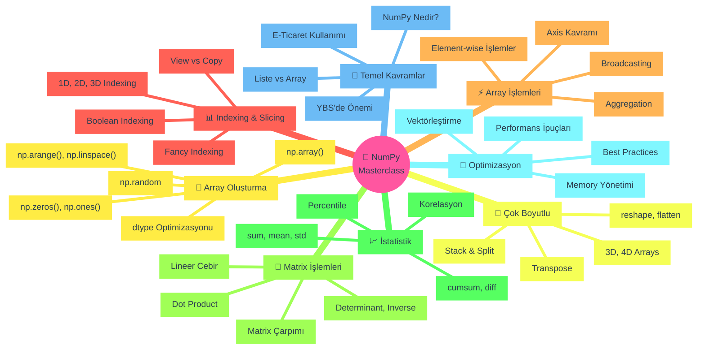
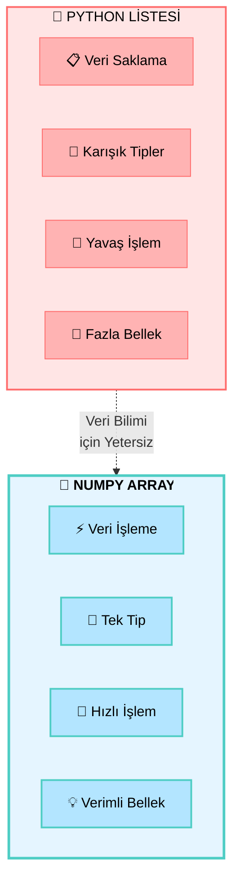
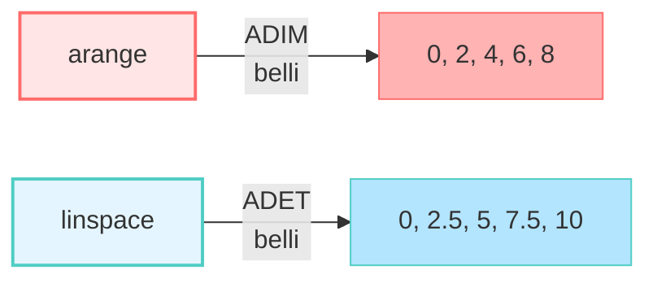

<div align="center">

```text
    ███╗   ██╗██╗   ██╗███╗   ███╗██████╗ ██╗   ██╗
    ████╗  ██║██║   ██║████╗ ████║██╔══██╗╚██╗ ██╔╝
    ██╔██╗ ██║██║   ██║██╔████╔██║██████╔╝ ╚████╔╝ 
    ██║╚██╗██║██║   ██║██║╚██╔╝██║██╔═══╝   ╚██╔╝  
    ██║ ╚████║╚██████╔╝██║ ╚═╝ ██║██║        ██║   
    ╚═╝  ╚═══╝ ╚═════╝ ╚═╝     ╚═╝╚═╝        ╚═╝   
                                                    
    ███╗   ███╗ █████╗ ███████╗████████╗███████╗██████╗  ██████╗██╗      █████╗ ███████╗███████╗
    ████╗ ████║██╔══██╗██╔════╝╚══██╔══╝██╔════╝██╔══██╗██╔════╝██║     ██╔══██╗██╔════╝██╔════╝
    ██╔████╔██║███████║███████╗   ██║   █████╗  ██████╔╝██║     ██║     ███████║███████╗███████╗
    ██║╚██╔╝██║██╔══██║╚════██║   ██║   ██╔══╝  ██╔══██╗██║     ██║     ██╔══██║╚════██║╚════██║
    ██║ ╚═╝ ██║██║  ██║███████║   ██║   ███████╗██║  ██║╚██████╗███████╗██║  ██║███████║███████║
    ╚═╝     ╚═╝╚═╝  ╚═╝╚══════╝   ╚═╝   ╚══════╝╚═╝  ╚═╝ ╚═════╝╚══════╝╚═╝  ╚═╝╚══════╝╚══════╝
```

### 🎓 YBS Öğrencileri İçin Kapsamlı NumPy Eğitimi

**E-Ticaret Senaryoları ile From Zero to Hero**

---

[](https://python.org)
[](https://numpy.org)
[](https://pandas.pydata.org)
[](https://matplotlib.org)
[](https://jupyter.org)
[](LICENSE)

</div>

---

## 🌟 Genel Bakış

Bu proje, **NumPy'nin temel ve ileri seviye özelliklerini** Yönetim Bilişim Sistemleri (YBS) perspektifinden öğrenmek için tasarlanmış **kapsamlı bir Jupyter Notebook eğitim materyalidir**. **E-Ticaret** senaryoları üzerinden array oluşturma, indexing, slicing, matrix aritmetiği, istatistiksel işlemler ve performans optimizasyonu konularını öğreneceksiniz.

### 🎯 Neden Bu Eğitim?

<table>
<tr>
<td width="50%" valign="top">

**📚 Eğitim Özellikleri**
- ✅ **Gerçek e-ticaret senaryoları** ile uygulama
- ✅ **18+ pratik örnek** ile çalışma
- ✅ **Mermaid diyagramları** ile görselleştirme
- ✅ **Türkçe + İnglizce** terminoloji
- ✅ **6700+ satır** kapsamlı içerik
- ✅ **71 hücre** adım adım öğretim

</td>
<td width="50%" valign="top">

**🎓 Öğrenme Çıktıları**
- ✅ NumPy array'lerini etkin kullanma
- ✅ Çok boyutlu veri yapıları oluşturma
- ✅ Broadcasting ve vectorization
- ✅ Matrix aritmetiği ve lineer cebir
- ✅ İstatistiksel analiz yapabilme
- ✅ Performans optimizasyonu

</td>
</tr>
</table>

### 🎭 Öğrenilecek Konular

Bu eğitimde kapsamlı bir şekilde öğrenecekleriniz:



---

## 📂 Proje Yapısı

```
day17/
│
├── 📓 numpy-ybs-masterclass.ipynb    # Ana eğitim notebook'u (6775 satır, 71 hücre)
├── 📄 README.md                      # Bu dosya
└── 📊 [Runtime'da oluşan veriler]    # E-ticaret simülasyon verileri
```

### 📓 Notebook Yapısı ve İçerik

| Adım | İçerik | Hücre | Satır Aralığı |
|------|--------|-------|---------------|
| 🌟 **ADIM 1** | NumPy'ye Giriş, Liste vs Array, İlk Komutlar | 8 hücre | 1-490 |
| 🔧 **ADIM 2** | Array Oluşturma Yöntemleri (zeros, ones, arange, linspace, random) | 9 hücre | 491-1100 |
| 📏 **ADIM 3** | Array Özellikleri (shape, dtype, reshape, broadcasting) | 7 hücre | 1101-1800 |
| 📊 **ADIM 4** | Indexing & Slicing (1D, 2D, Fancy, Boolean) | 8 hücre | 1801-2500 |
| ⚡ **ADIM 5** | Array İşlemleri (Element-wise, Aggregation, Axis) | 7 hücre | 2501-3200 |
| 🧊 **ADIM 6** | Çok Boyutlu Arrays (3D, 4D, Transpose, Reshape) | 6 hücre | 3201-3900 |
| 🔢 **ADIM 7** | Matrix Aritmetiği (Çarpım, Dot, Lineer Cebir) | 7 hücre | 3901-4650 |
| 🔗 **ADIM 8** | Stack & Split (Veri Birleştirme ve Ayırma) | 5 hücre | 4651-5200 |
| 📈 **ADIM 9** | İstatistiksel İşlemler (sum, mean, std, korelasyon) | 6 hücre | 5201-5800 |
| 🎯 **ADIM 10** | İleri Seviye Analizler (cumsum, diff, hareketli ortalama) | 5 hücre | 5801-6400 |
| 🚀 **ADIM 11** | Performans & Best Practices (Vektörleştirme, Optimizasyon) | 3 hücre | 6401-6775 |

---

## 🎯 NumPy Konuları - Detaylı Açıklama

### 🔢 **ADIM 1: NumPy'ye Giriş**

NumPy (Numerical Python), veri biliminin temel taşıdır. Python'da sayısal hesaplamaların temel kütüphanesidir.

#### 💡 **Neden NumPy?**



**Liste vs Array Karşılaştırması:**

| Özellik | 🐍 Python Listesi | 🔢 NumPy Array |
|---------|-------------------|-----------------|
| **Temel Amaç** | Veri saklama | Veri işleme |
| **Veri Tipi** | Heterojen (karışık) | Homojen (tek tip) |
| **Performans** | 🐌 Yavaş (65x) | 🚀 Çok hızlı |
| **Bellek** | 💾 Fazla kullanır | 💡 Verimli (%97 tasarruf) |
| **Aritmetik** | ➕ Eleman ekler | ✖️ Matematiksel işlem |
| **Boyut** | 1D (tek boyutlu) | nD (çok boyutlu) |
| **YBS İçin** | Başlangıç | Profesyonel |

---

### 🔧 **ADIM 2: Array Oluşturma Yöntemleri**

NumPy array'leri oluşturmanın birçok yolu vardır:

#### 📝 **np.array() - Manuel Oluşturma**

```python
# E-Ticaret: Haftalık satış verileri
gunluk_satislar = np.array([45, 52, 38, 61, 55, 48, 70])
```

#### 0️⃣ **np.zeros() - Sıfır Matrisi**

```python
# Başlangıç stok durumu
stok_matrisi = np.zeros((5, 10))  # 5 kategori, 10 ürün
```

#### 1️⃣ **np.ones() - Birler Matrisi**

```python
# Tüm ürünlere %100 fiyat çarpanı
fiyat_carpani = np.ones((100,))
```

#### 🔢 **np.arange() - Aralık Dizisi**

```python
# Ürün ID'leri: 1000'den 2000'e kadar
urun_idleri = np.arange(1000, 2001)

# %5 ile %50 arası indirim senaryoları
indirim_oranlari = np.arange(5, 55, 5) / 100
```

**arange vs range Farkı:**

| Özellik | Python range | NumPy arange |
|---------|-------------|--------------|
| Tip | Iterator | NumPy array |
| Float desteği | ❌ Hayır | ✅ Evet |
| Matematiksel işlem | ❌ Hayır | ✅ Evet |
| Hız | Yavaş | Hızlı |

#### 📏 **np.linspace() - Eşit Aralıklı Diziler**

```python
# 100 TL ile 1000 TL arası 7 fiyat seviyesi
fiyat_skalasi = np.linspace(100, 1000, 7)
# [100, 250, 400, 550, 700, 850, 1000]
```

**arange vs linspace:**



#### 🎲 **np.random - Rastgele Veriler**

```python
# Test için rastgele satış verileri
test_satislari = np.random.randint(10, 201, size=100)

# Normal dağılım - fiyat simülasyonu
fiyatlar = np.random.normal(loc=500, scale=100, size=1000)

# Uniform dağılım - 0-1 arası
rastgele_oranlar = np.random.uniform(0, 1, size=50)
```

#### 🔤 **dtype - Veri Tipi Optimizasyonu**

**Bellek Tasarrufu:**

| Veri Tipi | Byte/Eleman | Aralık | Kullanım |
|-----------|-------------|--------|----------|
| `int8` | 1 | -128 to 127 | Küçük sayılar |
| `int16` | 2 | -32,768 to 32,767 | Stok miktarı |
| `int32` | 4 | ±2 milyar | Ürün ID |
| `int64` | 8 | Çok büyük | Varsayılan |
| `float32` | 4 | 7 basamak | Fiyatlar |
| `float64` | 8 | 15 basamak | Varsayılan |
| `bool` | 1 | True/False | Aktiflik |

**Örnek:**
```python
# ❌ Kötü: 100M ürün için 1.6 GB RAM
ids_int64 = np.arange(100_000_000, dtype=np.int64)

# ✅ İyi: Aynı veri için 200 MB RAM
ids_int16 = np.arange(100_000_000, dtype=np.int16)
# %87.5 bellek tasarrufu!
```

---

### 📊 **ADIM 4: Indexing & Slicing**

Array'lerden veri seçme ve filtreleme teknikleri.

#### 🔍 **Temel Indexing**

```python
# 1D Array
satislar = np.array([100, 150, 120, 180, 200])
satislar[0]      # 100 (ilk eleman)
satislar[-1]     # 200 (son eleman)
satislar[1:4]    # [150, 120, 180] (slicing)

# 2D Array (Ürün-Şehir matrisi)
satis_matrisi = np.array([
    [100, 150, 120],  # Laptop
    [200, 250, 220]   # Telefon
])
satis_matrisi[0, 1]    # 150 (Laptop, Ankara)
satis_matrisi[:, 0]    # [100, 200] (İstanbul, tüm ürünler)
```

#### 🎨 **Fancy Indexing**

```python
# Belirli ürünleri seç
secili_indexler = [0, 2, 4]
secili_urunler = urun_fiyatlari[secili_indexler]
```

#### 🔍 **Boolean Indexing (En Güçlü!)**

```python
# Fiyatı 1000 TL'den az olan ürünler
ucuz_mask = fiyatlar < 1000
ucuz_urunler = fiyatlar[ucuz_mask]

# Çoklu koşul: Ucuz VE yüksek puanlı
kaliteli_mask = (fiyatlar < 1000) & (puanlar >= 4.0)
kaliteli_urunler = urun_isimleri[kaliteli_mask]
```

**Boolean Indexing SQL Karşılaştırması:**

| SQL | NumPy |
|-----|-------|
| `WHERE price < 1000` | `arr[arr < 1000]` |
| `WHERE price < 1000 AND rating >= 4` | `arr[(price < 1000) & (rating >= 4)]` |
| `WHERE price < 500 OR price > 2000` | `arr[(price < 500) \| (price > 2000)]` |

---

### ⚡ **ADIM 5: Array İşlemleri**

#### 📐 **Element-wise İşlemler**

```python
# Tüm fiyatlara %20 zam
yeni_fiyatlar = eski_fiyatlar * 1.20

# İki kategorinin satış toplamı
toplam_satis = kategori1_satis + kategori2_satis
```

#### 🎯 **Broadcasting**

Farklı boyutlardaki array'leri otomatik genişletme:

```python
# 5 ürün x 4 şehir matrisi
satislar = np.array([[100, 150, 120, 130],
                     [200, 250, 220, 240],
                     [150, 180, 160, 170],
                     [300, 350, 320, 340],
                     [250, 280, 260, 290]])

# Her şehire farklı çarpan (1D array)
bolge_carpanlari = np.array([1.0, 1.1, 1.05, 1.15])

# Broadcasting ile çarpma
ayarlanmis_satislar = satislar * bolge_carpanlari
# Her satır, kendi sütunuyla çarpılır!
```

#### 📊 **Aggregation İşlemleri**

```python
# Tek değer sonuçları
satislar.sum()      # Toplam
satislar.mean()     # Ortalama
satislar.std()      # Standart sapma
satislar.min()      # Minimum
satislar.max()      # Maximum
satislar.argmax()   # Maximum'un indexi

# Axis bazlı işlemler
satislar.sum(axis=0)   # Her sütun toplamı
satislar.mean(axis=1)  # Her satır ortalaması
```

**Axis Kavramı:**

```
2D Array shape: (4, 5)
                 ↓     ↓
              axis=0  axis=1
              (satır)  (sütun)

sum(axis=0) → Her SÜTUN için toplam (4 değer gider, 5 kalır)
sum(axis=1) → Her SATIR için toplam (5 değer gider, 4 kalır)
```

---

### 🧊 **ADIM 6: Çok Boyutlu Arrays**

#### 📦 **3D Array - Zaman-Ürün-Şehir Küpü**

```python
# 4 hafta x 3 ürün x 5 şehir
haftalik_satislar_3d = np.zeros((4, 3, 5))

# Shape: (hafta, ürün, şehir)
haftalik_satislar_3d[0, 1, 2]  # 1. hafta, 2. ürün, 3. şehir
haftalik_satislar_3d[:, 0, :]  # Tüm haftalar, 1. ürün, tüm şehirler
```

#### 🔄 **Reshape İşlemleri**

```python
# 1D → 2D dönüşüm
arr_1d = np.arange(12)           # [0, 1, 2, ..., 11]
arr_2d = arr_1d.reshape(3, 4)    # 3x4 matrix

# Otomatik boyut hesaplama
arr_auto = arr_1d.reshape(3, -1)  # -1 otomatik hesaplanır (4)

# Düzleştirme
flatten = arr_2d.flatten()        # 2D → 1D (copy)
ravel = arr_2d.ravel()           # 2D → 1D (view, daha hızlı)
```

---

### 🔢 **ADIM 7: Matrix Aritmetiği**

#### 🎯 **Matrix Çarpımı**

```python
# @ operatörü veya np.dot()
A = np.array([[1, 2], [3, 4]])
B = np.array([[5, 6], [7, 8]])

C = A @ B  # Matrix çarpımı
# [[19, 22],
#  [43, 50]]

# Element-wise çarpım (farklı!)
D = A * B  # Her eleman kendi karşılığıyla çarpılır
```

**Matrix Çarpımı Kuralı:**
```
(m, n) @ (n, p) = (m, p)
  ↑       ↑
  Eşit olmalı!
```

#### 💼 **E-Ticaret Örneği: Gelir Hesaplama**

```python
# Günlük satış adetleri (7 gün x 3 kategori)
gunluk_satislar = np.array([
    [12, 25, 8],   # Pazartesi
    [15, 28, 10],  # Salı
    ...
])

# Kategori fiyatları (3 kategori)
kategori_fiyatlari = np.array([2500, 150, 80])

# Günlük gelir hesaplama
gunluk_gelirler = gunluk_satislar @ kategori_fiyatlari
```

#### 🔐 **Lineer Cebir**

```python
from numpy.linalg import det, inv, eig, solve

# Determinant
det(A)              # Skalar değer

# Ters matrix
A_inv = inv(A)      # A⁻¹
A @ A_inv           # = Identity matrix

# Eigenvalues & Eigenvectors
eigenvalues, eigenvectors = eig(A)

# Lineer denklem sistemi çözme: Ax = b
x = solve(A, b)
```

**E-Ticaret Kullanımı: Fiyat Geri Hesaplama**
```python
# Bilinen: Toplam ödemeler ve adet
# 2×Laptop + 1×Mouse = 2500 TL
# 1×Laptop + 3×Mouse = 1900 TL

adet_matrisi = np.array([[2, 1], [1, 3]])
toplam_odemeler = np.array([2500, 1900])

fiyatlar = solve(adet_matrisi, toplam_odemeler)
# [Laptop fiyatı, Mouse fiyatı]
```

---

### 📈 **ADIM 9: İstatistiksel İşlemler**

#### 📊 **Temel İstatistikler**

```python
# Merkezi eğilim
satislar.mean()      # Ortalama
satislar.median()    # Medyan
satislar.std()       # Standart sapma
satislar.var()       # Varyans

# Min-Max
satislar.min()
satislar.max()
satislar.argmin()    # Minimum'un indexi
satislar.argmax()    # Maximum'un indexi

# Percentile
np.percentile(satislar, 25)   # 1. çeyrek (Q1)
np.percentile(satislar, 50)   # Medyan (Q2)
np.percentile(satislar, 75)   # 3. çeyrek (Q3)
np.percentile(satislar, 90)   # 90. yüzdelik
```

#### 🔗 **Korelasyon & Kovaryans**

```python
# İki değişken arasındaki ilişki
korelasyon = np.corrcoef(sepet_tutari, musteri_memnuniyeti)

# Kovaryans matrisi
kovaryans = np.cov(veri_matrisi)
```

---

### 🎯 **ADIM 10: İleri Seviye Analizler**

#### 📈 **Kümülatif İşlemler**

```python
# Kümülatif toplam (running total)
aylik_satislar = np.array([1500, 1650, 1800, 1750, 1900, 2000, ...])
kumlatif_satis = np.cumsum(aylik_satislar)
# [1500, 3150, 4950, 6700, 8600, 10600, ...]

# Kümülatif çarpım (büyüme analizi)
buyume_oranlari = np.array([1.0, 1.1, 1.08, 1.05, ...])
kumlatif_buyume = np.cumprod(buyume_oranlari)
```

#### 📉 **Değişim Analizi (diff)**

```python
# Bir önceki aya göre değişim
degisim = np.diff(aylik_satislar)
# [150, 150, -50, 150, 100, ...]

# İkinci dereceden fark (ivme)
ivme = np.diff(degisim)
```

#### 📊 **Hareketli Ortalamalar**

```python
# 3 aylık hareketli ortalama
window_size = 3
window = np.ones(window_size) / window_size
hareketli_ort = np.convolve(satislar, window, mode='valid')

# Ağırlıklı hareketli ortalama
weights = np.array([0.2, 0.3, 0.5])  # Son aya daha fazla ağırlık
agirlikli_ort = np.convolve(satislar, weights, mode='valid')
```

---

## 💼 Gerçek Dünya Kullanım Senaryoları

### 🎯 **Senaryo 1: Hafta Sonu Kampanya Analizi**

**İş İhtiyacı:** "Hafta sonu %20 İndirim" kampanyasının etkisini ölçmek.

**NumPy Kullanımı:**
```python
# Normal hafta vs kampanya haftası
normal_satislar = np.array([45, 52, 38, 61, 55, 48, 50])
kampanya_satislari = np.array([50, 58, 45, 75, 70, 85, 95])

# Artış hesaplama
fark = kampanya_satislari - normal_satislar
artis_yuzdesi = (fark / normal_satislar * 100).mean()

print(f"Kampanya etkisi: %{artis_yuzdesi:.1f} artış")
```

**Çıktı:** "Kampanya günlük satışları ortalama %28.5 artırdı."

---

### 🎯 **Senaryo 2: Çoklu Ürün Fiyat Optimizasyonu**

**İş İhtiyacı:** 5 kategoriye farklı indirimler uygulayıp toplam ciro etkisini görmek.

**NumPy Kullanımı:**
```python
kategoriler = ["Elektronik", "Giyim", "Ev & Yaşam", "Kozmetik", "Kitap"]
mevcut_fiyatlar = np.array([2500, 350, 750, 280, 85])
indirim_oranlari = np.array([0.15, 0.25, 0.20, 0.30, 0.10])

# Tek satırda yeni fiyatları hesapla (Broadcasting!)
yeni_fiyatlar = mevcut_fiyatlar * (1 - indirim_oranlari)

# Aylık 1000'er satış varsayımı ile ciro kaybı
ciro_kaybi = (mevcut_fiyatlar - yeni_fiyatlar) * 1000
print(f"Toplam ciro kaybı: {ciro_kaybi.sum():,.0f} TL")
```

---

### 🎯 **Senaryo 3: Bölgesel Performans Analizi**

**İş İhtiyacı:** Hangi bölgelerde hangi ürünler daha iyi satıyor?

**NumPy Kullanımı:**
```python
# 5 ürün x 4 şehir satış matrisi
satis_matrisi = np.array([
    [150, 180, 145, 165],  # Laptop
    [220, 250, 210, 240],  # Telefon
    [180, 200, 175, 190],  # Tablet
    [320, 350, 310, 340],  # Monitor
    [270, 290, 260, 285]   # Kulaklık
])

# Her şehrin toplam satışı
sehir_toplamlari = satis_matrisi.sum(axis=0)

# En iyi şehir
en_iyi_sehir_idx = sehir_toplamlari.argmax()
print(f"En iyi performans: Şehir {en_iyi_sehir_idx+1}")

# Her ürünün en çok satıldığı şehir
for i, urun in enumerate(urunler):
    en_iyi_sehir = satis_matrisi[i].argmax()
    print(f"{urun}: Şehir {en_iyi_sehir+1}")
```

---

### 🎯 **Senaryo 4: Yıllık Satış Trend Analizi**

**İş İhtiyacı:** 2025 yılı satışlarının trendini analiz etmek.

**NumPy Kullanımı:**
```python
aylar = ['Ocak', 'Şubat', 'Mart', 'Nisan', 'Mayıs', 'Haziran',
         'Temmuz', 'Ağustos', 'Eylül', 'Ekim', 'Kasım', 'Aralık']
laptop_satislari = np.array([1500, 1650, 1800, 1750, 1900, 2000,
                              2100, 2050, 2150, 2300, 2450, 2600])

# Kümülatif toplam (yıllık hedef takibi)
kumlatif = np.cumsum(laptop_satislari)

# MoM (Month-over-Month) değişim
mom_degisim = np.diff(laptop_satislari)

# 3 aylık hareketli ortalama
window = np.ones(3) / 3
trend = np.convolve(laptop_satislari, window, mode='valid')

# Yıllık büyüme
yillik_buyume = ((laptop_satislari[-1] / laptop_satislari[0]) - 1) * 100
print(f"Yıllık büyüme: %{yillik_buyume:.2f}")
```

---

### 🎯 **Senaryo 5: Müşteri Segmentasyonu**

**İş İhtiyacı:** Müşterileri harcama davranışına göre gruplandırmak.

**NumPy Kullanımı:**
```python
# Müşteri harcamaları
musteri_harcamalari = np.random.normal(1500, 500, 10000)

# Percentile ile kategorileme
p25 = np.percentile(musteri_harcamalari, 25)
p50 = np.percentile(musteri_harcamalari, 50)
p75 = np.percentile(musteri_harcamalari, 75)

# Boolean indexing ile segmentler
dusuk_deger = musteri_harcamalari[musteri_harcamalari < p25]
orta_deger = musteri_harcamalari[(musteri_harcamalari >= p25) & 
                                 (musteri_harcamalari < p75)]
vip = musteri_harcamalari[musteri_harcamalari >= p75]

print(f"Düşük Değer: {len(dusuk_deger)} müşteri")
print(f"Orta Değer: {len(orta_deger)} müşteri")
print(f"VIP: {len(vip)} müşteri")
```

---

## 🚀 Kurulum ve Başlangıç

### 📋 Gereksinimler

```bash
# Python 3.8 veya üzeri
python --version

# Gerekli kütüphaneler
pip install numpy pandas matplotlib jupyter
```

### ▶️ Notebook'u Çalıştırma

```bash
# Dizine git
cd day17

# Jupyter Notebook başlat
jupyter notebook numpy-ybs-masterclass.ipynb
```

**💡 İpucu:** `Shift + Enter` ile hücreleri tek tek çalıştırın veya `Cell > Run All` ile tümünü çalıştırın.

---

## 📚 Ek Kaynaklar

### 📖 Önerilen Okumalar

- **NumPy Documentation** - [numpy.org](https://numpy.org)
- **NumPy for Beginners** - Ücretsiz eBook
- **Python Data Science Handbook** - Jake VanderPlas
- **Wes McKinney - Python for Data Analysis** - Pandas yaratıcısından

### 🎥 Video Kaynakları

- **NumPy Tutorial** - freeCodeCamp (YouTube)
- **Python NumPy** - Corey Schafer Serisi
- **Data Analysis with Python** - Coursera
- **NumPy Crash Course** - Keith Galli

### 🔧 Araçlar ve Kütüphaneler

- **NumPy:** Sayısal hesaplamalar
- **Pandas:** Veri manipülasyonu (NumPy üzerine kurulu)
- **Matplotlib/Seaborn:** Görselleştirme
- **SciPy:** İleri bilimsel hesaplamalar
- **Scikit-learn:** Machine Learning (NumPy tabanlı)

---

## 🎯 En İyi Uygulamalar (Best Practices)

### ✅ Yapılması Gerekenler

| 🎯 Pratik | 📝 Açıklama |
|-----------|-------------|
| **Vektörleştirme Kullan** | For loop yerine NumPy işlemleri (10-100x hızlı) |
| **Doğru dtype Seç** | Bellek tasarrufu için optimum veri tipi |
| **Broadcasting Kullan** | Kopyalama yerine akıllı işlem |
| **View vs Copy Bil** | Gereksiz kopyalama yapma |
| **Axis Kavramını Anla** | sum(axis=0) ne yapar? |
| **Boolean Indexing** | Koşullu filtreleme için en güçlü yöntem |

### ❌ Yapılmaması Gerekenler

| ⚠️ Hata | 📝 Sonuç |
|---------|----------|
| **For Loop ile İşlem** | Çok yavaş (NumPy vectorization kullan) |
| **Gereksiz Copy** | Bellek israfı (view kullan) |
| **Yanlış dtype** | 8x fazla bellek kullanımı |
| **Broadcasting Unutmak** | Gereksiz reshape işlemleri |
| **List ile Karıştırmak** | Array beklenen yerde list kullanmak |

### 💡 Performans İpuçları

```python
# ❌ Kötü: For loop ile
sonuc = []
for x in arr:
    sonuc.append(x * 2)

# ✅ İyi: Vectorization
sonuc = arr * 2  # 50-100x daha hızlı!

# ❌ Kötü: Gereksiz copy
yeni_arr = arr.copy()
yeni_arr[0] = 100

# ✅ İyi: View kullan (mümkünse)
view_arr = arr[:]
view_arr[0] = 100

# ❌ Kötü: Yanlış dtype
ids = np.arange(1000, dtype=np.float64)  # 8 byte/eleman

# ✅ İyi: Optimum dtype
ids = np.arange(1000, dtype=np.int16)    # 2 byte/eleman
```

---

## 🤝 Katkıda Bulunma

Bu eğitim materyali **Veri Bilimi ve Makine Öğrenmesi 2026 - 100 Günlük Bootcamp** programının bir parçasıdır.

### 💡 Önerileriniz için:

- 🐛 Hata bulursanız issue açın
- ✨ Yeni örnekler eklemek isterseniz pull request gönderin
- 💬 Sorularınız için discussions kullanın
- ⭐ Beğendiyseniz repository'yi yıldızlayın

---

## 📝 Lisans

Bu proje **eğitim amaçlı** hazırlanmıştır. Kaynak göstererek özgürce kullanabilirsiniz.

---

<div align="center">

## 🎓 İyi Öğrenmeler Dileriz!

### ⚡ From Zero to Hero with NumPy!

---

**🔢 NumPy**, veri biliminin matematik motorudur.  
**💼 YBS**, bu motoru iş kararlarına dönüştürme sanatıdır.  
**🚀 Siz**, bu ikisini birleştiren profesyonelsiniz!

---

### 🌟 Remember

> *"NumPy olmadan Python, hesap makinesi olmadan muhasebeci gibidir."*  
> *"Vektörleştirme, veri bilimcinin en yakın dostudur."*

---

**📅 Son Güncelleme:** 4 Şubat 2026  
**👨‍🏫 Eğitmen:** Cemal YÜKSEL  
**🎯 Hedef:** YBS Öğrencileri ve Veri Analistleri

---

### 💌 İletişim

**Sorularınız mı var?**  
📧 GitHub Discussions bölümünden bize ulaşabilirsiniz!

**Güncellemeler için:**  
⭐ Repository'yi yıldızlayın  
👁️ Watch edin  
🔔 Bildirimleri açın

---


</div>
