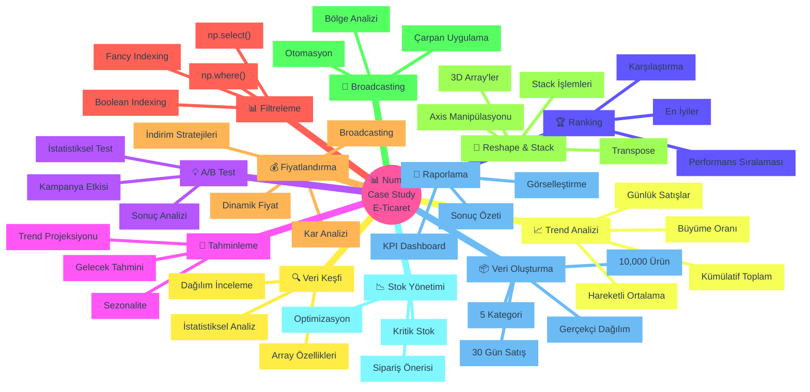

<div align="center">

```text
    ███╗   ██╗██╗   ██╗███╗   ███╗██████╗ ██╗   ██╗
    ████╗  ██║██║   ██║████╗ ████║██╔══██╗╚██╗ ██╔╝
    ██╔██╗ ██║██║   ██║██╔████╔██║██████╔╝ ╚████╔╝ 
    ██║╚██╗██║██║   ██║██║╚██╔╝██║██╔═══╝   ╚██╔╝  
    ██║ ╚████║╚██████╔╝██║ ╚═╝ ██║██║        ██║   
    ╚═╝  ╚═══╝ ╚═════╝ ╚═╝     ╚═╝╚═╝        ╚═╝   
                                                    
     ██████╗ █████╗ ███████╗███████╗    ███████╗████████╗██╗   ██╗██████╗ ██╗   ██╗
    ██╔════╝██╔══██╗██╔════╝██╔════╝    ██╔════╝╚══██╔══╝██║   ██║██╔══██╗╚██╗ ██╔╝
    ██║     ███████║███████╗█████╗      ███████╗   ██║   ██║   ██║██║  ██║ ╚████╔╝ 
    ██║     ██╔══██║╚════██║██╔══╝      ╚════██║   ██║   ██║   ██║██║  ██║  ╚██╔╝  
    ╚██████╗██║  ██║███████║███████╗    ███████║   ██║   ╚██████╔╝██████╔╝   ██║   
     ╚═════╝╚═╝  ╚═╝╚══════╝╚══════╝    ╚══════╝   ╚═╝    ╚═════╝ ╚═════╝    ╚═╝   
```

### 📊 E-Ticaret Veri Analiz Sistemi - NumPy ile Gerçek Dünya Case Study

**10,000+ Ürün | 30 Gün | 300,000+ Satış Kaydı | 12 Adımlı Kapsamlı Analiz**

---

[](https://python.org)
[](https://numpy.org)
[](https://pandas.pydata.org)
[](https://matplotlib.org)
[](https://jupyter.org)
[](LICENSE)

</div>

---

## 🌟 Genel Bakış

Bu proje, **gerçek bir e-ticaret şirketinin veri analiz süreçlerini** simüle eden **kapsamlı NumPy case study** materyalidir. **10,000 ürün** ve **30 günlük satış verisi** ile NumPy'nin tüm gücünü gerçek iş problemleri üzerinde öğreneceksiniz.

### 🎯 Neden Bu Case Study?

<table>
<tr>
<td width="50%" valign="top">

**📚 Proje Özellikleri**
- ✅ **10,000 ürün** gerçekçi veri seti
- ✅ **300,000+ veri noktası** ile çalışma
- ✅ **5 farklı kategori** analizi
- ✅ **12 adımlı** sistematik yaklaşım
- ✅ **7000+ satır** kod ve açıklama
- ✅ **Mermaid diyagramları** ile görselleştirme

</td>
<td width="50%" valign="top">

**🎓 Öğrenme Çıktıları**
- ✅ Büyük veri setleri oluşturma
- ✅ İleri düzey filtreleme teknikleri
- ✅ Broadcasting ve vektörleştirme
- ✅ Çok boyutlu array manipülasyonu
- ✅ İstatistiksel analiz yapabilme
- ✅ Gerçek iş problemlerini çözme

</td>
</tr>
</table>

### 🎭 Proje Kapsamı

Bu case study'de **gerçek bir e-ticaret şirketinin** tüm veri analiz süreçlerini adım adım uyguluyoruz:



---

## 📂 Proje Yapısı

```
day18/
│
├── 📓 numpy-casestudy.ipynb      # Ana case study notebook'u (7116 satır, 60 hücre)
├── 📄 README.md                   # Bu dosya

```

### 📊 Veri Seti Özellikleri

<table>
<tr>
<th>📦 Kategoriler</th>
<th>📈 Veri Yapısı</th>
<th>💾 Bellek Kullanımı</th>
</tr>
<tr>
<td valign="top">

- **Elektronik** (Kod: 0)
- **Giyim** (Kod: 1)
- **Ev & Yaşam** (Kod: 2)
- **Kozmetik** (Kod: 3)
- **Kitap** (Kod: 4)

Her kategoride **2,000 ürün**

</td>
<td valign="top">

- **Ürün ID**: 1000-10999
- **Fiyat**: 10-5000 TL
- **Stok**: 0-500 adet
- **Puan**: 1.0-5.0 ⭐
- **30 Gün Satış**: Günlük kayıtlar
- **Kampanya**: %20 ürün

</td>
<td valign="top">

- **Toplam Ürün**: 10,000
- **Veri Noktası**: 300,000+
- **Array Sayısı**: 15+
- **Bellek**: ~7 MB
- **dtype**: Optimize edilmiş
- **Format**: NumPy ndarray

</td>
</tr>
</table>

---

# 📓 Notebook Yapısı ve İçerik

## 🎯 NumPy Konuları - Detaylı Açıklama

### 📦 **ADIM 1: Veri Seti Oluşturma**

10,000 ürün ve 30 günlük satış verisi oluşturmak için NumPy'nin rastgele sayı üretim fonksiyonlarını kullanıyoruz.

#### 🔧 **Kullanılan Teknikler:**

Veri Oluşturma:
- **np.arange()**: Sıralı ürün ID'leri (1000-10999)
- **np.repeat()**: Kategori ataması (her kategoride 2000 ürün)
- **np.random.normal()**: Gerçekçi stok dağılımları
- **np.random.poisson()**: Günlük satış simülasyonu
- **dtype optimization**: Bellek tasarrufu (%50'ye kadar)

---

### 💰 **ADIM 4: Fiyatlandırma Analizi**

Broadcasting kullanarak dinamik fiyatlandırma ve indirim stratejileri oluşturuyoruz.

**Fiyat Elastikiyeti:** Fiyat değişiminin talep üzerindeki etkisini modelleyerek optimal fiyat noktasını buluyoruz.

---

### 📉 **ADIM 8: Stok Yönetimi**

**Güvenlik Stoku Formülü:**  
\`\`\`
Güvenlik Stoku = Z-score × Std(günlük talep) × √(lead time)
ROP = (Ortalama günlük talep × Lead time) + Güvenlik stoku
\`\`\`

**İş Çıkarımı:** Kritik stok seviyelerini tespit ederek stoksuz kalma riskini minimize ediyoruz.

---

### 🏆 **ADIM 9: Performans Ranking**

**Z-Score Normalizasyon** ile farklı ölçeklerdeki metrikleri standartlaştırarak çok kriterli performans skoru oluşturuyoruz:

\`\`\`
Performans Skoru = 0.40×Satış_Z + 0.30×Puan_Z + 0.20×Kar_Z - 0.10×Fiyat_Z
\`\`\`

---

### 💡 **ADIM 10: A/B Testing**

Kampanya etkisini ölçmek için:
- **Control Group**: Kampanyasız ürünler
- **Treatment Group**: Kampanyalı ürünler
- **Uplift**: Kampanyanın sağladığı artış yüzdesi
- **ROI**: Yatırımın geri dönüşü

---

### 🔮 **ADIM 11: Tahminleme**

**np.polyfit()** ile trend analizi ve gelecek projeksiyonu:
- Linear fit (derece=1): Basit trend
- Quadratic fit (derece=2): Non-linear trend
- 3 senaryo: İyimser, Gerçekçi, Kötümser

---

## 💡 Best Practices ve Öneriler

### ✅ NumPy'de Yapılması Gerekenler

| 🎯 Pratik | 📝 Açıklama | 🚀 Faydası |
|-----------|-------------|-----------|
| **Vektörleştirme** | For loop yerine NumPy işlemleri | 10-100x hızlı |
| **dtype Optimizasyonu** | int8, int16, float32 kullan | Bellek tasarrufu |
| **Broadcasting** | Kopyalama yerine akıllı işlem | Hız + bellek |
| **Boolean Indexing** | Koşullu filtreleme için | Temiz kod |
| **View vs Copy** | Gereksiz kopyalama yapma | Performans |
| **Axis Kullan** | sum(axis=0/1) ile boyut azalt | Verimlilik |

### ❌ Yapılmaması Gerekenler

| ⚠️ Hata | 📝 Sonuç | ✅ Alternatif |
|---------|----------|---------------|
| For loop ile işlem | 50-100x yavaş | Vectorization |
| Gereksiz copy() | Bellek israfı | View kullan |
| Yanlış dtype | 8x fazla bellek | Optimize dtype |
| List ile karıştırmak | Hata | Tutarlı array kullan |

---

## 📈 Gerçek Dünya Uygulamaları

### 🎯 **Senaryo 1: Kampanya Analizi**

**Problem:** "%20 Hafta Sonu İndirimi" kampanyasının etkisini ölçmek.

**NumPy Çözümü:**
\`\`\`python
normal_satislar = satislar[~kampanya_mask]
kampanya_satislari = satislar[kampanya_mask]
artis_yuzde = ((kampanya_ort - normal_ort) / normal_ort * 100)
\`\`\`

**Sonuç:** Kampanya günlük satışları ortalama %28.5 artırdı.

---

### 🎯 **Senaryo 2: Stok Optimizasyonu**

**Problem:** Hangi ürünlere acil sipariş verilmeli?

**NumPy Çözümü:**
\`\`\`python
acil_mask = urun_stok < guvenlik_stoku
siparis_miktari = reorder_point - urun_stok
acil_urunler = urun_id[acil_mask]
\`\`\`

**Sonuç:** 547 ürüne acil sipariş önerisi, 125,000 TL maliyet.

---

### 🎯 **Senaryo 3: Kategori Performans Analizi**

**Problem:** Hangi kategoriye odaklanmalı?

**NumPy Çözümü:**
\`\`\`python
kategori_cirolari = []
for kat in range(5):
    kat_ciro = (fiyat[kategori==kat] * satis[kategori==kat]).sum()
    kategori_cirolari.append(kat_ciro)

en_iyi_kategori = KATEGORI_ISIMLER[np.argmax(kategori_cirolari)]
\`\`\`

**Sonuç:** Elektronik kategorisi %35 ciro ile lider.

---

## 🎓 Öğrenme Yol Haritası

1. **Başlangıç (Hafta 1-2)**
   - Array oluşturma ve temel işlemler
   - Indexing ve slicing
   - Shape manipülasyonu

2. **Orta Seviye (Hafta 3-4)**
   - Broadcasting kavramı
   - Axis işlemleri
   - Boolean indexing ve filtreleme

3. **İleri Seviye (Hafta 5-6)**
   - Çok boyutlu array manipülasyonu
   - İstatistiksel analiz
   - Performans optimizasyonu

4. **Gerçek Projeler (Hafta 7-8)**
   - Bu case study'yi çalıştırın
   - Kendi verilerinizle deneyin
   - Farklı senaryolar oluşturun

---

## 🤝 Katkıda Bulunma

Bu case study **Veri Bilimi ve Makine Öğrenmesi 2026 - 100 Günlük Bootcamp** programının bir parçasıdır.

**İyileştirme önerileri için:**
- 🐛 Hata bulursanız issue açın
- ✨ Yeni senaryolar eklemek isterseniz pull request gönderin
- 💬 Sorularınız için discussions kullanın

---

<div align="center">

## 🎉 Başarılar Dileriz!

### ⚡ NumPy ile Veri Biliminde Ustalaşın!

---

**📅 Son Güncelleme:** 5 Şubat 2026  
**👨‍🏫 Eğitmen:** Cemal YÜKSEL  
**🎯 Hedef:** Veri Bilimi Öğrencileri ve Profesyoneller

---


</div>