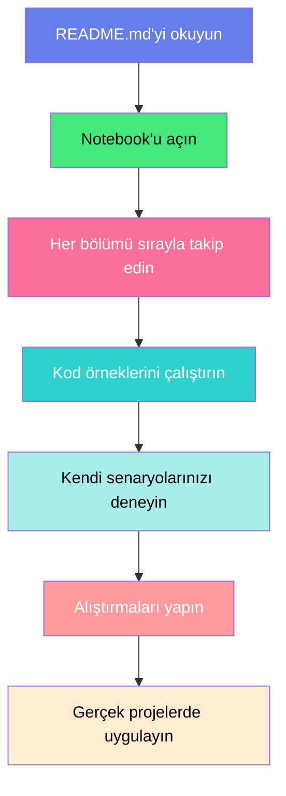

<div align="center">

```
╔═══════════════════════════════════════════════════════════════════════════════╗
║                                                                               ║
║   ██╗      ██████╗  ██████╗ ██████╗ ███████╗                                ║
║   ██║     ██╔═══██╗██╔═══██╗██╔══██╗██╔════╝                                ║
║   ██║     ██║   ██║██║   ██║██████╔╝███████╗                                ║
║   ██║     ██║   ██║██║   ██║██╔═══╝ ╚════██║                                ║
║   ███████╗╚██████╔╝╚██████╔╝██║     ███████║                                ║
║   ╚══════╝ ╚═════╝  ╚═════╝ ╚═╝     ╚══════╝                                ║
║                                                                               ║
║        🔄 LOOPS & ITERATIONS - Döngüler ile Otomasyon Gücü                   ║
║                                                                               ║
╚═══════════════════════════════════════════════════════════════════════════════╝
```

<h3>💎 100 Günlük Veri Bilimi & Makine Öğrenmesi Bootcamp - Yedinci Gün</h3>

[](https://www.python.org/)
[](https://jupyter.org/)
[](LICENSE)
[](https://github.com)
[](https://github.com)

<p align="center">
  
</p>

---

### 🎯 Bu Notebook'ta Neler Var?

<table>
<tr>
<td width="33%" align="center">

<h4>🔁 FOR Döngüleri</h4>
<p>Range, string, list iterasyonu ve temel for loop yapıları</p>
</td>
<td width="33%" align="center">

<h4>♾️ WHILE Döngüleri</h4>
<p>Koşul bazlı döngüler, sonsuz loop'lar ve kontrol mekanizmaları</p>
</td>
<td width="33%" align="center">

<h4>🔢 Nested Loops</h4>
<p>İç içe döngüler, matris işlemleri ve çok boyutlu iterasyon</p>
</td>
</tr>
<tr>
<td width="33%" align="center">

<h4>🛑 Break & Continue</h4>
<p>Döngü kontrol komutları, erken çıkış ve atlama stratejileri</p>
</td>
<td width="33%" align="center">

<h4>🔗 Enumerate & Zip</h4>
<p>Index takibi, paralel iterasyon ve gelişmiş döngü teknikleri</p>
</td>
<td width="33%" align="center">

<h4>✨ Comprehensions</h4>
<p>List, dict, set comprehension ile tek satırlık güçlü yapılar</p>
</td>
</tr>
<tr>
<td width="33%" align="center">

<h4>📊 Veri Analizi</h4>
<p>Müşteri skorları, satış verileri ve istatistiksel hesaplamalar</p>
</td>
<td width="33%" align="center">

<h4>💰 Finans Uygulamaları</h4>
<p>Maaş hesaplama, kredi analizi, departman bütçeleri</p>
</td>
<td width="33%" align="center">

<h4>📦 Stok Yönetimi</h4>
<p>Envanter takibi, kritik stok uyarıları ve ürün analizleri</p>
</td>
</tr>
</table>

</div>

---

## 🌟 Öne Çıkan Özellikler

> **Döngüler, tekrarlayan işlemleri otomatikleştiren programlamanın kalbidir!**

```python
🎨 Modern Tasarım       → Gradient renkler, profesyonel layout ve görsel anlatım
📱 İnteraktif Öğrenme   → Her döngü türünün detaylı örnekleri ve canlı uygulamalar
🎯 İş Senaryoları       → E-ticaret otomasyonu, finans analizi, stok takibi
🔄 Gerçek Dünya         → Müşteri puanlama, envanter yönetimi, satış raporları
💡 Derinlemesine        → 9 ADIM, 200+ örnek, nested loops ve comprehensions
🚀 Adım Adım            → Temel for döngüsünden ileri seviye comprehension'lara
```

<div align="center">

### 💎 **"From Basics to Advanced - Loop Mastery" Yaklaşımı**

Basit `for` döngüleri ile başlıyor,  
ardından **while, nested loops ve kontrol komutları** öğretiliyor,  
en sonunda **list comprehension ile profesyonel tek satır yapılar** ile ustalaşıyorsunuz!

</div>

---

## 📖 İçerik Haritası

<div align="center">

### 🗺️ Detaylı Konu Akışı

</div>

| 📌 Adım | 🎯 Konu Başlığı | 📋 İçerik Özeti |
|---------|-----------------|-----------------|
| **1️⃣** | **Döngülere Giriş** | Döngü kavramı, önemi, YBS'de kullanım alanları, temel terminoloji |
| **2️⃣** | **FOR Döngüsü Temelleri** | range() fonksiyonu, string ve list iterasyonu, temel for yapıları |
| **3️⃣** | **FOR ile Koleksiyonlar** | Tuple, dict, set üzerinde döngüler, enumerate ve zip kullanımı |
| **4️⃣** | **WHILE Döngüsü** | While yapısı, koşul kontrolü, sonsuz döngüler, kullanıcı girişi |
| **5️⃣** | **Döngü Kontrol Komutları** | break, continue, pass komutları, döngüden çıkış stratejileri |
| **6️⃣** | **İç İçe Döngüler (Nested)** | 2D matrisler, çok boyutlu iterasyon, performans optimizasyonu |
| **7️⃣** | **List Comprehensions** | Tek satır döngüler, list/dict/set comprehension, koşullu yapılar |
| **8️⃣** | **Gerçek Dünya Senaryoları** | E-ticaret, finans analizi, stok yönetimi, müşteri skorlama |
| **9️⃣** | **İleri Seviye Teknikler** | Performance tips, best practices, debugging, optimizasyon |

<div align="center">


</div>

---

## 📚 Detaylı Bölüm İçerikleri

### 1️⃣ Döngülere Giriş

<div style="background: linear-gradient(135deg, #667eea 0%, #764ba2 100%); padding: 20px; border-radius: 10px; color: white;">

**🎯 Bu bölümde öğrenecekleriniz:**

- 🔄 **Döngü Kavramı**: Döngülerin temel mantığı ve programlamadaki rolü
- 💼 **YBS Uygulamaları**: İş dünyasında döngülerin kritik kullanım alanları
- 📊 **Veri İşleme**: Binlerce satır veriyi otomatik işleme teknikleri
- 🎴 **FOR vs WHILE**: İki ana döngü türünün farkları ve ne zaman hangisini kullanacağınız
- 📚 **Terminoloji**: Iterator, iterable, iteration, index gibi temel kavramlar
- ⚠️ **Sonsuz Döngü**: Dikkat edilmesi gereken kritik noktalar

Gerçek dünya örneği olarak **Maaş Bordrosu Sistemi** üzerinden şirket çalışanlarının maaş hesaplamaları, departman bazlı analizler ve toplu işlemler gösterilmektedir.

</div>

---

### 2️⃣ FOR Döngüsü Temelleri

<div style="background: linear-gradient(135deg, #43e97b 0%, #38f9d7 100%); padding: 20px; border-radius: 10px; color: white;">

**🎯 Bu bölümde öğrenecekleriniz:**

- 🔢 **range() Fonksiyonu**: Sayı dizileri oluşturma, start-stop-step parametreleri
- 📝 **String Üzerinde Döngü**: Karakter karakter metin işleme, string analizi
- 📋 **List İterasyonu**: Liste elemanlarını tek tek işleme teknikleri
- 🎨 **Pratik Örnekler**: Çarpım tablosu, toplam hesaplama, filtreleme işlemleri
- 🔄 **İterasyon Kontrolü**: Döngü akışını yönetme stratejileri

Bu bölüm, FOR döngülerinin en temel yapı taşlarını kapsar. Sayılardan stringlere, listelerden matematiksel işlemlere kadar geniş bir yelpazede pratik uygulamalar sunar.

</div>

---

### 3️⃣ FOR ile Koleksiyonlar

<div style="background: linear-gradient(135deg, #fa709a 0%, #fee140 100%); padding: 20px; border-radius: 10px; color: white;">

**🎯 Bu bölümde öğrenecekleriniz:**

- 📦 **Tuple Döngüleri**: Değişmez koleksiyonlar üzerinde iterasyon
- 📖 **Dictionary İterasyonu**: keys(), values(), items() metodları ile anahtar-değer çiftleri
- 🎲 **Set Döngüleri**: Benzersiz elemanlar üzerinde işlem yapma
- 🔢 **enumerate() Kullanımı**: Index ve değeri birlikte takip etme teknikleri
- 🔗 **zip() Fonksiyonu**: Birden fazla listeyi paralel işleme
- 💰 **Gerçek Senaryo**: Ürün fiyatlandırma, stok takibi, departman analizi

Koleksiyon türlerinin her biri için özel teknikler ve profesyonel kullanım senaryoları detaylı şekilde ele alınmaktadır.

</div>

---

### 4️⃣ WHILE Döngüsü

<div style="background: linear-gradient(135deg, #30cfd0 0%, #330867 100%); padding: 20px; border-radius: 10px; color: white;">

**🎯 Bu bölümde öğrenecekleriniz:**

- ♾️ **While Yapısı**: Koşul bazlı döngülerin temel mantığı
- 🎯 **Kullanıcı Girişi**: Input() ile etkileşimli programlar oluşturma
- 🎮 **Tahmin Oyunu**: While döngüsü ile interaktif uygulamalar
- 🏧 **ATM Simülasyonu**: Bakiye kontrolü, para çekme, limit yönetimi
- 💳 **Kredi Hesaplama**: Aylık taksit, faiz hesabı, anapara-faiz ayrımı
- ⚠️ **Sonsuz Döngü Yönetimi**: Güvenli döngü sonlandırma stratejileri

WHILE döngüleri özellikle kullanıcı etkileşimi gerektiren ve döngü sayısının önceden belli olmadığı senaryolarda kritik öneme sahiptir.

</div>

---

### 5️⃣ Döngü Kontrol Komutları

<div style="background: linear-gradient(135deg, #a8edea 0%, #fed6e3 100%); padding: 20px; border-radius: 10px;">

**🎯 Bu bölümde öğrenecekleriniz:**

- 🛑 **break Komutu**: Döngüden anında çıkış yapma stratejileri
- ⏭️ **continue Komutu**: Mevcut iterasyonu atlayıp bir sonrakine geçme
- 💤 **pass Komutu**: Boş blok oluşturma ve placeholder kullanımı
- 🔍 **Hedef Arama**: Liste içinde belirli değer bulma algoritmaları
- 📧 **Email Validasyonu**: Geçerli email filtreleme ve doğrulama
- 👥 **Çalışan Filtreleme**: Koşullu çalışan işleme ve raporlama
- 🏢 **Departman Analizi**: Şube bazlı performans değerlendirme

Bu kontrol komutları, döngülerin esnekliğini artırır ve karmaşık iş mantığını uygulamanıza olanak tanır.

</div>

---

### 6️⃣ İç İçe Döngüler (Nested Loops)

<div style="background: linear-gradient(135deg, #ff9a9e 0%, #fecfef 100%); padding: 20px; border-radius: 10px;">

**🎯 Bu bölümde öğrenecekleriniz:**

- 🔢 **Nested FOR**: İç içe for döngülerinin yapısı ve kullanımı
- 📊 **2D Matrisler**: Çok boyutlu veri yapılarında gezinme
- 🏢 **Şube-Ürün Analizi**: Çapraz tablo hesaplamaları
- 📦 **Stok Matrisi**: Depo ve ürün bazlı envanter yönetimi
- 🎯 **Koordinat Sistemleri**: X-Y ekseninde nokta işlemleri
- ⚡ **Performance Tips**: İç içe döngülerde performans optimizasyonu
- 🎨 **Pattern Printing**: Geometrik şekiller ve desenler oluşturma

Nested loops, veri bilimi ve makine öğrenmesinde sıkça kullanılan matris işlemlerinin temelidir.

</div>

---

### 7️⃣ List Comprehensions

<div style="background: linear-gradient(135deg, #ffecd2 0%, #fcb69f 100%); padding: 20px; border-radius: 10px;">

**🎯 Bu bölümde öğrenecekleriniz:**

- ✨ **List Comprehension**: Tek satırda liste oluşturma teknikleri
- 📊 **Koşullu Comprehension**: if-else yapılarını tek satırda kullanma
- 📖 **Dict Comprehension**: Dictionary oluşturma ve dönüştürme
- 🎲 **Set Comprehension**: Benzersiz değer koleksiyonları
- 🔄 **Nested Comprehension**: İç içe comprehension yapıları
- ⚡ **Performance Karşılaştırması**: FOR döngüsü vs Comprehension hız testi
- 💼 **İş Senaryoları**: Veri dönüştürme, filtreleme, mapping işlemleri

Comprehensions, Python'un en güçlü ve Pythonic özelliklerinden biridir. Kod okunabilirliğini ve performansı artırır.

</div>

---

### 8️⃣ Gerçek Dünya Senaryoları

<div style="background: linear-gradient(135deg, #ff6e7f 0%, #bfe9ff 100%); padding: 20px; border-radius: 10px;">

**🎯 Bu bölümde öğrenecekleriniz:**

- 💰 **Finans Uygulamaları**: Maaş hesaplama, performans bonusu, risk analizi
- 📦 **Stok Yönetimi**: Kritik stok uyarıları, envanter değerlendirme
- 🛒 **E-Ticaret**: Sepet toplam, indirim hesaplama, kargo ücretlendirme
- 📊 **Satış Analizi**: Aylık raporlar, yıllık karşılaştırma, çeyreklik değerlendirme
- 👥 **Müşteri Puanlama**: Skor hesaplama, segmentasyon, risk grupları
- 🎯 **Performans Değerlendirme**: Çalışan, şube ve ürün performansı
- 🏢 **Departman Bütçe**: Maliyet analizi, bütçe takibi, gider raporları

Bu bölüm, öğrendiğiniz tüm döngü tekniklerini gerçek iş problemlerinde nasıl uygulayacağınızı gösterir.

</div>

---

### 9️⃣ İleri Seviye Teknikler

<div style="background: linear-gradient(135deg, #667eea 0%, #764ba2 100%); padding: 20px; border-radius: 10px; color: white;">

**🎯 Bu bölümde öğrenecekleriniz:**

- ⚡ **Performance Optimization**: Döngü hızlandırma teknikleri
- 🎯 **Best Practices**: Python döngülerinde profesyonel standartlar
- 🔍 **Debugging**: Döngü hatalarını bulma ve düzeltme stratejileri
- 💡 **Memory Management**: Bellek verimli döngü yazma
- 🚀 **Pythonic Code**: Daha okunabilir ve etkili kod yazma
- 📈 **Complexity Analysis**: Zaman ve alan karmaşıklığı değerlendirmesi
- 🛠️ **Refactoring**: Mevcut döngüleri optimize etme

İleri seviye bu teknikler, sizi profesyonel Python geliştiricisi seviyesine taşıyacak kritik bilgiler içerir.

</div>

---


##  Kurulum ve Kullanım

###  Gereksinimler

```bash
Python 3.8+
Jupyter Notebook / JupyterLab / VS Code
```

**Opsiyonel Kütüphaneler:**
- `time` - Performans ölçümü için (built-in)
- Temel Python bilgisi yeterlidir, ekstra paket gerekmez! 

---

###  Notebook'u Çalıştırma

<details>
<summary><b> Option 1: Jupyter Notebook ile</b></summary>

```bash
# Terminal'de proje klasörüne gidin
cd day7

# Jupyter Notebook'u başlatın
jupyter notebook

# Browser'da loops-donguler.ipynb dosyasını açın
```

</details>

<details>
<summary><b> Option 2: VS Code ile (Önerilen)</b></summary>

```bash
# VS Code'da klasörü açın
code day7

# loops-donguler.ipynb dosyasına tıklayın
# Python kernel'ı seçin
# Cell'leri sırayla çalıştırın (Shift + Enter)
```

**VS Code Extensions (Önerilen):**
- Python
- Jupyter
- Jupyter Notebook Renderers

</details>

<details>
<summary><b> Option 3: Google Colab ile</b></summary>

```bash
# 1. loops-donguler.ipynb dosyasını indirin
# 2. Google Drive'a yükleyin
# 3. Google Colab ile açın
# 4. Hazır! Hiçbir kurulum gerekmez 
```

</details>

---

###  Önerilen Öğrenme Yolu



---

##  Öğrenme İpuçları

<table>
<tr>
<td width="50%">

###  Yapmanız Gerekenler

-  Her kod örneğini mutlaka çalıştırın
-  Kodu değiştirip farklı sonuçlar deneyin
-  Kendi senaryolarınızı oluşturun
-  Hata mesajlarını okuyun ve anlayın
-  Performans farklarını gözlemleyin
-  Notlar alın ve özetleyin

</td>
<td width="50%">

###  Kaçınmanız Gerekenler

-  Sadece okuyup geçmeyin
-  Kod örneklerini atlamayın
-  Acele etmeyin, her konuyu sindirin
-  Hata aldığınızda pes etmeyin
-  Sadece ezberle yetinmeyin
-  Gerçek proje yapmayı ertelemeyin

</td>
</tr>
</table>

---

##  Öğrenme İstatistikleri

<div align="center">

|  Metrik |  Değer |  Açıklama |
|-----------|----------|-------------|
| **Toplam Cell** | 102+ | Markdown + Code hücreleri |
| **Kod Örneği** | 200+ | Çalıştırılabilir Python kodu |
| **Gerçek Senaryo** | 50+ | İş dünyasından uygulamalar |
| **Tahmini Süre** | 4-6 saat | Detaylı öğrenme için |
| **Zorluk Seviyesi** | Başlangıç  İleri | Adım adım ilerleyen yapı |
| **Pratik Ağırlık** | %80 | Teori %20, Uygulama %80 |

</div>

---

##  Katkıda Bulunma

Bu eğitim materyaline katkıda bulunmak isterseniz:

<div align="center">

###  Nasıl Katkı Sağlayabilirsiniz?

</div>

`mermaid
graph LR
    A[ Fork] --> B[ Değişiklik]
    B --> C[ Test]
    C --> D[ Commit]
    D --> E[ Pull Request]
    
    style A fill:#667eea,color:#fff
    style B fill:#43e97b,color:#000
    style C fill:#fa709a,color:#fff
    style D fill:#30cfd0,color:#fff
    style E fill:#a8edea,color:#000
`

###  Katkı Alanları

-  **Bug Düzeltmeleri**: Hataları bildirin veya düzeltin
-  **Dokümantasyon**: README ve açıklamaları geliştirin
-  **Yeni Örnekler**: Gerçek dünya senaryoları ekleyin
-  **Görsel İyileştirmeler**: Grafikler ve diyagramlar
-  **Kod Optimizasyonu**: Performans iyileştirmeleri
-  **Çeviri**: İngilizce veya diğer dillere çeviri

###  Pull Request Kuralları

<table>
<tr>
<td width="50%">

** Yapılması Gerekenler**

-  Açıklayıcı commit mesajları
-  Kod örneklerini test edin
-  Türkçe karakter kullanımına dikkat
-  Mevcut formatı koruyun
-  Dokümantasyon ekleyin

</td>
<td width="50%">

** Yapılmaması Gerekenler**

-  Çalışmayan kod eklemeyin
-  Telif hakkı ihlali yapmayın
-  Gereksiz dosya eklemeyin
-  Format tutarsızlığı yaratmayın
-  Test edilmemiş örnek eklemeyin

</td>
</tr>
</table>

---

##  İletişim ve Destek

<div align="center">

###  Bootcamp Bilgileri

**100 Günlük Veri Bilimi & Makine Öğrenmesi Bootcamp**

Profesyonel veri bilimci olmak için gereken tüm becerileri kazanın!

</div>

###  İletişim Kanalları

<table align="center">
<tr>
<td align="center" width="25%">
<br>
<b>Email</b><br>
<a href="mailto:info@bootcamp.com">info@bootcamp.com</a>
</td>
<td align="center" width="25%">
<br>
<b>Website</b><br>
<a href="https://bootcamp.com">bootcamp.com</a>
</td>
<td align="center" width="25%">
<br>
<b>Discord</b><br>
<a href="#">Topluluğa Katıl</a>
</td>
<td align="center" width="25%">
<br>
<b>GitHub</b><br>
<a href="#">Repository</a>
</td>
</tr>
</table>

###  Sık Sorulan Sorular

<details>
<summary><b> Python bilmeden bu notebook'u takip edebilir miyim?</b></summary>

Temel Python bilgisine ihtiyacınız var. Önceki günlerin materyallerini tamamladıysanız hazırsınız!

</details>

<details>
<summary><b> Alıştırmalar var mı?</b></summary>

Evet! Her bölümün sonunda pratik yapabileceğiniz gerçek dünya senaryoları bulunmaktadır.

</details>

<details>
<summary><b> Jupyter Notebook olmadan çalışabilir miyim?</b></summary>

Evet! Google Colab veya VS Code ile de çalışabilirsiniz. Kurulum bölümüne bakın.

</details>

<details>
<summary><b> Hatalarla karşılaşırsam ne yapmalıyım?</b></summary>

Hata mesajını okuyun, Google'da arayın veya GitHub Issues bölümünde sorun bildirin.

</details>

<details>
<summary><b> Bu materyaller ticari amaçla kullanılabilir mi?</b></summary>

MIT Lisansı ile lisanslanmıştır. Detaylar için LICENSE dosyasına bakın.

</details>

---

##  İlgili Kaynaklar

###  Önceki Dersler

-  **Day 1**: Python Temelleri ve Veri Tipleri
-  **Day 2**: Değişkenler ve Operatörler
-  **Day 3**: String İşlemleri
-  **Day 4**: Listeler ve Tuple'lar
-  **Day 5**: Dictionary ve Set'ler
-  **Day 6**: IF-ELIF-ELSE Koşullu Yapılar
-  **Day 7**: Loops ve Döngüler  *(Şu An Buradasınız)*

###  Sonraki Dersler

-  **Day 8**: Fonksiyonlar (Functions)
-  **Day 9**: Lambda ve Map-Filter-Reduce
-  **Day 10**: Hata Yönetimi (Exception Handling)
-  **Day 11**: Dosya İşlemleri
-  **Day 12**: Modüller ve Paketler

###  Dış Kaynaklar

-  [Python Resmi Dokümantasyonu](https://docs.python.org/3/)
-  [Real Python - Loops Tutorial](https://realpython.com/)
-  [W3Schools Python Loops](https://www.w3schools.com/python/python_for_loops.asp)
-  [YouTube Python Tutorials](https://www.youtube.com/)
-  [Stack Overflow Python Tag](https://stackoverflow.com/questions/tagged/python)

---
