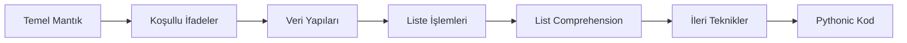

# 🎯 Day 8 - Python Quiz & Comprehensive Solutions

<div align="center">


### 📚 Veri Bilimi ve Makine Öğrenmesi 2026 - 100 Günlük Bootcamp

**Kapsamlı Python Alıştırmaları ve Detaylı Çözümler**

</div>

---

## 📖 İçindekiler

- [📝 Genel Bakış](#-genel-bakış)
- [🎓 Kapsanan Konular](#-kapsanan-konular)
- [📊 Quiz Soruları](#-quiz-soruları)
- [💡 Öğrenme Hedefleri](#-öğrenme-hedefleri)
- [🚀 Nasıl Kullanılır](#-nasıl-kullanılır)
- [🔍 Detaylı İçerik](#-detaylı-içerik)
- [🎯 Önemli Notlar](#-önemli-notlar)
- [🤝 Katkıda Bulunma](#-katkıda-bulunma)

---

## 📝 Genel Bakış

Bu notebook, Python programlama dilinin temel ve orta seviye konularını kapsayan **10 kapsamlı quiz sorusu** ve bunların **profesyonel, detaylı çözümlerini** içermektedir. Her soru:

- ✅ **Adım adım çözüm** ile açıklanmıştır
- ✅ **Alternatif yöntemler** gösterilmiştir
- ✅ **Best practices** (en iyi pratikler) vurgulanmıştır
- ✅ **Görsel ASCII çıktılar** ile desteklenmiştir
- ✅ **Pratik örnekler** içermektedir

---

## 🎓 Kapsanan Konular

<table>
<tr>
<td width="50%">

### 🔹 Temel Kavramlar
- ✨ Mantıksal Operatörler (AND, OR)
- ✨ Koşullu İfadeler (if-elif-else)
- ✨ Modül (%) Operatörü
- ✨ Boolean Mantığı

</td>
<td width="50%">

### 🔸 Veri Yapıları
- ✨ Dictionary (Sözlük) Operasyonları
- ✨ Liste İşlemleri ve Filtreleme
- ✨ Tuple ve Tuple Unpacking
- ✨ List Comprehension

</td>
</tr>
<tr>
<td width="50%">

### 🔹 İleri Teknikler
- ✨ Random Modülü
- ✨ Matematiksel Hesaplamalar
- ✨ Veri Dönüşümleri
- ✨ Fonksiyonel Programlama

</td>
<td width="50%">

### 🔸 Best Practices
- ✨ Pythonic Kod Yazımı
- ✨ Performans Optimizasyonu
- ✨ Code Readability
- ✨ Clean Code Prensipleri

</td>
</tr>
</table>

---

## 📊 Quiz Soruları

### 📌 Soru 1-2: Mantıksal Operatörler
> **Konu:** AND ve OR operatörlerinin kullanımı ve boolean mantığı

**Soru 1:**
```python
x = 5, y = 3, z = 6
x > y and z > x  # Sonuç: True
```

**Soru 2:**
```python
x = 5, y = 3, z = 6
x < y or z > y  # Sonuç: True
```

**Öğrenilen Kavramlar:**
- AND operatörü: Her iki koşul da True olmalı
- OR operatörü: En az bir koşul True olmalı
- Boolean değerlendirme sırası

---

### 📌 Soru 3: Koşullu İfadeler
> **Konu:** if-elif-else yapısı ve yaş sınıflandırması

```python
yas = 20

if yas < 18:
    print("18 yaşından küçüksünüz")
elif yas >= 18 and yas < 30:
    print("18 ile 30 yaş arasında bir gençsiniz")  # ✅ BU BLOK ÇALIŞIR
elif yas >= 30 and yas < 40:
    print("30 ve 40 arasına gelmişsiniz")
else:
    print("40 yaşından daha büyüksünüz")
```

**Öğrenilen Kavramlar:**
- if-elif-else yapısında sadece BİR blok çalışır
- Koşullar yukarıdan aşağıya sırayla kontrol edilir
- İlk True olan koşulun bloğu çalışır

---

### 📌 Soru 4: Dictionary - Değer Kontrolü
> **Konu:** Dictionary değerlerinde eleman arama

```python
my_dictionary = {"k1":10, "k2k":"a", "k32":30, "k4":"c"}

if "c" in my_dictionary.values():
    print("✅ 'c' harfi değerler içinde bulunuyor!")
```

**Üç Yöntem:**
1. ⚡ `.values()` metodu + `in` operatörü (Önerilen)
2. 🔄 For döngüsü ile manuel kontrol
3. 📝 List comprehension

---

### 📌 Soru 5: Dictionary - Anahtar Kontrolü
> **Konu:** Dictionary anahtarlarında eleman arama

```python
my_other_dictionary = {"b":203, "c":"a", "a":400, "d":"f"}

if "a" in my_other_dictionary:  # .keys() opsiyonel
    print("✅ 'a' anahtarı bulundu!")
```

**Önemli Not:**
- `in` operatörü dictionary'lerde varsayılan olarak anahtarlarda arar
- Anahtar kontrolü O(1) - Çok hızlı!
- Değer kontrolü O(n) - Daha yavaş

---

### 📌 Soru 6: Liste Filtreleme - Çift Sayılar
> **Konu:** Listeden çift sayıları filtreleme

```python
my_numbers = [1,2,3,4,5,6,19,20,32,21,20,1111,23,24]

# Yöntem 1: Klasik for döngüsü
for sayi in my_numbers:
    if sayi % 2 == 0:
        print(sayi)

# Yöntem 2: List comprehension (Pythonic)
cift_sayilar = [sayi for sayi in my_numbers if sayi % 2 == 0]
# Sonuç: [2, 4, 6, 20, 32, 20, 24]
```

**Çift Sayı Kontrolü:**
- Formül: `sayi % 2 == 0`
- `%` (modül) operatörü bölme işleminden kalanı verir

---

### 📌 Soru 7: Daire Çevresi Hesaplama
> **Konu:** Matematiksel dönüşümler ve liste transformasyonu

```python
r_list = [3, 2, 5, 8, 4, 6, 9, 12]
pi = 3.14

# Çevre = 2 × π × r
cevre_listesi = [2 * pi * r for r in r_list]
# Sonuç: [18.84, 12.56, 31.40, 50.24, 25.12, 37.68, 56.52, 75.36]
```

**Üç Yöntem:**
1. 🔄 For döngüsü + append
2. ⚡ List comprehension (Önerilen)
3. 🎯 map() fonksiyonu

---

### 📌 Soru 8: Tuple Unpacking
> **Konu:** Tuple yapısından veri çıkarma

```python
age_name_list = [("Ahmet",30), ("Ayse",24), ("Mehmet",40), ("Fatma",29)]

# Yöntem 1: İndeksleme
yas_listesi = [eleman[1] for eleman in age_name_list]

# Yöntem 2: Tuple Unpacking (Önerilen)
yas_listesi = [yas for isim, yas in age_name_list]
# Sonuç: [30, 24, 40, 29]
```

**Tuple Unpacking:**
- En okunabilir yöntem
- Değişken isimleri anlamlı ve açıklayıcı
- Pythonic kod yazımı

---

### 📌 Soru 9: Random Modülü
> **Konu:** Rastgele seçim yapma

```python
import random

metal_list = ["Metallica", "Iron Maiden", "Dream Theater", "Megadeth", "AC/DC"]

# Yöntem 1: random.choice() (En kolay)
rastgele_grup = random.choice(metal_list)

# Yöntem 2: random.randint() ile indeks
rastgele_indeks = random.randint(0, len(metal_list) - 1)
rastgele_grup = metal_list[rastgele_indeks]

# Yöntem 3: random.sample()
rastgele_grup = random.sample(metal_list, 1)[0]
```

**Random Modülü Fonksiyonları:**
- `random.choice(liste)` → Tek eleman seç
- `random.randint(a, b)` → Rastgele tam sayı
- `random.sample(liste, k)` → k tane eleman seç
- `random.shuffle(liste)` → Listeyi karıştır

---

### 📌 Soru 10: List Comprehension - Boolean Listesi
> **Konu:** Boolean değerler üreten list comprehension

```python
number_list = [5, 7, 18, 21, 20, 10, 405, 24]

# Her sayının çift olup olmadığını kontrol et
sonuc = [num % 2 == 0 for num in number_list]
# Sonuç: [False, False, True, False, True, True, False, True]
```

**List Comprehension Anatomisi:**
```python
[ifade for eleman in kaynak_liste if koşul]
 ↓      ↓   ↓       ↓  ↓
 1      2   3       4  5
```

**Kullanım Senaryoları:**
1. Filtreleme: `[x for x in liste if x > 5]`
2. Dönüştürme: `[x*2 for x in liste]`
3. Boolean: `[x > 5 for x in liste]`
4. Ternary: `['ÇİFT' if x%2==0 else 'TEK' for x in liste]`

---

## 💡 Öğrenme Hedefleri

Bu quiz'i tamamladıktan sonra şunları öğrenmiş olacaksınız:

<table>
<tr>
<td>

### 🎯 Temel Beceriler
- [x] Boolean mantığı ve mantıksal operatörler
- [x] Koşullu ifadelerin doğru kullanımı
- [x] Dictionary ve liste operasyonları
- [x] Modül operatörü ile matematik işlemleri

</td>
<td>

### 🚀 İleri Beceriler
- [x] List comprehension teknikleri
- [x] Tuple unpacking yöntemleri
- [x] Random modülü kullanımı
- [x] Pythonic kod yazımı

</td>
</tr>
<tr>
<td>

### 💻 Best Practices
- [x] Clean code prensipleri
- [x] Performans optimizasyonu
- [x] Alternatif çözüm yöntemleri
- [x] Profesyonel kod yapısı

</td>
<td>

### 📚 Problem Çözme
- [x] Algoritmik düşünme
- [x] Veri yapısı seçimi
- [x] Hata ayıklama teknikleri
- [x] Kod analizi yetenekleri

</td>
</tr>
</table>

---

## 🚀 Nasıl Kullanılır

### 📋 Ön Koşullar

```bash
# Python 3.x kurulu olmalı
python --version

# Jupyter Notebook kurulu olmalı
pip install jupyter notebook
```

### 🏃 Çalıştırma

1. **Notebook'u Aç:**
   ```bash
   cd day8
   jupyter notebook Quizz.ipynb
   ```

2. **Hücreleri Çalıştır:**
   - Her hücreyi sırayla çalıştırın (`Shift + Enter`)
   - Veya tümünü çalıştırın (`Cell > Run All`)

3. **Çıktıları İncele:**
   - Her sorunun detaylı açıklamasını okuyun
   - ASCII görselleştirmeleri inceleyin
   - Alternatif yöntemleri deneyin

---

## 🔍 Detaylı İçerik

### 📊 Quiz İstatistikleri

| Kategori | Sayı | Detay |
|----------|------|-------|
| **Toplam Soru** | 10 | Temel → Orta seviye |
| **Kod Hücreleri** | 42 | Interaktif çalıştırılabilir |
| **Markdown Hücreleri** | 3 | Soru başlıkları |
| **Çözüm Yöntemi** | 3+ | Her soru için alternatifler |
| **Kod Satırı** | 1400+ | Detaylı açıklamalarla |

### 🎨 Özellikler

#### ✨ Detaylı Açıklamalar
Her soru için:
- 🔍 Adım adım çözüm
- 📝 Konsept açıklamaları
- 💡 İpuçları ve best practices
- ⚠️ Yaygın hatalar

#### 🎯 Alternatif Çözümler
Her problem için en az 2-3 farklı çözüm yöntemi:
- **Temel Yöntem:** Anlaşılır, eğitim amaçlı
- **Pythonic Yöntem:** Profesyonel, optimize edilmiş
- **İleri Seviye:** Fonksiyonel programlama teknikleri

#### 📊 Görselleştirmeler
- ASCII tabloları
- Bar grafikleri
- Adım adım execution flowları
- Sonuç karşılaştırmaları

#### 🎓 Öğretici İçerik
- Konsept açıklamaları
- Performans karşılaştırmaları
- Best practices rehberi
- Real-world örnekler

---

## 🎯 Önemli Notlar

### ⚡ Performans İpuçları

```python
# ❌ YAVAŞ - Değer kontrolü O(n)
if "value" in dictionary.values():
    pass

# ✅ HIZLI - Anahtar kontrolü O(1)
if "key" in dictionary:
    pass
```

### 🐍 Pythonic Kod Örnekleri

```python
# ❌ Pythonic değil
result = []
for x in lista:
    if x % 2 == 0:
        result.append(x)

# ✅ Pythonic
result = [x for x in lista if x % 2 == 0]
```

### 💎 Best Practices

1. **Okunabilirlik > Kısalık**
   - Karmaşık list comprehension yerine klasik for kullan
   
2. **Anlamlı Değişken İsimleri**
   - `x`, `y` yerine `yas`, `isim` kullan

3. **Doğru Veri Yapısı Seçimi**
   - Sık arama → Dictionary kullan
   - Sıralı veri → List kullan
   - Değiştirilemez → Tuple kullan

4. **Modül Kullanımı**
   - Gerektiğinde `import` yap
   - `random`, `math` gibi standart kütüphanelerden faydalan

---

## 📈 Öğrenme Yolu



### 🎓 Zorluk Seviyeleri

| Soru | Seviye | Konular |
|------|--------|---------|
| 1-2 | 🟢 Kolay | Mantıksal operatörler |
| 3 | 🟢 Kolay | if-elif-else |
| 4-5 | 🟡 Orta | Dictionary operasyonları |
| 6 | 🟡 Orta | Liste filtreleme, modül operatörü |
| 7 | 🟡 Orta | Matematiksel dönüşümler |
| 8 | 🟡 Orta | Tuple unpacking |
| 9 | 🟡 Orta | Random modülü |
| 10 | 🟠 Orta-İleri | List comprehension (Boolean) |

---

## 🛠️ Kullanılan Teknolojiler

<div align="center">

| Teknoloji | Versiyon | Kullanım Amacı |
|-----------|----------|----------------|
|  | 3.x | Programlama dili |
|  | Latest | İnteraktif geliştirme |
|  | Latest | Kod editörü |

</div>

---

## 📚 Kaynaklar ve Referanslar

### 📖 Python Dokümantasyonu
- [Python Official Docs](https://docs.python.org/3/)
- [Python Tutorial](https://docs.python.org/3/tutorial/)
- [Python Standard Library](https://docs.python.org/3/library/)

### 🎓 Öğrenme Kaynakları
- [Real Python](https://realpython.com/)
- [Python.org Beginners Guide](https://wiki.python.org/moin/BeginnersGuide)
- [W3Schools Python](https://www.w3schools.com/python/)

### 💡 Best Practices
- [PEP 8 - Style Guide](https://pep8.org/)
- [Python Best Practices](https://docs.python-guide.org/)
- [Clean Code Python](https://github.com/zedr/clean-code-python)

---

## 🤝 Katkıda Bulunma

Bu projeye katkıda bulunmak isterseniz:

1. 🍴 Fork edin
2. 🔨 Değişikliklerinizi yapın
3. ✅ Test edin
4. 📫 Pull request gönderin

### 💬 Geri Bildirim

Sorularınız veya önerileriniz için:
- 📧 Issue açın
- 💬 Discussion başlatın
- ⭐ Repo'yu yıldızlayın

---

## 📊 İlerleme Takibi

### ✅ Tamamlanan Konular

- [x] Mantıksal Operatörler (AND, OR)
- [x] Koşullu İfadeler (if-elif-else)
- [x] Dictionary Operasyonları (keys, values, items)
- [x] Liste Filtreleme ve Dönüştürme
- [x] Modül (%) Operatörü
- [x] Tuple ve Tuple Unpacking
- [x] List Comprehension
- [x] Random Modülü
- [x] Matematiksel Hesaplamalar
- [x] Pythonic Kod Yazımı

---

## 🎉 Başarım Rozetleri

Bu quiz'i tamamladığınızda kazandığınız beceriler:

<div align="center">


</div>

---

## 🏆 Quiz Özeti

<div align="center">

### 🎓 Tamamlanan Modül: Python Temel Quiz

**Toplam Soru:** 10 | **Kapsam:** Temel → Orta Seviye | **Durum:** ✅ Tamamlandı

---

### 📈 Öğrenilen Konular

**Veri Yapıları** | **Kontrol Akışı** | **Fonksiyonlar** | **Best Practices**

---

### 🌟 Sonraki Adım

Day 9'a geçmeye hazırsın! 🚀

</div>


<div align="center">

## 💫 Bootcamp Progress

**Day 8 / 100** - Python Quiz & Practice


### 🎯 "Pratik mükemmelleştirir. Her satır kod, bir adım daha ileri!"
