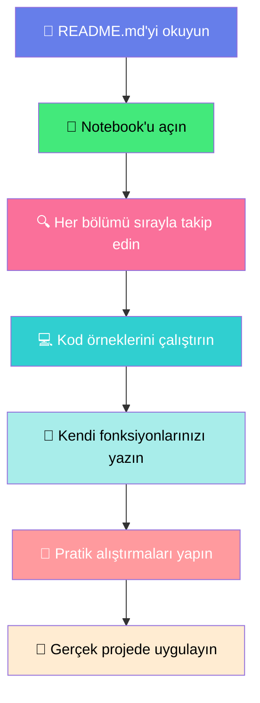

<div align="center">

```
╔═══════════════════════════════════════════════════════════════════════════════╗
║                                                                               ║
║   ███████╗██╗   ██╗███╗   ██╗ ██████╗████████╗██╗ ██████╗ ███╗   ██╗███████╗║
║   ██╔════╝██║   ██║████╗  ██║██╔════╝╚══██╔══╝██║██╔═══██╗████╗  ██║██╔════╝║
║   █████╗  ██║   ██║██╔██╗ ██║██║        ██║   ██║██║   ██║██╔██╗ ██║███████╗║
║   ██╔══╝  ██║   ██║██║╚██╗██║██║        ██║   ██║██║   ██║██║╚██╗██║╚════██║║
║   ██║     ╚██████╔╝██║ ╚████║╚██████╗   ██║   ██║╚██████╔╝██║ ╚████║███████║║
║   ╚═╝      ╚═════╝ ╚═╝  ╚═══╝ ╚═════╝   ╚═╝   ╚═╝ ╚═════╝ ╚═╝  ╚═══╝╚══════╝║
║                                                                               ║
║        🔧 FUNCTIONS - Python'un Modüler Gücü ve Fonksiyonel Sanatı!         ║
║                                                                               ║
╚═══════════════════════════════════════════════════════════════════════════════╝
```

<h3>💎 100 Günlük Veri Bilimi & Makine Öğrenmesi Bootcamp - Dokuzuncu Gün</h3>

[](https://www.python.org/)
[](https://jupyter.org/)
[](LICENSE)
[](https://github.com)
[](https://github.com)

<p align="center">
  
</p>

---

### 🎯 Bu Notebook'ta Neler Var?

<table>
<tr>
<td width="33%" align="center">

<h4>🔧 Temel Fonksiyonlar</h4>
<p>def keyword, parametreler, return ve fonksiyon yapısı</p>
</td>
<td width="33%" align="center">

<h4>📦 Args & Kwargs</h4>
<p>Sınırsız parametre, esnek fonksiyon yapıları ve best practices</p>
</td>
<td width="33%" align="center">

<h4>⚡ Lambda</h4>
<p>Tek satır fonksiyonlar, anonymous functions ve functional programming</p>
</td>
</tr>
<tr>
<td width="33%" align="center">

<h4>🗺️ Map & Filter</h4>
<p>Toplu veri işleme, dönüştürme ve filtreleme teknikleri</p>
</td>
<td width="33%" align="center">

<h4>🔐 Closure & Scope</h4>
<p>LEGB kuralı, nested functions ve state management</p>
</td>
<td width="33%" align="center">

<h4>✨ Decorators</h4>
<p>Fonksiyon süsleyiciler, wrapper patterns ve meta-programming</p>
</td>
</tr>
<tr>
<td width="33%" align="center">

<h4>⚙️ Higher-Order</h4>
<p>Yüksek seviye fonksiyonlar, callback patterns ve composition</p>
</td>
<td width="33%" align="center">

<h4>💼 YBS Uygulamaları</h4>
<p>İK sistemi, maaş hesaplama, çalışan yönetimi ve raporlama</p>
</td>
<td width="33%" align="center">

<h4>📚 Best Practices</h4>
<p>Profesyonel kod yazma, type hints, docstring ve clean code</p>
</td>
</tr>
</table>

</div>

---

## 🌟 Öne Çıkan Özellikler

> **Fonksiyonlar, modern programlamanın kalbinde atan modüler yapı taşlarıdır!**

```python
🎨 Profesyonel Tasarım   → Gradient renkler, modern layout ve görsel zenginlik
📱 Kapsamlı İçerik       → 12 ana bölüm, 163 cell, 300+ kod örneği
🎯 Enterprise Projeler   → Gerçek İK Yönetim Sistemi (5 modül)
🔄 İleri Seviye          → Closure, Decorators, Higher-Order, Partial Functions
💡 Derinlemesine         → Her konsept detaylı açıklanmış + flashcard'lar
🚀 Sıfırdan İleri        → Basit def'ten decorator'lara tam yol haritası
```

<div align="center">

### 💎 **"From Basics to Master - Complete Functions Journey" Yaklaşımı**

En basit `def` ile başlıyor,  
ardından **lambda, map, filter** ile devam ediyor,  
**closure, decorator ve higher-order** fonksiyonlarla ustalaşıyorsunuz,  
en sonunda **profesyonel enterprise proje** ile taçlanıyorsunuz!

</div>

---

## 📖 İçerik Haritası

<div align="center">

### 🗺️ Detaylı Konu Akışı

</div>

| 📌 Adım | 🎯 Konu Başlığı | 📋 İçerik Özeti |
|---------|-----------------|-----------------|
| **1️⃣** | **Fonksiyonlara Giriş** | Fonksiyon vs Method, temel kavramlar, neden kullanılır, YBS'de önemi |
| **2️⃣** | **Temel Fonksiyon Oluşturma** | def keyword, parametresiz fonksiyonlar, docstring, fonksiyon çağırma |
| **3️⃣** | **Parametreli Fonksiyonlar** | Pozisyonel, default, keyword parametreler, karışık kullanım |
| **4️⃣** | **Return Kavramı** | print vs return farkı, değer döndürme, çoklu return, None kavramı |
| **5️⃣** | **Args & Kwargs** | *args (sınırsız pozisyonel), **kwargs (sınırsız keyword), esnek yapılar |
| **6️⃣** | **Scope (Kapsam)** | LEGB kuralı, Local-Enclosing-Global-Built-in, global keyword, nonlocal |
| **7️⃣** | **Lambda Fonksiyonları** | Anonymous functions, tek satır syntax, sorted/map/filter ile kullanım |
| **8️⃣** | **Map Fonksiyonu** | Toplu veri dönüştürme, iterator yapısı, for döngüsü karşılaştırması |
| **9️⃣** | **Filter & Reduce** | Veri filtreleme, liste birleştirme, functools.reduce kullanımı |
| **🔟** | **İleri Seviye Fonksiyonlar** | Nested, Closure, Decorators, Higher-Order, Partial functions |
| **1️⃣1️⃣** | **Gerçek Dünya Projesi** | 5 modüllü İK Yönetim Sistemi - CRUD, logging, reporting, analysis |
| **1️⃣2️⃣** | **Best Practices & Özet** | Type hints, clean code, docstring, profesyonel standartlar, özet |

<div align="center">


</div>

---

## 📚 Detaylı Bölüm İçerikleri

### 1️⃣ Fonksiyonlara Giriş

<div style="background: linear-gradient(135deg, #667eea 0%, #764ba2 100%); padding: 20px; border-radius: 10px; color: white;">

**🎯 Bu bölümde öğrenecekleriniz:**

- 🔧 **Fonksiyon Kavramı**: Nedir, neden kullanılır, temel mantığı
- 🆚 **Fonksiyon vs Method**: İkisi arasındaki kritik farklar
- 💼 **YBS Uygulamaları**: İş dünyasında fonksiyonların rolü
- 📊 **Modüler Programlama**: Kod organizasyonu ve tekrar kullanılabilirlik
- 🎯 **İlk Fonksiyonlar**: print(), len(), sum() gibi built-in örnekler
- 📚 **Terminoloji**: Parameter, argument, return, call gibi kavramlar

Gerçek dünya örneği olarak **TechCorp Çalışan Sistemi** üzerinden 20 kişilik bir şirketin veri modeli oluşturulmuş, DataFrame ile profesyonel veri yönetimi gösterilmektedir.

</div>

---

### 2️⃣ Temel Fonksiyon Oluşturma

<div style="background: linear-gradient(135deg, #43e97b 0%, #38f9d7 100%); padding: 20px; border-radius: 10px; color: white;">

**🎯 Bu bölümde öğrenecekleriniz:**

- 🔑 **def Keyword**: Fonksiyon tanımlama söz dizimi
- 📝 **Docstring**: Fonksiyonları belgeleme (triple quotes)
- 🎨 **Girintileme**: Python'da indentation kuralları
- 📞 **Fonksiyon Çağırma**: Parantez ile çalıştırma vs sadece isim yazma
- 🔄 **Tekrar Kullanılabilirlik**: Aynı fonksiyonu birden fazla kez çağırma
- 💻 **Pratik Örnekler**: Şirket bilgileri, departman analizleri, çalışan raporları

Bu bölüm, fonksiyonların en temel yapı taşlarını kapsar. Parametresiz basit fonksiyonlardan başlayarak, profesyonel dokümantasyon ve best practice'lere kadar geniş bir yelpaze sunar.

</div>

---

### 3️⃣ Parametreli Fonksiyonlar

<div style="background: linear-gradient(135deg, #fa709a 0%, #fee140 100%); padding: 20px; border-radius: 10px; color: white;">

**🎯 Bu bölümde öğrenecekleriniz:**

- 📥 **Pozisyonel Parametreler**: Sırayla gönderilen değerler
- 🏷️ **Keyword Parametreler**: İsimli parametre gönderimi
- ⚙️ **Default (Varsayılan) Değerler**: Opsiyonel parametreler
- 🔀 **Karışık Kullanım**: Pozisyonel + keyword + default birlikte
- ⚠️ **Parametre Sırası**: Normal → default → *args → **kwargs kuralı
- 💰 **Gerçek Senaryo**: Maaş hesaplama, prim sistemi, çalışan bonusları

Parametre türlerinin her biri için detaylı örnekler ve profesyonel kullanım senaryoları. Maaş artışı, bonus hesaplama, departman bazlı analizler gibi YBS uygulamaları.

</div>

---

### 4️⃣ Return Kavramı - Değer Döndürme

<div style="background: linear-gradient(135deg, #30cfd0 0%, #330867 100%); padding: 20px; border-radius: 10px; color: white;">

**🎯 Bu bölümde öğrenecekleriniz:**

- 📤 **return Keyword**: Değer döndürme mekanizması
- 🆚 **print vs return**: En karıştırılan konu detaylıca açıklanıyor!
- 🔢 **Çoklu Return**: Tuple ile birden fazla değer döndürme
- ⚡ **Erken Çıkış**: return ile fonksiyonu sonlandırma
- 🔄 **None Kavramı**: return olmadığında ne olur?
- 💼 **YBS Örnekleri**: Net maaş hesaplama, vergi kesintisi, toplam gelir

Return konusu Python'da en çok karıştırılan konulardan biridir. print() ile return arasındaki farklar çok detaylı örneklerle gösterilmiştir.

</div>

---

### 5️⃣ Args & Kwargs - Sınırsız Parametre!

<div style="background: linear-gradient(135deg, #a8edea 0%, #fed6e3 100%); padding: 20px; border-radius: 10px;">

**🎯 Bu bölümde öğrenecekleriniz:**

- ⭐ ***args**: Sınırsız pozisyonel parametre (tuple olarak)
- 🌟 ****kwargs**: Sınırsız keyword parametre (dict olarak)
- 🔄 **Unpacking**: * ve ** operatörleri ile liste/dict açma
- 📦 **Esnek Fonksiyonlar**: Parametre sayısı belli olmayan durumlar
- 🎯 **Gerçek Kullanım**: Toplu maaş artışı, çoklu departman analizi
- ⚠️ **Parametre Sırası**: Normal → *args → default → **kwargs

Args ve kwargs, Python'un en güçlü özelliklerinden biridir. Fonksiyonlarınızı inanılmaz esnek hale getirir ve API tasarımında kritik öneme sahiptir.

</div>

---

### 6️⃣ Scope (Kapsam) - LEGB Kuralı

<div style="background: linear-gradient(135deg, #ff9a9e 0%, #fecfef 100%); padding: 20px; border-radius: 10px;">

**🎯 Bu bölümde öğrenecekleriniz:**

- 🔤 **LEGB**: Local → Enclosing → Global → Built-in arama sırası
- 🏠 **Local Scope**: Fonksiyon içi değişkenler (en dar kapsam)
- 📦 **Enclosing Scope**: İç içe fonksiyonlarda dış fonksiyon kapsamı
- 🌍 **Global Scope**: Modül seviyesi değişkenler
- 🏛️ **Built-in Scope**: Python'un yerleşik fonksiyonları
- 🔑 **global & nonlocal**: Dış kapsamdaki değişkenleri değiştirme

Scope konusu, değişken görünürlüğünü ve Python'ın değişkenleri nasıl aradığını anlamak için kritiktir. LEGB kuralı detaylı örneklerle açıklanmıştır.

</div>

---

### 7️⃣ Lambda Fonksiyonları

<div style="background: linear-gradient(135deg, #ffecd2 0%, #fcb69f 100%); padding: 20px; border-radius: 10px;">

**🎯 Bu bölümde öğrenecekleriniz:**

- ⚡ **Lambda Syntax**: Tek satırda fonksiyon tanımlama
- 🎯 **Anonymous Functions**: İsimsiz fonksiyonlar
- 🔗 **sorted() ile**: key parametresi ile güçlü sıralama
- 📊 **map() ile**: Lambda + map kombinasyonu
- 🔍 **filter() ile**: Koşullu filtreleme
- 💼 **YBS Örnekleri**: Maaş sıralama, çalışan filtreleme, performans analizi

Lambda, functional programming'in temel taşıdır. Kısa ve öz fonksiyonlar yazmak, callback'ler oluşturmak için mükemmeldir.

</div>

---

### 8️⃣ Map Fonksiyonu - Toplu İşlem Gücü

<div style="background: linear-gradient(135deg, #ff6e7f 0%, #bfe9ff 100%); padding: 20px; border-radius: 10px;">

**🎯 Bu bölümde öğrenecekleriniz:**

- 🗺️ **map() Kullanımı**: Tüm elemanlara fonksiyon uygulama
- 🆚 **For Döngüsü Karşılaştırma**: map vs for loop
- ⚡ **Iterator Yapısı**: Lazy evaluation, bellek verimliliği
- 🔄 **Çoklu Iterable**: 2+ liste ile paralel işlem
- 📊 **Veri Dönüştürme**: Type conversion, string işlemleri
- 💰 **Maaş Hesaplamaları**: Toplu artış, prim, bonus sistemleri

map() fonksiyonu, veri bilimi ve analitik projelerinde sıkça kullanılan güçlü bir araçtır. For döngüsüne göre daha temiz ve okunabilir kod sağlar.

</div>

---

### 9️⃣ Filter & Reduce Fonksiyonları

<div style="background: linear-gradient(135deg, #667eea 0%, #764ba2 100%); padding: 20px; border-radius: 10px; color: white;">

**🎯 Bu bölümde öğrenecekleriniz:**

- 🔍 **filter() Kullanımı**: Koşula göre elemanlari filtreleme
- 📉 **reduce() Fonksiyonu**: Liste elemanlarını tek değere indirme
- 🎯 **Lambda ile Birlikte**: filter + lambda kombinasyonu
- 🔄 **Pipeline Pattern**: map → filter → reduce zincirleme
- 💼 **Çalışan Filtreleme**: Performans, departman, maaş kriterleri
- 📊 **Veri Analizi**: Toplam hesaplama, ortalama, min/max bulma

filter() ve reduce() ile functional programming yaklaşımı tam anlamıyla devreye girer. Veri pipeline'ları oluşturmak için mükemmel araçlardır.

</div>

---

### 🔟 İleri Seviye Fonksiyonlar - Master Level!

<div style="background: linear-gradient(135deg, #43e97b 0%, #38f9d7 100%); padding: 20px; border-radius: 10px;">

**🎯 Bu bölümde öğrenecekleriniz:**

- 🏗️ **Nested Functions**: İç içe fonksiyonlar, helper functions
- 🔐 **Closure**: State saklama, factory patterns, private variables
- ✨ **Decorators**: Fonksiyon süsleyicileri, @ syntax, wrapper pattern
- ⚙️ **Higher-Order Functions**: Fonksiyonu parametre/return olarak alma
- 🎯 **Partial Functions**: functools.partial ile parametre dondurma
- 💡 **Design Patterns**: Factory, Decorator, Strategy patterns

Bu bölüm Python'un en gelişmiş fonksiyon özelliklerini kapsar. Professional Python developer olmak için bu konseptlere hakim olmak şarttır!

</div>

---

### 1️⃣1️⃣ Gerçek Dünya Projesi - İK Yönetim Sistemi

<div style="background: linear-gradient(135deg, #fa709a 0%, #fee140 100%); padding: 20px; border-radius: 10px;">

**🎯 Bu bölümde öğrenecekleriniz:**

Bu bölüm, **5 modüllü enterprise seviye bir İK Yönetim Sistemi** geliştirmenizi sağlar:

#### 🏗️ **MODÜL 1: Sistem Altyapısı**
- Decorators ile logging sistemi
- Closure ile sayaç mekanizması
- Yetki kontrol sistemi
- İşlem takip sistemi

#### 👥 **MODÜL 2: Çalışan Yönetimi**
- CRUD operasyonları (Create, Read, Update, Delete)
- Çalışan arama (lambda + filter)
- Toplu işlemler (map kullanımı)
- Validasyon ve hata yönetimi

#### 💰 **MODÜL 3: Maaş Yönetimi**
- Maaş hesaplayıcı factory (closure)
- Toplu maaş artışı (partial functions)
- Prim ve bonus sistemleri
- Net gelir hesaplama

#### 📊 **MODÜL 4: Raporlama ve Analiz**
- Nested functions ile rapor formatlaması
- Terfi adayı belirleme (pipeline pattern)
- Risk analizi sistemi
- Departman karşılaştırma

#### 🎯 **MODÜL 5: Sistem Özeti**
- Kapsamlı istatistikler
- reduce() ile toplamlar
- sorted() ile sıralamalar
- En iyi performanslar

**Proje Özellikleri:**
- ✅ 15+ profesyonel fonksiyon
- ✅ Tüm öğrenilen konseptleri kullanan gerçek sistem
- ✅ Decorator, closure, lambda, map, filter, reduce entegrasyonu
- ✅ Modüler ve genişletilebilir yapı
- ✅ Professional logging ve error handling

</div>

---

### 1️⃣2️⃣ Best Practices & Genel Özet

<div style="background: linear-gradient(135deg, #30cfd0 0%, #330867 100%); padding: 20px; border-radius: 10px; color: white;">

**🎯 Bu bölümde öğrenecekleriniz:**

- 📝 **İsimlendirme**: snake_case, açıklayıcı isimler, verb kullanımı
- 📚 **Docstring**: Google Style, Args-Returns-Example bölümleri
- 🎯 **Type Hints**: Modern Python'da tip belirtme (3.5+)
- ⚡ **Tek Sorumluluk**: Single Responsibility Principle
- 🔄 **DRY Prensibi**: Don't Repeat Yourself
- 🛡️ **Hata Yönetimi**: try-except, defensive programming
- 📏 **Fonksiyon Uzunluğu**: 10-20 satır ideal, modülerlik
- 💡 **Mutable Defaults**: Tehlikeli varsayılan parametreler
- 🔑 **KISS & YAGNI**: Keep It Simple, You Aren't Gonna Need It

Professional kod yazma standartları, clean code prensipleri ve Python best practices'ler detaylı örneklerle açıklanmıştır.

</div>

---

## 🔧 Kurulum ve Kullanım

### 🔍 Gereksinimler

```bash
Python 3.8+
Jupyter Notebook / JupyterLab / VS Code
```

**Opsiyonel Kütüphaneler:**
- `pandas` - DataFrame işlemleri için
- `numpy` - Sayısal hesaplamalar için (opsiyonel)
- `functools` - reduce, partial için (built-in)

---

### 📂 Notebook'u Çalıştırma

<details>
<summary><b>🎯 Option 1: Jupyter Notebook ile</b></summary>

```bash
# Terminal'de proje klasörüne gidin
cd day9

# Jupyter Notebook'u başlatın
jupyter notebook

# Browser'da Python_Functions_YBS_MasterClass.ipynb dosyasını açın
```

</details>

<details>
<summary><b>💎 Option 2: VS Code ile (Önerilen)</b></summary>

```bash
# VS Code'da klasörü açın
code day9

# Python_Functions_YBS_MasterClass.ipynb dosyasına tıklayın
# Python kernel'ı seçin
# Cell'leri sırayla çalıştırın (Shift + Enter)
```

**VS Code Extensions (Önerilen):**
- Python
- Jupyter
- Jupyter Notebook Renderers
- Pylance

</details>

<details>
<summary><b>☁️ Option 3: Google Colab ile</b></summary>

```bash
# 1. Python_Functions_YBS_MasterClass.ipynb dosyasını indirin
# 2. Google Drive'a yükleyin
# 3. Google Colab ile açın
# 4. Hazır! Hiçbir kurulum gerekmez ☁️
```

</details>

---

### 🎓 Önerilen Öğrenme Yolu



---

## 💡 Öğrenme İpuçları

<table>
<tr>
<td width="50%">

### ✅ Yapmanız Gerekenler

- ✅ Her kod örneğini mutlaka çalıştırın
- ✅ Kodu değiştirip farklı senaryolar deneyin
- ✅ Kendi fonksiyonlarınızı yazın
- ✅ Hata mesajlarını okuyun ve anlayın
- ✅ Lambda, map, filter'ı alıştırma yaparak öğrenin
- ✅ Gerçek dünya projesini adım adım takip edin

</td>
<td width="50%">

### ❌ Kaçınmanız Gerekenler

- ❌ Sadece okuyup geçmeyin
- ❌ Kod örneklerini kopyala-yapıştır yapmayın
- ❌ İleri konulara acele etmeyin
- ❌ Hata aldığınızda pes etmeyin
- ❌ Sadece ezberle yetinmeyin
- ❌ Pratik yapmayı ertelemeyin

</td>
</tr>
</table>

---


## 📞 İletişim ve Destek

<div align="center">

### 🎓 Bootcamp Bilgileri

**100 Günlük Veri Bilimi & Makine Öğrenmesi Bootcamp**

Profesyonel veri bilimci olmak için gereken tüm becerileri kazanın!

</div>

---

</table>

### ❓ Sık Sorulan Sorular

<details>
<summary><b>❓ Python bilmeden bu notebook'u takip edebilir miyim?</b></summary>

Temel Python bilgisine ihtiyacınız var. Önceki günlerin materyallerini (değişkenler, veri tipleri, if-else, döngüler) tamamladıysanız hazırsınız!

</details>

<details>
<summary><b>❓ Fonksiyonlar neden bu kadar önemli?</b></summary>

Fonksiyonlar modern programlamanın temelidir! Kod tekrarını önler, okunabilirliği artırır, test edilebilirliği sağlar ve profesyonel yazılım geliştirmenin vazgeçilmez parçasıdır.

</details>

<details>
<summary><b>❓ Lambda fonksiyonlarını ne zaman kullanmalıyım?</b></summary>

Lambda kısa, tek kullanımlık fonksiyonlar için idealdir. Özellikle map(), filter(), sorted() gibi fonksiyonların key parametresi ile kullanıldığında çok güçlüdür. Karmaşık mantık için normal fonksiyon tercih edilmelidir.

</details>

<details>
<summary><b>❓ Decorators gerçekten gerekli mi?</b></summary>

Professional Python development için kesinlikle! Logging, authentication, timing, caching gibi cross-cutting concern'ler için mükemmeldir. Flask, Django gibi framework'ler decorator'ları yoğun kullanır.

</details>

<details>
<summary><b>❓ Jupyter Notebook olmadan çalışabilir miyim?</b></summary>

Evet! Google Colab (ücretsiz) veya VS Code (Jupyter extension ile) kullanabilirsiniz. Kurulum bölümüne bakın.

</details>

<details>
<summary><b>❓ İK Yönetim Sistemi projesini nasıl çalıştırabilirim?</b></summary>

Notebook'u sırayla takip edin. Proje 5 modülden oluşur ve her modül önceki modüllere bağımlıdır. Adım adım cell'leri çalıştırarak tam çalışır bir sistem elde edersiniz!

</details>

<details>
<summary><b>❓ Bu materyaller ticari amaçla kullanılabilir mi?</b></summary>

MIT Lisansı ile lisanslanmıştır. Detaylar için LICENSE dosyasına bakın.

</details>

---


### 🌐 Dış Kaynaklar

- 🐍 [Python Resmi Dokümantasyonu](https://docs.python.org/3/)
- 📖 [Real Python - Functions Tutorial](https://realpython.com/defining-your-own-python-function/)
- 🎓 [W3Schools Python Functions](https://www.w3schools.com/python/python_functions.asp)
- 📚 [PEP 8 - Style Guide](https://pep8.org/)
- 🎬 [YouTube - Python Functions](https://www.youtube.com/)
- 💬 [Stack Overflow Python Tag](https://stackoverflow.com/questions/tagged/python)

---

<div align="center">

## 🎉 Teşekkürler!


**Python Functions masterclass'ına katıldığınız için teşekkür ederiz!**

Fonksiyonlar öğrenmek sadece başlangıç, asıl güç onları **doğru** kullanmakta!

---


<p align="center">
  <i>"Fonksiyonlar olmadan kod yazmak, LEGO'suz oyuncak inşa etmeye benzer!"</i>
</p>

**Happy Coding!** 💻✨

</div>

---

<div align="center">

**⭐ Eğer bu materyal işinize yaradıysa, yıldız vermeyi unutmayın! ⭐**

Made with ❤️ by 100 Days Data Science Bootcamp Team

© 2026 - All Rights Reserved

</div>
